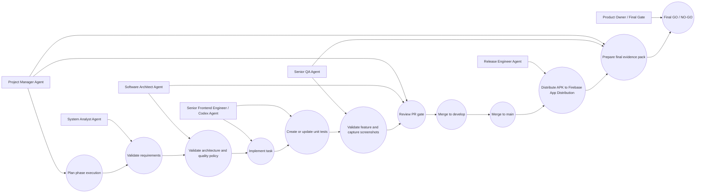
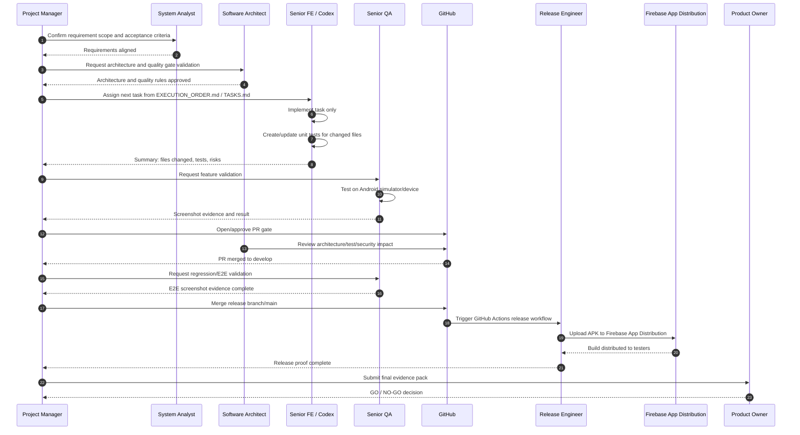
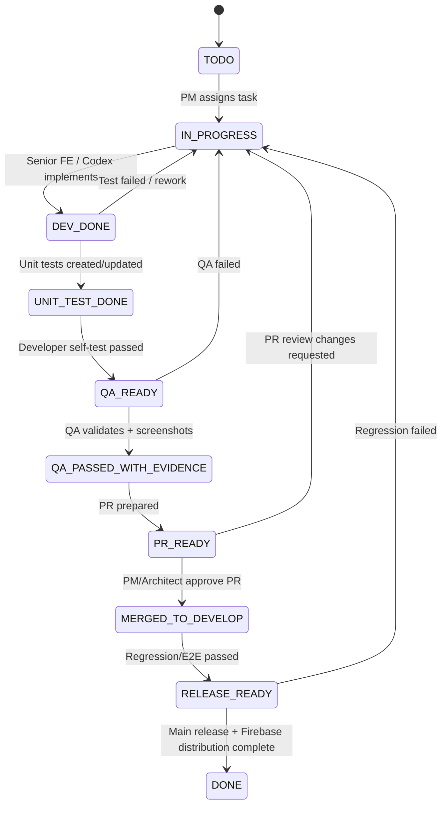
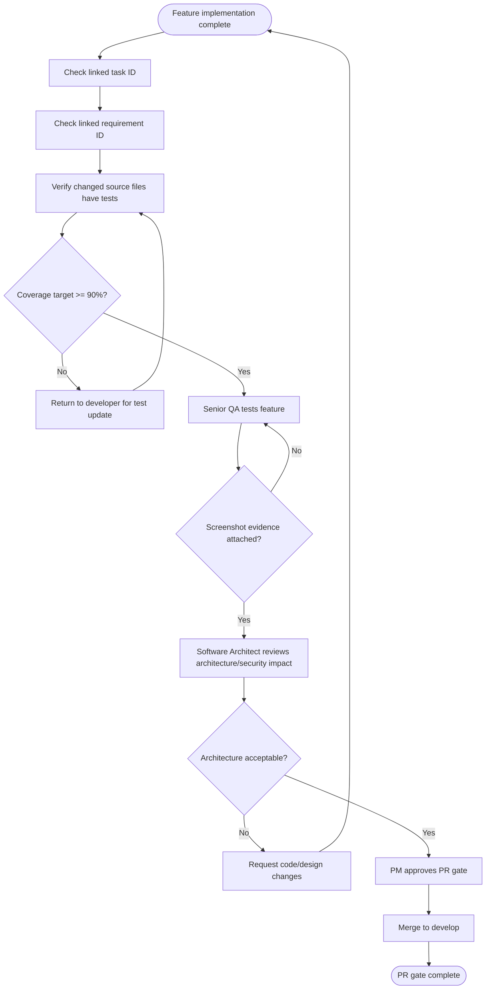
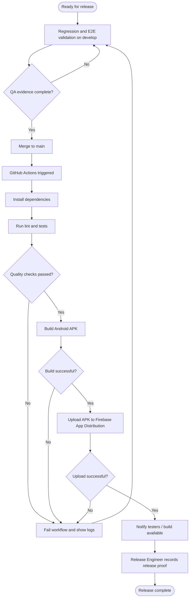

# UML Delivery Workflow — MBC Parking MVP

> This document describes the **delivery/team workflow**, not the MBC product behavior.
>
> Product/system UML remains in `UML_SYSTEM_DIAGRAMS.md`.
>
> Use this document to explain how Project Manager, System Analyst, Software Architect, Senior Frontend Engineer/Codex, Senior QA, Release Engineer, and Product Owner collaborate to deliver the project.

---

## 1. Delivery Actors and Responsibilities

| Actor / Agent                          | Responsibility                                                                             |
| -------------------------------------- | ------------------------------------------------------------------------------------------ |
| Project Manager Agent                  | Execute `EXECUTION_ORDER.md` phase by phase, track task status, block incomplete gates.    |
| System Analyst Agent                   | Validate requirement alignment, acceptance criteria, and scope.                            |
| Software Architect Agent               | Validate architecture, security, test strategy, module boundaries, and extensibility.      |
| Senior Frontend Engineer / Codex Agent | Implement one task at a time from `TASKS.md`, update tests, summarize output.              |
| Senior QA Agent                        | Validate feature before PR merge and capture Android simulator/device screenshot evidence. |
| Release Engineer Agent                 | Configure GitHub Actions and Firebase App Distribution release pipeline.                   |
| Product Owner / Final Gate             | Approve final GO / NO-GO using checklist and QA evidence.                                  |

---

## 2. Delivery Use Case Diagram



---

## 3. End-to-End Delivery Activity Diagram

```mermaid
flowchart TD
  A([Start project delivery]) --> B[Requirement freeze]
  B --> C[System Analyst validates requirements]
  C --> D{Requirement aligned?}
  D -- No --> B
  D -- Yes --> E[Architecture freeze]
  E --> F[Software Architect validates design, security, and test policy]
  F --> G{Architecture approved?}
  G -- No --> E
  G -- Yes --> H[PM selects next phase from EXECUTION_ORDER.md]

  H --> I[Codex / Senior FE works one task from TASKS.md]
  I --> J[Create or update unit tests for changed source files]
  J --> K{Coverage target >= 90%?}
  K -- No --> J
  K -- Yes --> L[Developer self-test]
  L --> M[QA validates feature on Android simulator/device]
  M --> N{QA screenshot evidence attached?}
  N -- No --> M
  N -- Yes --> O[Create PR]
  O --> P[Architect and PM review PR gate]
  P --> Q{PR approved?}
  Q -- No --> I
  Q -- Yes --> R[Merge to develop]

  R --> S{More phase tasks?}
  S -- Yes --> H
  S -- No --> T[Regression and E2E validation]
  T --> U{E2E evidence complete?}
  U -- No --> T
  U -- Yes --> V[Merge to main]
  V --> W[GitHub Actions builds APK]
  W --> X[Firebase App Distribution upload]
  X --> Y[Final QA evidence pack]
  Y --> Z[PO final GO / NO-GO]
  Z --> END([Delivery complete])
```



---

## 4. Delivery Sequence Diagram



---

## 5. Task State Diagram



---

## 6. PR Gate Activity Diagram



---

## 7. Release Pipeline Activity Diagram



---

## 8. Delivery Rules

1. `EXECUTION_ORDER.md` is the official PM execution sequence.
2. `TASKS.md` is the compact task index for Codex/dev work.
3. `REQUIREMENTS.md` defines business behavior.
4. `CARD_DATA_SECURITY_LEDGER_SPEC.md` defines NFC, tariff, card, ledger, and Silent Shield behavior.
5. Work must be executed one task at a time.
6. Parking MVP only. Generic/non-parking activity is future extension only.
7. Every changed executable source file must have created/updated unit tests.
8. Unit-test coverage target is 90% for executable source.
9. QA screenshot evidence is required before PR merge.
10. Merge/push to `main` must trigger GitHub Actions and Firebase App Distribution.
11. Final delivery requires QA evidence pack and PO final GO / NO-GO.

---

## 9. Final Evidence Checklist

| Evidence                             | Owner              | Required before final GO? |
| ------------------------------------ | ------------------ | ------------------------: |
| Requirement alignment checklist      | System Analyst     |                       Yes |
| Architecture/security review         | Software Architect |                       Yes |
| Unit test and coverage proof         | Senior FE / Codex  |                       Yes |
| Android simulator/device screenshots | Senior QA          |                       Yes |
| E2E flow screenshots                 | Senior QA          |                       Yes |
| Firebase App Distribution proof      | Release Engineer   |                       Yes |
| Final GO / NO-GO checklist           | Product Owner / PM |                       Yes |

---

## 10. Final GO / NO-GO Rule

```txt
GO only when:
- all required parking MVP flows pass,
- unit-test and coverage policy is satisfied,
- QA screenshot evidence exists,
- release pipeline proof exists,
- unresolved TBD items are accepted or closed,
- Product Owner / PM approves final checklist.
```
