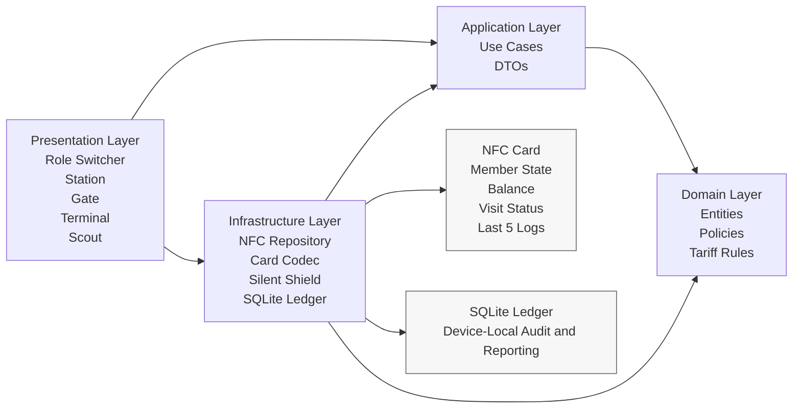
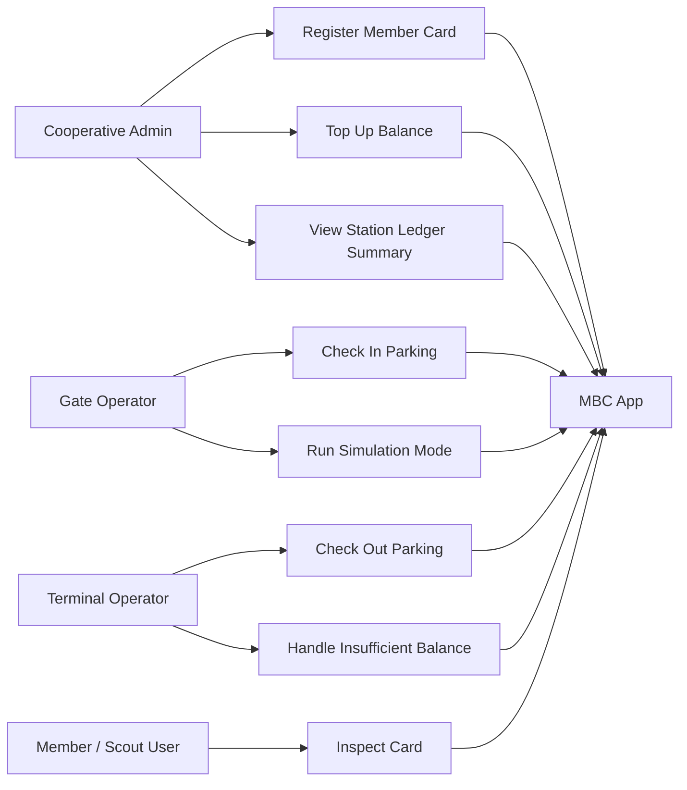
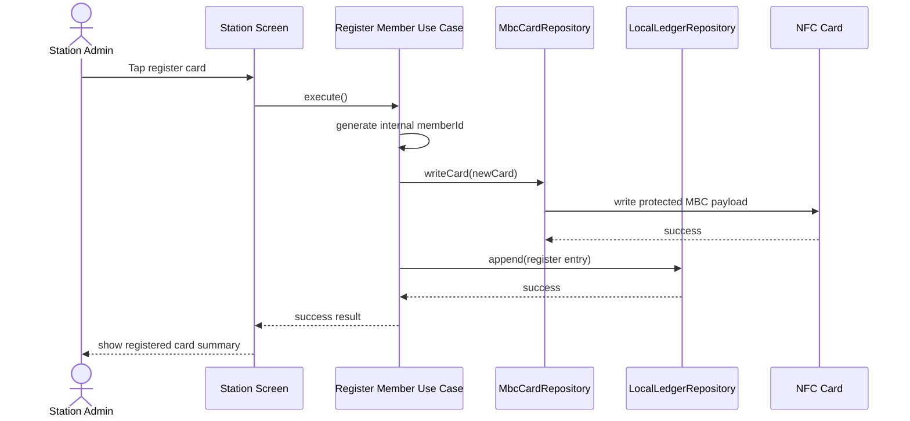
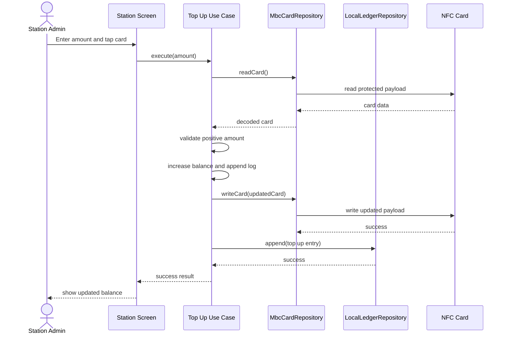
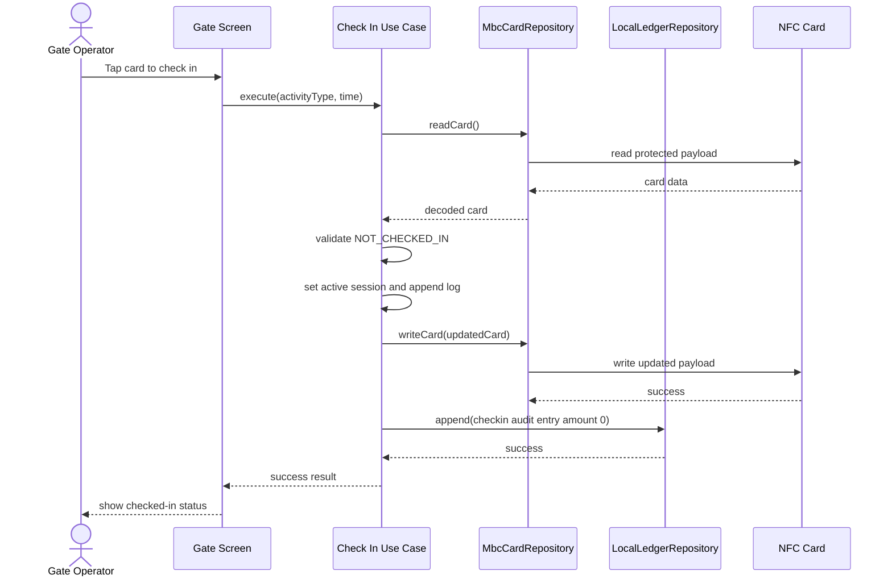
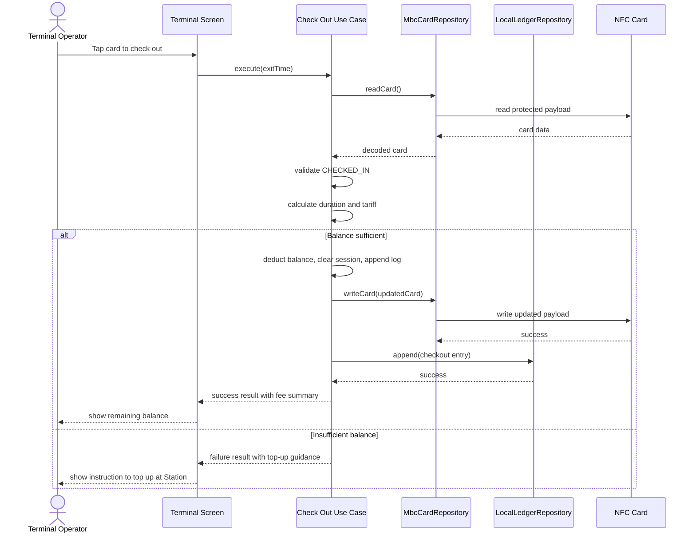
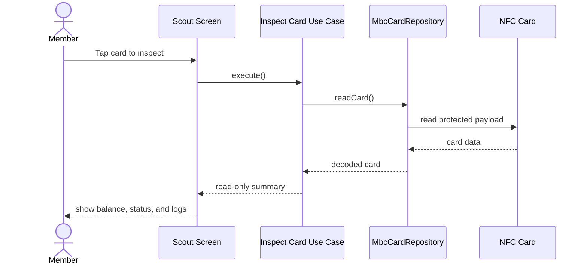
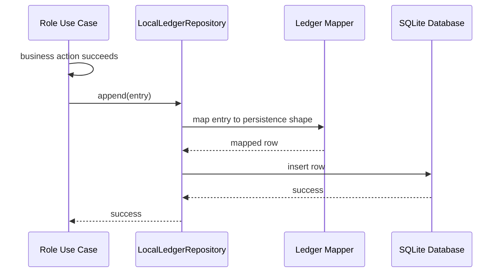
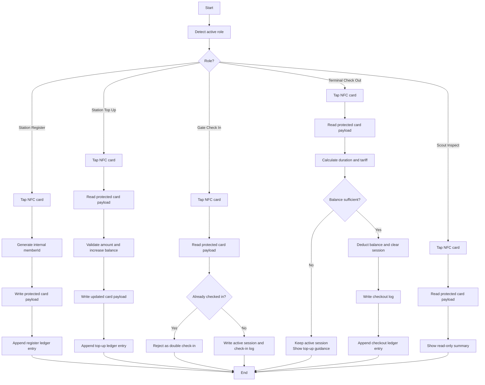

# KDX Membership Benefit Card UML and System Diagrams

This document contains the baseline UML/system diagrams for the current MBC scope.

Scope reflected here:

- one app with four roles: Station, Gate, Terminal, Scout
- NFC card as member-state source of truth
- local SQLite ledger as current-device/current-installation reporting and audit store
- Android-first real NFC validation
- parking as the only MVP activity, with reusable activity flow design for future extension

## 1. Component Diagram

## 2. Use-Case Diagram

## 3. Sequence Diagram: Station Registration

## 4. Sequence Diagram: Station Top-Up

## 5. Sequence Diagram: Gate Check-In

## 6. Sequence Diagram: Terminal Check-Out

## 7. Sequence Diagram: Scout Inspection

## 8. Sequence Diagram: Local Ledger Write Flow

## 9. Activity Diagram: Main Parking Tap-In / Tap-Out Flow

## 10. Notes

- These diagrams intentionally reflect the current MVP and assessment scope.
- Guest flow is excluded.
- Full internal member ID is not shown in normal operator/member screens.
- The local SQLite ledger is device-local reporting support, not member-state truth.
- Real-card behavior remains subject to the final physical NFC tag constraints.
