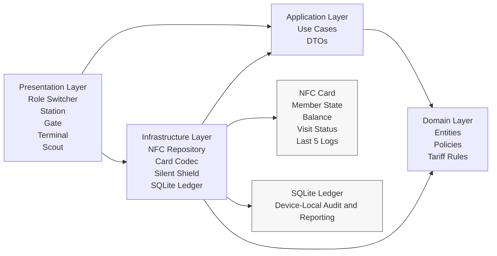
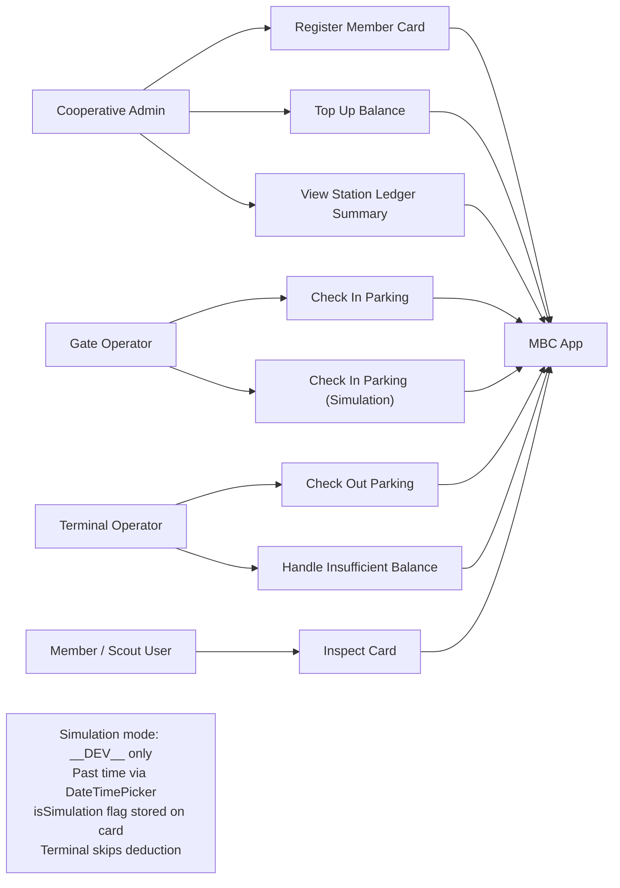
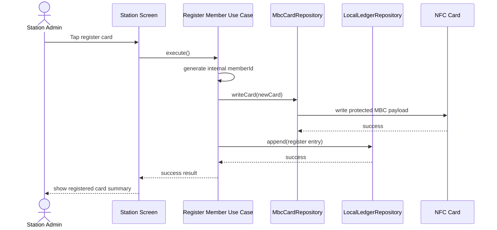
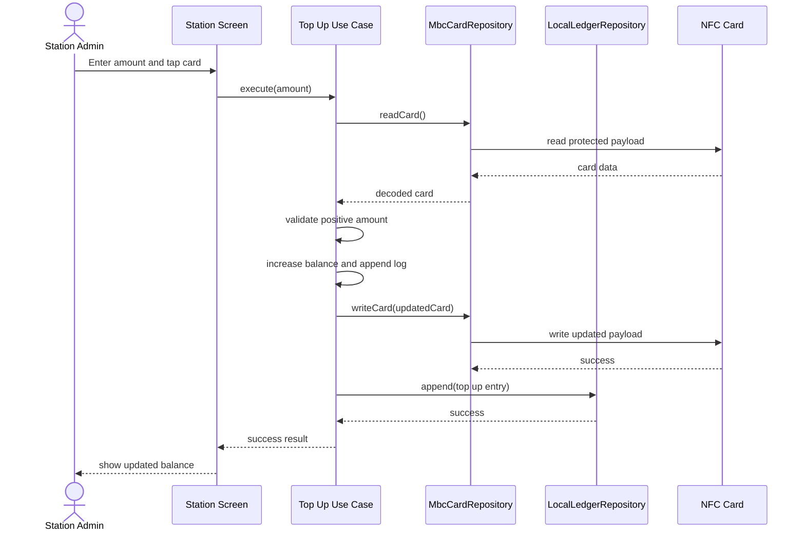
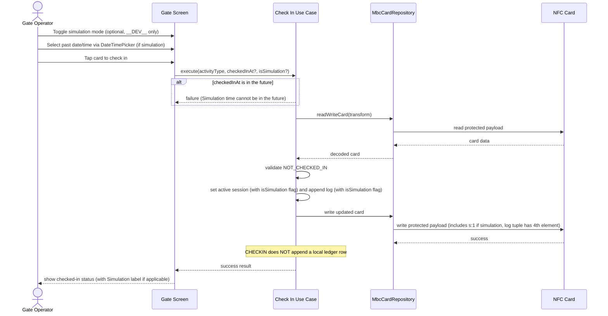
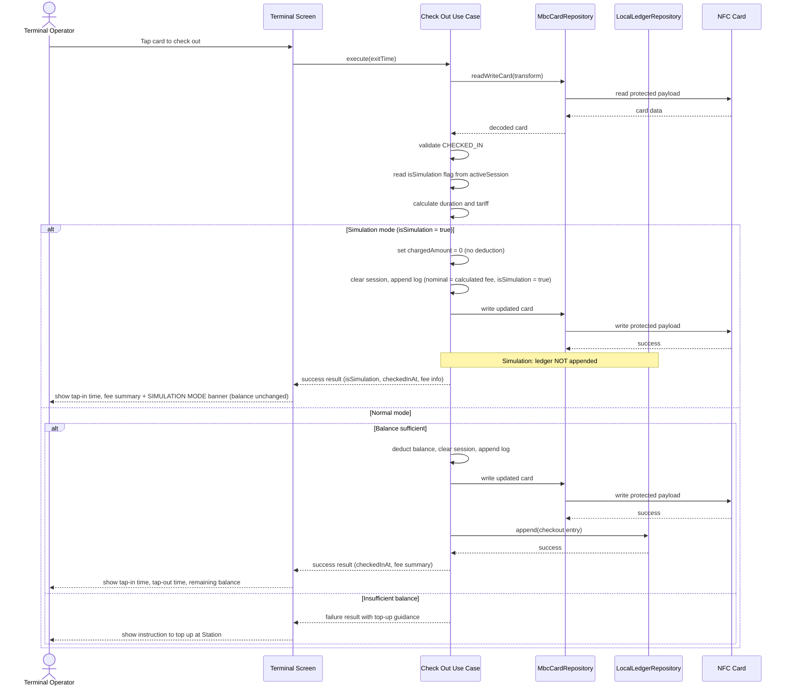
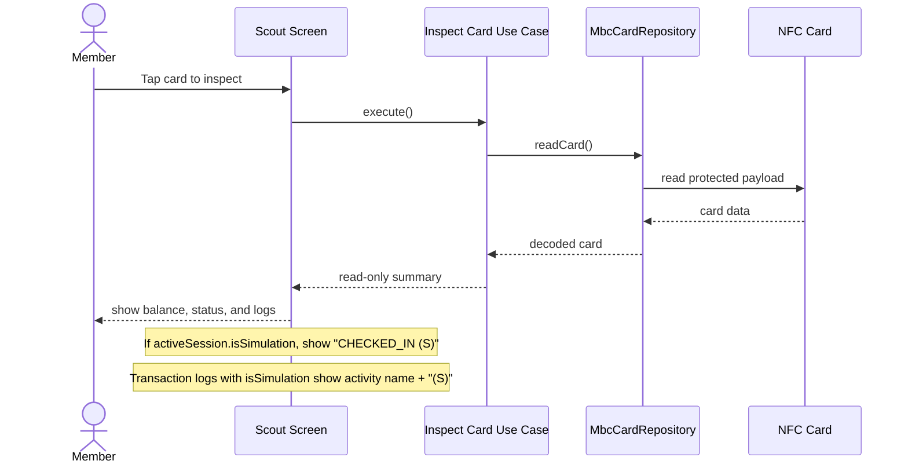
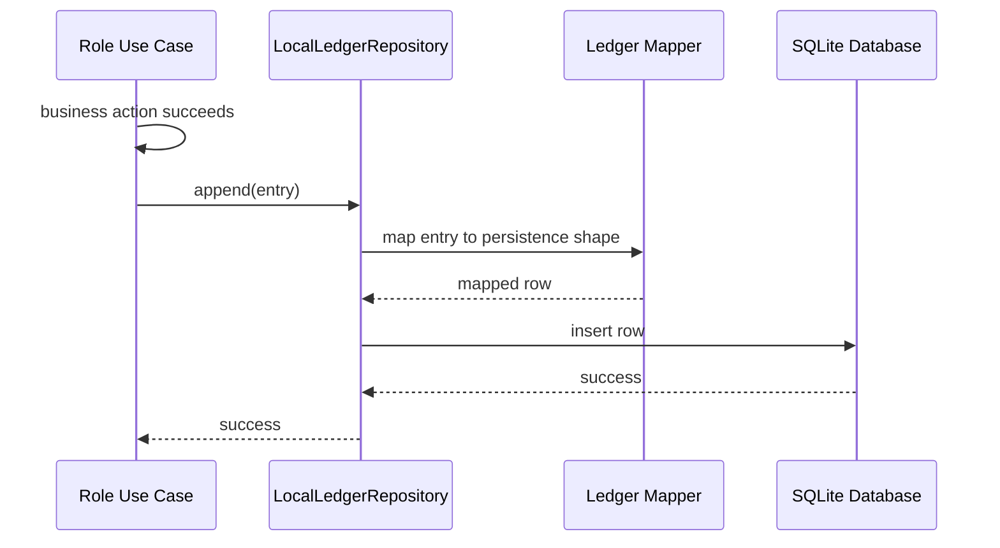
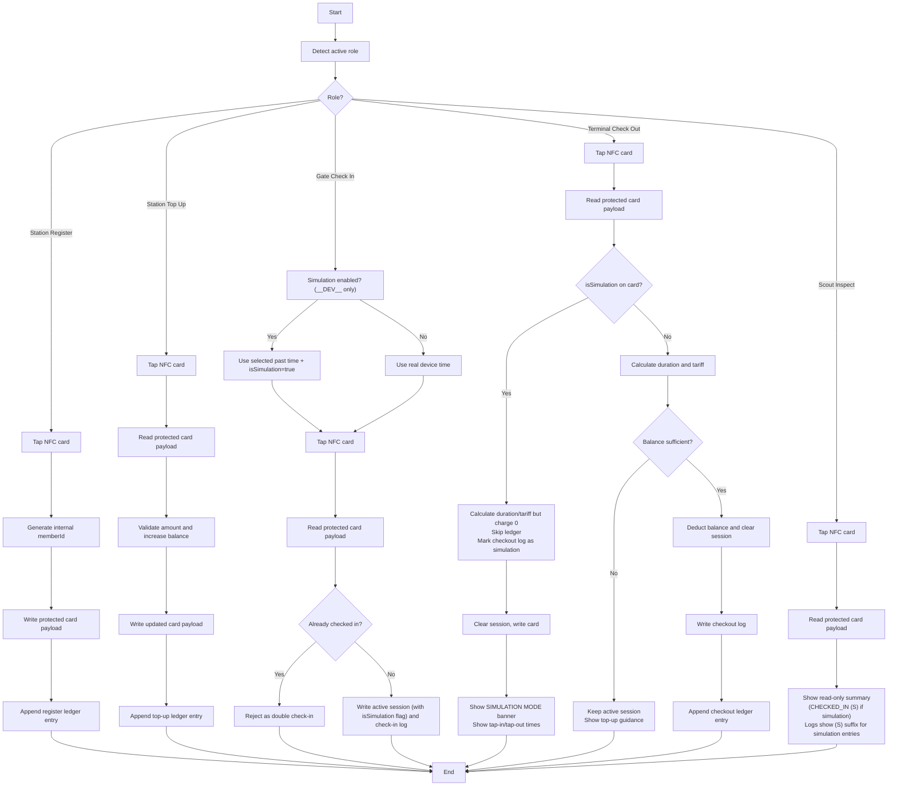

# Membership Benefit Card UML and System Diagrams

This document contains the baseline UML/system diagrams for the current MBC scope.

Scope reflected here:

- one app with four roles: Station, Gate, Terminal, Scout
- NFC card as member-state source of truth
- local SQLite ledger as device-local reporting and audit store
- Android-first real NFC validation
- parking as the only MVP activity, with reusable activity flow design for future extension
- simulation mode at Gate (**DEV** only) for testing/demo with past check-in time

## 1. Component Diagram

```mermaid
flowchart LR
  UI["Presentation Layer\nRole Switcher\nStation\nGate\nTerminal\nScout"] --> APP["Application Layer\nUse Cases\nDTOs"]
  APP --> DOMAIN["Domain Layer\nEntities\nPolicies\nTariff Rules"]
  INFRA["Infrastructure Layer\nNFC Repository\nCard Codec\nSilent Shield\nSQLite Ledger"] --> APP
  INFRA --> DOMAIN

  NFC["NFC Card\nMember State\nBalance\nVisit Status\nLast 5 Logs"]:::ext
  DB["SQLite Ledger\nDevice-Local Audit and Reporting"]:::ext

  UI --> INFRA
  INFRA --> NFC
  INFRA --> DB

  classDef ext fill:#f7f7f7,stroke:#666,stroke-width:1px;
```

## 2. Use-Case Diagram

```mermaid
flowchart LR
  Admin["Cooperative Admin"] --> UC1["Register Member Card"]
  Admin --> UC2["Top Up Balance"]
  Admin --> UC3["View Station Ledger Summary"]

  GateOp["Gate Operator"] --> UC4["Check In Parking"]
  GateOp --> UC5["Check In Parking (Simulation)"]

  TerminalOp["Terminal Operator"] --> UC6["Check Out Parking"]
  TerminalOp --> UC7["Handle Insufficient Balance"]

  Member["Member / Scout User"] --> UC8["Inspect Card"]

  UC1 --> SYS["MBC App"]
  UC2 --> SYS
  UC3 --> SYS
  UC4 --> SYS
  UC5 --> SYS
  UC6 --> SYS
  UC7 --> SYS
  UC8 --> SYS

  Note1["Simulation mode: __DEV__ only\nPast time via DateTimePicker\nisSimulation flag stored on card\nTerminal skips deduction"]
```

## 3. Sequence Diagram: Station Registration

```mermaid
sequenceDiagram
  actor Admin as Station Admin
  participant UI as Station Screen
  participant Register as Register Member Use Case
  participant CardRepo as MbcCardRepository
  participant Ledger as LocalLedgerRepository
  participant Card as NFC Card

  Admin->>UI: Tap register card
  UI->>Register: execute()
  Register->>Register: generate internal memberId
  Register->>CardRepo: writeCard(newCard)
  CardRepo->>Card: write protected MBC payload
  Card-->>CardRepo: success
  Register->>Ledger: append(register entry)
  Ledger-->>Register: success
  Register-->>UI: success result
  UI-->>Admin: show registered card summary
```

## 4. Sequence Diagram: Station Top-Up

```mermaid
sequenceDiagram
  actor Admin as Station Admin
  participant UI as Station Screen
  participant TopUp as Top Up Use Case
  participant CardRepo as MbcCardRepository
  participant Ledger as LocalLedgerRepository
  participant Card as NFC Card

  Admin->>UI: Enter amount and tap card
  UI->>TopUp: execute(amount)
  TopUp->>CardRepo: readCard()
  CardRepo->>Card: read protected payload
  Card-->>CardRepo: card data
  CardRepo-->>TopUp: decoded card
  TopUp->>TopUp: validate positive amount
  TopUp->>TopUp: increase balance and append log
  TopUp->>CardRepo: writeCard(updatedCard)
  CardRepo->>Card: write updated payload
  Card-->>CardRepo: success
  TopUp->>Ledger: append(top up entry)
  Ledger-->>TopUp: success
  TopUp-->>UI: success result
  UI-->>Admin: show updated balance
```

## 5. Sequence Diagram: Gate Check-In

```mermaid
sequenceDiagram
  actor Operator as Gate Operator
  participant UI as Gate Screen
  participant CheckIn as Check In Use Case
  participant CardRepo as MbcCardRepository
  participant Card as NFC Card

  Operator->>UI: Toggle simulation mode (optional, __DEV__ only)
  Operator->>UI: Select past date/time via DateTimePicker (if simulation)
  Operator->>UI: Tap card to check in
  UI->>CheckIn: execute(activityType, checkedInAt?, isSimulation?)
  alt checkedInAt is in the future
    CheckIn-->>UI: failure (Simulation time cannot be in the future)
  end
  CheckIn->>CardRepo: readWriteCard(transform)
  CardRepo->>Card: read protected payload
  Card-->>CardRepo: card data
  CardRepo-->>CheckIn: decoded card
  CheckIn->>CheckIn: validate NOT_CHECKED_IN
  CheckIn->>CheckIn: set active session (with isSimulation flag) and append log (with isSimulation flag)
  CheckIn->>CardRepo: write updated card
  CardRepo->>Card: write protected payload (includes s:1 if simulation, log tuple has 4th element)
  Card-->>CardRepo: success
  Note over CheckIn: CHECKIN does NOT append a local ledger row
  CheckIn-->>UI: success result
  UI-->>Operator: show checked-in status (with Simulation label if applicable)
```

## 6. Sequence Diagram: Terminal Check-Out

```mermaid
sequenceDiagram
  actor Operator as Terminal Operator
  participant UI as Terminal Screen
  participant Checkout as Check Out Use Case
  participant CardRepo as MbcCardRepository
  participant Ledger as LocalLedgerRepository
  participant Card as NFC Card

  Operator->>UI: Tap card to check out
  UI->>Checkout: execute(exitTime)
  Checkout->>CardRepo: readWriteCard(transform)
  CardRepo->>Card: read protected payload
  Card-->>CardRepo: card data
  CardRepo-->>Checkout: decoded card
  Checkout->>Checkout: validate CHECKED_IN
  Checkout->>Checkout: read isSimulation flag from activeSession
  Checkout->>Checkout: calculate duration and tariff
  alt Simulation mode (isSimulation = true)
    Checkout->>Checkout: set chargedAmount = 0 (no deduction)
    Checkout->>Checkout: clear session, append log (nominal = calculated fee, isSimulation = true)
    Checkout->>CardRepo: write updated card
    CardRepo->>Card: write protected payload
    Card-->>CardRepo: success
    Note over Checkout,Ledger: Simulation: ledger NOT appended
    Checkout-->>UI: success result (isSimulation, checkedInAt, fee info)
    UI-->>Operator: show tap-in time, fee summary + SIMULATION MODE banner (balance unchanged)
  else Normal mode
    alt Balance sufficient
      Checkout->>Checkout: deduct balance, clear session, append log
      Checkout->>CardRepo: write updated card
      CardRepo->>Card: write protected payload
      Card-->>CardRepo: success
      Checkout->>Ledger: append(checkout entry)
      Ledger-->>Checkout: success
      Checkout-->>UI: success result (checkedInAt, fee summary)
      UI-->>Operator: show tap-in time, tap-out time, remaining balance
    else Insufficient balance
      Checkout-->>UI: failure result with top-up guidance
      UI-->>Operator: show instruction to top up at Station
    end
  end
```

## 7. Sequence Diagram: Scout Inspection

```mermaid
sequenceDiagram
  actor Member as Member
  participant UI as Scout Screen
  participant Inspect as Inspect Card Use Case
  participant CardRepo as MbcCardRepository
  participant Card as NFC Card

  Member->>UI: Tap card to inspect
  UI->>Inspect: execute()
  Inspect->>CardRepo: readCard()
  CardRepo->>Card: read protected payload
  Card-->>CardRepo: card data
  CardRepo-->>Inspect: decoded card
  Inspect-->>UI: read-only summary
  UI-->>Member: show balance, status, and logs
  Note over UI: If activeSession.isSimulation, show "CHECKED_IN (S)"
  Note over UI: Transaction logs with isSimulation show activity name + "(S)"
```

## 8. Sequence Diagram: Local Ledger Write Flow

```mermaid
sequenceDiagram
  participant UseCase as Role Use Case
  participant Ledger as LocalLedgerRepository
  participant Mapper as Ledger Mapper
  participant SQLite as SQLite Database

  UseCase->>UseCase: business action succeeds
  UseCase->>Ledger: append(entry)
  Ledger->>Mapper: map entry to persistence shape
  Mapper-->>Ledger: mapped row
  Ledger->>SQLite: insert row
  SQLite-->>Ledger: success
  Ledger-->>UseCase: success
```

## 9. Activity Diagram: Main Parking Tap-In / Tap-Out Flow

```mermaid
flowchart TD
  A["Start"] --> B["Detect active role"]
  B --> C{"Role?"}

  C -->|Station Register| D["Tap NFC card"]
  D --> E["Generate internal memberId"]
  E --> F["Write protected card payload"]
  F --> G["Append register ledger entry"]
  G --> Z["End"]

  C -->|Station Top Up| H["Tap NFC card"]
  H --> I["Read protected card payload"]
  I --> J["Validate amount and increase balance"]
  J --> K["Write updated card payload"]
  K --> L["Append top-up ledger entry"]
  L --> Z

  C -->|Gate Check In| M["Simulation enabled? (__DEV__ only)"]
  M -->|Yes| M1["Use selected past time + isSimulation=true"]
  M -->|No| M2["Use real device time"]
  M1 --> M3["Tap NFC card"]
  M2 --> M3
  M3 --> N["Read protected card payload"]
  N --> O{"Already checked in?"}
  O -->|Yes| P["Reject as double check-in"]
  P --> Z
  O -->|No| Q["Write active session (with isSimulation flag) and check-in log"]
  Q --> Z

  C -->|Terminal Check Out| R["Tap NFC card"]
  R --> S["Read protected card payload"]
  S --> S1{"isSimulation on card?"}
  S1 -->|Yes| S2["Calculate duration/tariff but charge 0\nSkip ledger\nMark checkout log as simulation"]
  S2 --> S3["Clear session, write card"]
  S3 --> S4["Show SIMULATION MODE banner\nShow tap-in/tap-out times"]
  S4 --> Z
  S1 -->|No| T["Calculate duration and tariff"]
  T --> U{"Balance sufficient?"}
  U -->|No| V["Keep active session\nShow top-up guidance"]
  V --> Z
  U -->|Yes| W["Deduct balance and clear session"]
  W --> X["Write checkout log"]
  X --> Y["Append checkout ledger entry"]
  Y --> Z

  C -->|Scout Inspect| AA["Tap NFC card"]
  AA --> AB["Read protected card payload"]
  AB --> AC["Show read-only summary\n(CHECKED_IN (S) if simulation)\nLogs show (S) suffix for simulation entries"]
  AC --> Z
```

## 10. Notes

- These diagrams intentionally reflect the current MVP and assessment scope.
- Guest flow is excluded.
- Full internal member ID is not shown in normal operator/member screens.
- The local SQLite ledger is device-local reporting support, not member-state truth.
- Real-card behavior remains subject to the final physical NFC tag constraints.
- Simulation mode is available only in debug builds (`__DEV__`). It stores `isSimulation` on the NFC card itself (codec field `s:1` in active session, 4th tuple element in transaction logs), so the flag travels with the card regardless of which device performs checkout.
- Simulation DateTimePicker limits selection to last 3 months (`minimumDate`) and no future dates (`maximumDate`).
- Simulation check-in and checkout transaction logs are marked with `isSimulation` and displayed with `(S)` suffix in Scout.
- Simulation checkouts do not append to the local ledger (no revenue inflation).
- Scout displays "CHECKED_IN (S)" when a card's active session has the simulation flag, and "(S)" on simulation transaction log entries.
- Terminal checkout summary shows both "Tap in at" (from card's checkedInAt) and "Tap out at" times.
- NFC Log Panel component is only rendered in debug builds (`__DEV__` guard at component level). In release builds it returns null.
