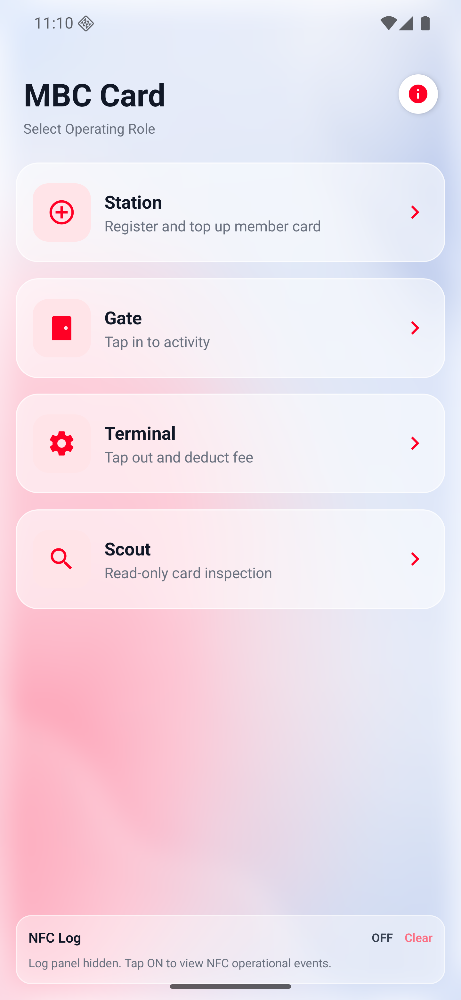
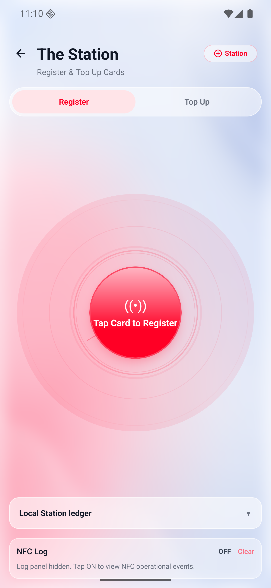
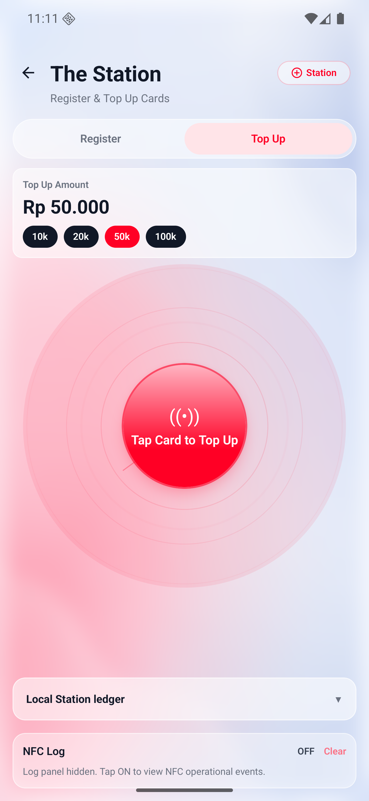
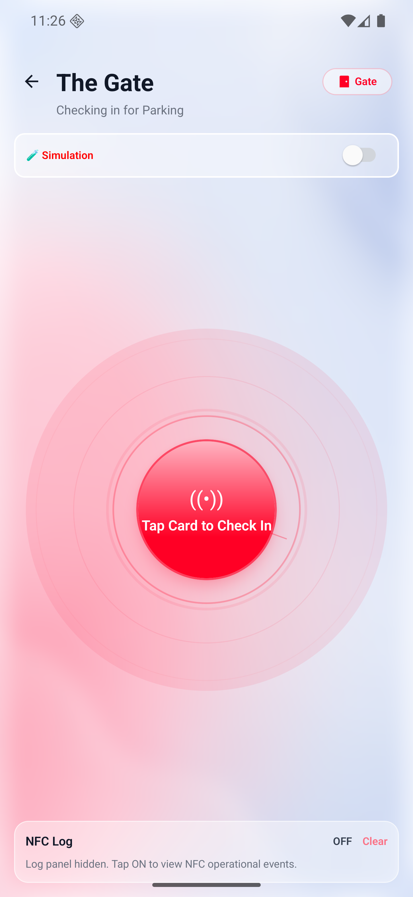
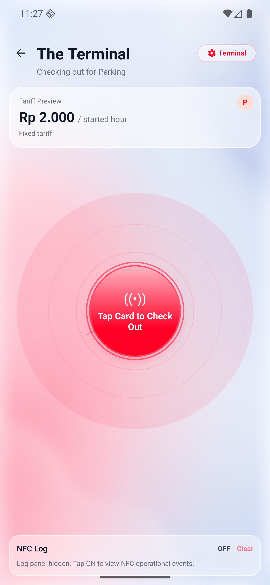
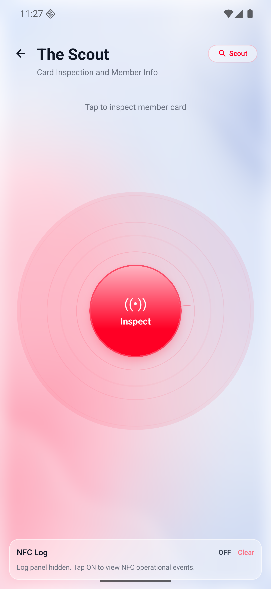
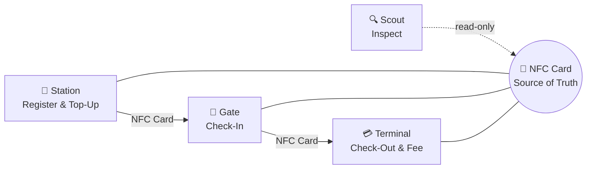
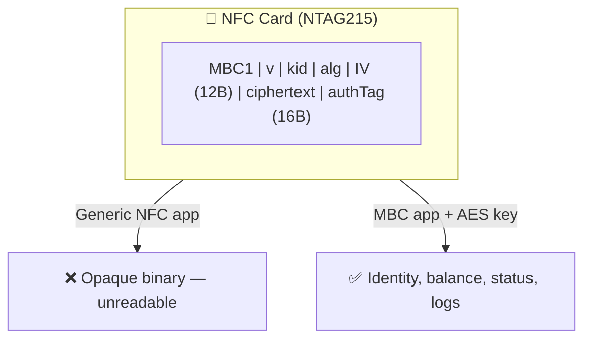

# Membership Benefit Card

[](https://sonarcloud.io/summary/new_code?id=Schitzos_mbc-nfc)
[](https://sonarcloud.io/summary/new_code?id=Schitzos_mbc-nfc)

[](https://sonarcloud.io/summary/new_code?id=Schitzos_mbc-nfc)
[](https://sonarcloud.io/summary/new_code?id=Schitzos_mbc-nfc)
[](https://sonarcloud.io/summary/new_code?id=Schitzos_mbc-nfc)
[](https://sonarcloud.io/summary/new_code?id=Schitzos_mbc-nfc)
[](https://sonarcloud.io/summary/new_code?id=Schitzos_mbc-nfc)


Offline-first NFC membership card app for a village cooperative. The NFC card is the portable source of truth for member identity, balance, and activity state — no backend required.

## Status

**Production-ready assessment build.** Full parking MVP validated on real hardware (ASUS ROG Phone 9 FE + NTAG215).

## App Screenshots

|                      Role Switcher                      |                    Station (Register)                     |                     Station (Top Up)                     |
| :-----------------------------------------------------: | :-------------------------------------------------------: | :------------------------------------------------------: |
|  |  |  |

|                    Gate                    |                      Terminal                      |                    Scout                     |
| :----------------------------------------: | :------------------------------------------------: | :------------------------------------------: |
|  |  |  |

## Architecture

Clean Architecture with SOLID principles:

```
Presentation → Application → Domain
Infrastructure → Application/Domain contracts
```

- **Domain**: Entities, tariff rules, card state policy
- **Application**: Use cases (register, top-up, check-in, check-out, inspect)
- **Infrastructure**: NFC reader/writer, Silent Shield codec, SQLite ledger
- **Presentation**: Role screens, Signal UI components

## Tech Stack

| Area       | Choice                                    |
| ---------- | ----------------------------------------- |
| Framework  | React Native CLI + TypeScript             |
| NFC        | `react-native-nfc-manager`                |
| Crypto     | `react-native-quick-crypto` (AES-256-GCM) |
| Local DB   | SQLite (device-local audit only)          |
| UI         | Signal UI design system                   |
| State      | Zustand + React Context (DI)              |
| Navigation | React Navigation                          |
| Splash     | `react-native-bootsplash`                 |
| Testing    | Jest (477+ tests, 90%+ coverage)          |
| E2E        | Maestro (autonomous UI flows)             |
| Quality    | SonarCloud, Husky hooks                   |

## Key Features

- **4 Roles**: Station, Gate, Terminal, Scout — switchable in one app
- **Station**: Register cards, top-up balance, view local ledger summary
- **Gate**: Check-in members to parking (real device time)
- **Terminal**: Check-out, calculate fee (Rp 2.000/started hour), deduct balance
- **Scout**: Read-only card inspection (balance, status, last 5 transactions)
- **Silent Shield**: AES-256-GCM authenticated encryption — card data unreadable by generic NFC apps
- **NTAG215 Compact Codec**: 362 bytes worst-case, fits within 480-byte NDEF capacity
- **Offline-first**: No internet required for any core flow
- **Single-tap NFC**: Read+validate+transform+write in one session
- **SQLite Ledger**: Device-local audit trail for Station operations

## Parking Flow



1. **Station** registers a new card → writes member ID + initial balance
2. **Station** tops up balance → increases stored value
3. **Gate** checks in → writes entry timestamp to card
4. **Terminal** checks out → calculates fee (Rp 2.000/started hour), deducts balance
5. **Scout** inspects → reads card without modifying (balance, status, last 5 logs)

## Project Structure

```
src/
├── domain/              # Business rules (zero dependencies)
│   └── membership/
│       ├── entities/    # Card, Member, Transaction types
│       ├── policies/    # Tariff calculator, state policy, log policy
│       ├── repositories/# Repository interfaces (ports)
│       └── errors/      # Domain error codes
├── application/         # Use cases (orchestration)
│   ├── use-cases/       # Register, TopUp, CheckIn, CheckOut, Inspect
│   └── dto/             # Presentation-safe data transfer objects
├── infrastructure/      # External implementations
│   ├── nfc/             # Real NFC repo, mock repo, codec, Silent Shield
│   ├── local-ledger/    # SQLite audit repository
│   └── utils/           # E2E config
├── presentation/        # UI layer
│   ├── screens/         # Splash, RoleSwitcher, Station, Gate, Terminal, Scout
│   ├── components/      # ScreenHeader, RadarZone, NfcActionSheet, SignalButton, etc.
│   ├── hooks/           # Custom React hooks
│   ├── stores/          # Zustand state
│   └── theme/           # Colors, typography, spacing, shadows
├── shared/              # Cross-layer utilities
│   ├── ports/           # Clock abstraction
│   └── utils/           # ID generator, masking
└── app/                 # Composition root
    ├── container.ts     # DI wiring
    ├── navigation.tsx   # React Navigation stack
    └── providers.tsx    # Context providers
```

## Security — Silent Shield

Card data is protected with AES-256-GCM authenticated encryption:



- Member ID, balance, activity status, and transaction logs are **never** stored as plain text
- Tampered payloads are rejected (GCM authentication tag verification)
- Demo uses app-bundled AES key; production requires secure key provisioning

## How to Run

### Prerequisites

Set up your React Native development environment following the [official guide](https://reactnative.dev/docs/set-up-your-environment?platform=android).

Minimum requirements:

| Tool                    | Version             |
| ----------------------- | ------------------- |
| Node.js                 | ≥ 18                |
| JDK                     | 17                  |
| Android Studio          | Latest stable       |
| Android SDK             | API 35 (Android 15) |
| Android SDK Build-Tools | 35.0.0              |
| Android NDK             | 27.1.12297006       |

Ensure the following environment variables are set:

```bash
export ANDROID_HOME=$HOME/Library/Android/sdk   # macOS
export PATH=$PATH:$ANDROID_HOME/emulator
export PATH=$PATH:$ANDROID_HOME/platform-tools
```

### Run the App

```bash
# Install dependencies
npm install

# Start Metro
npm start

# Run on Android (device or emulator)
npm run android
```

**Hardware requirement**: Android device with NFC enabled + NTAG215 tags for real NFC operations.

## E2E Testing (Maestro)

Autonomous UI-level E2E testing using Maestro with a mock NFC repository (no hardware needed):

### Install Maestro

```bash
# macOS / Linux
curl -Ls "https://get.maestro.mobile.dev" | bash

# Verify installation
maestro --version
```

### Run E2E Tests

```bash
# 1. Set E2E_MODE = true in src/infrastructure/utils/e2e.config.ts
# 2. Build the E2E variant
npm run e2e:android

# 3. Run Maestro flows
npm run e2e:test         # All flows
npm run e2e:happy-flow   # Happy path only
npm run e2e:bad-flow     # Error cases only

# 4. Set E2E_MODE = false after testing
```

## Branch Strategy

- `main` → protected release (triggers Firebase App Distribution)
- `develop` → integration
- `feature/*` → implementation branches

## Known Limitations

- iOS NFC write is deferred (read-only/best-effort)
- Demo AES key is app-bundled (production needs secure provisioning)
- SQLite ledger is device-local only, not cross-device
- Device clock correctness is an operational dependency
