# Membership Benefit Card (MBC)

## 📋 Assessment Presentation

> _"One app, four roles, zero internet required"_

---

# 1. Project Overview

## Membership Benefit Card

**Offline-first NFC membership card application for a village cooperative**

| Concept           | Description                                  |
| ----------------- | -------------------------------------------- |
| **One App**       | Single React Native application              |
| **Four Roles**    | Station · Gate · Terminal · Scout            |
| **NFC Card**      | Portable source of truth — no backend needed |
| **Offline-First** | Works without internet by design             |
| **MVP Activity**  | Member Parking (Rp 2.000/started hour)       |

```
  ┌──────────┐     NFC tap      ┌──────────┐
  │  Phone   │ ◄──────────────► │  Card    │
  │  (App)   │   read/write     │ (NTAG215)│
  └──────────┘                  └──────────┘
       │  All data lives on the card
       │  No server, no internet needed
       ▼
  ┌──────────┐
  │  SQLite  │  Local audit ledger (device-only)
  └──────────┘
```

---

# 2. Problem Statement & Goals

## The Problem

> A village cooperative needs modern member services — identity, balance, activity tracking — but **internet connectivity is unstable and unreliable**.

## The Solution

An **offline-first NFC membership card** where the card itself stores all member data, the phone app reads/writes via NFC, and no backend server is required.

| Goal                 | Description                                                       |
| -------------------- | ----------------------------------------------------------------- |
| 🔌 **Offline-First** | All operations work without internet                              |
| 🔒 **Secure**        | AES-256-GCM encryption — unreadable by generic NFC apps           |
| 👤 **Simple**        | Cooperative staff can operate with minimal training               |
| 🔄 **Extensible**    | Parking is first activity; more can be added without code changes |

---

# 3. Requirements Coverage

## 📊 Requirements at a Glance

| Category                    | Count                          | Status         |
| --------------------------- | ------------------------------ | -------------- |
| Business Requirements       | 12 requirements                | ✅ All covered |
| System Requirements         | 14 requirements                | ✅ All covered |
| Functional Requirements     | 17 requirements                | ✅ All covered |
| Non-Functional Requirements | 23 requirements                | ✅ All covered |
| User Stories                | 15 stories (all Must priority) | ✅ All covered |
| Edge Cases                  | 20 scenarios                   | ✅ All handled |

## Key Business Requirements

| #   | Requirement                                        | Verification                 |
| --- | -------------------------------------------------- | ---------------------------- |
| 1   | Offline operation — no internet dependency         | ✅ All flows tested offline  |
| 2   | MBC as portable member identity and benefit card   | ✅ NFC card stores all state |
| 3   | Staff can register cards and top-up balances       | ✅ Station role              |
| 4   | Tap-based entry and exit flows for members         | ✅ Gate + Terminal roles     |
| 5   | Sensitive data not readable by external NFC apps   | ✅ Silent Shield AES-256-GCM |
| 6   | Offline device-side audit trail and income summary | ✅ SQLite ledger             |

## Key System Requirements

| #   | Requirement                                       | Verification             |
| --- | ------------------------------------------------- | ------------------------ |
| 1   | One app with four switchable roles                | ✅ Role Switcher         |
| 2   | NFC read/write without backend API                | ✅ Single-tap operations |
| 3   | Reject tampered, malformed, or unregistered cards | ✅ CARD_TAMPERED error   |
| 4   | Authenticated encryption (Silent Shield)          | ✅ AES-256-GCM           |
| 5   | Local SQLite ledger for offline audit             | ✅ Station reporting     |
| 6   | Toggleable NFC operational log panel              | ✅ All role screens      |

## 🎯 Traceability Matrix (Summary)

Every requirement traces through: **Requirement → Design → Task → Test → Evidence**

| Layer               | Coverage                                   |
| ------------------- | ------------------------------------------ |
| BR → FR mapping     | 12/12 business requirements traced         |
| FR → Design mapping | 17/17 functional requirements traced       |
| FR → Test mapping   | All FRs have unit + device tests           |
| NFR → Verification  | 23/23 non-functional requirements verified |

> Full traceability matrix available in `.codex/specs/TRACEABILITY.md`

---

# 4. Application Flow & Role Responsibilities

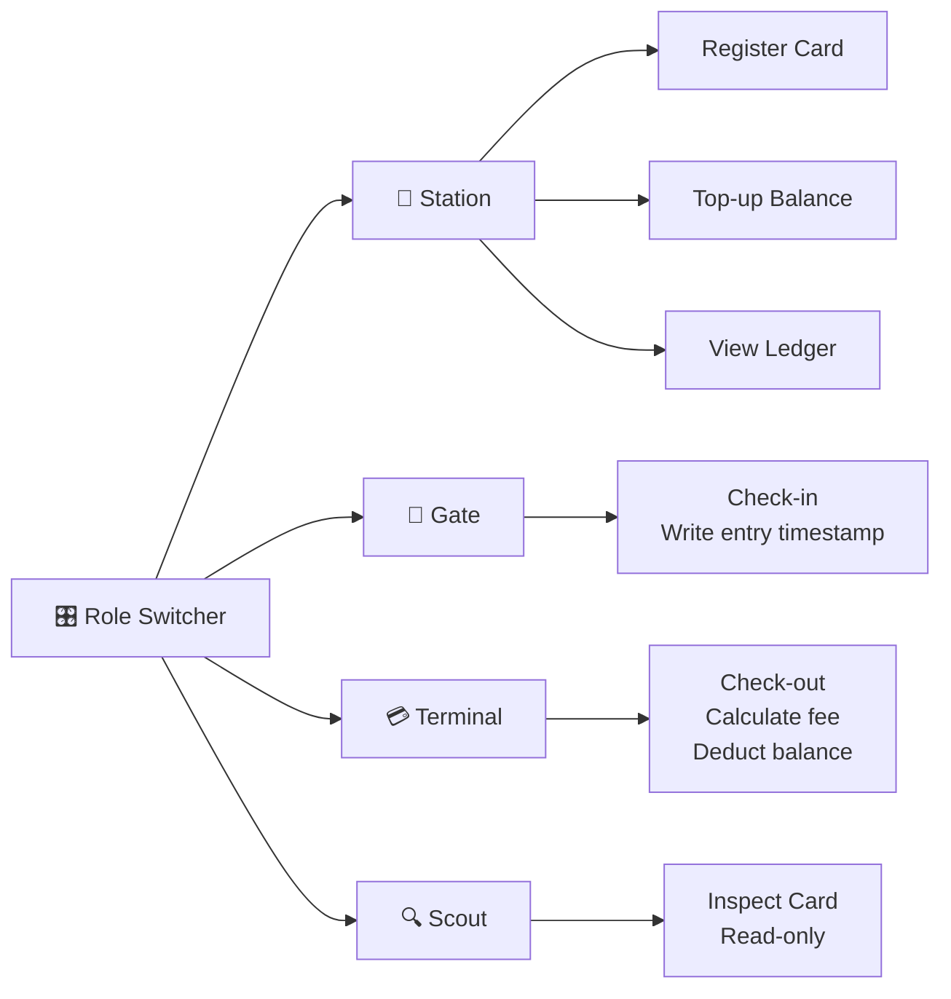

| Role         | Purpose               | NFC Actions  | Ledger Write        |
| ------------ | --------------------- | ------------ | ------------------- |
| **Station**  | Member administration | Read + Write | ✅ Register, Top-up |
| **Gate**     | Entry point           | Read + Write | ❌ Card-only        |
| **Terminal** | Exit point            | Read + Write | ✅ Checkout         |
| **Scout**    | Inspection            | Read only    | ❌ Never writes     |

## Fee Calculation

```
Fee = Rp 2.000 × ⌈duration in hours⌉

Examples:
  1 second    → 1 started hour  → Rp 2.000
  61 minutes  → 2 started hours → Rp 4.000
  3.5 hours   → 4 started hours → Rp 8.000
```

---

# 5. Sequence Diagrams — All Role Flows

## 5.1 Station: Register Member Card

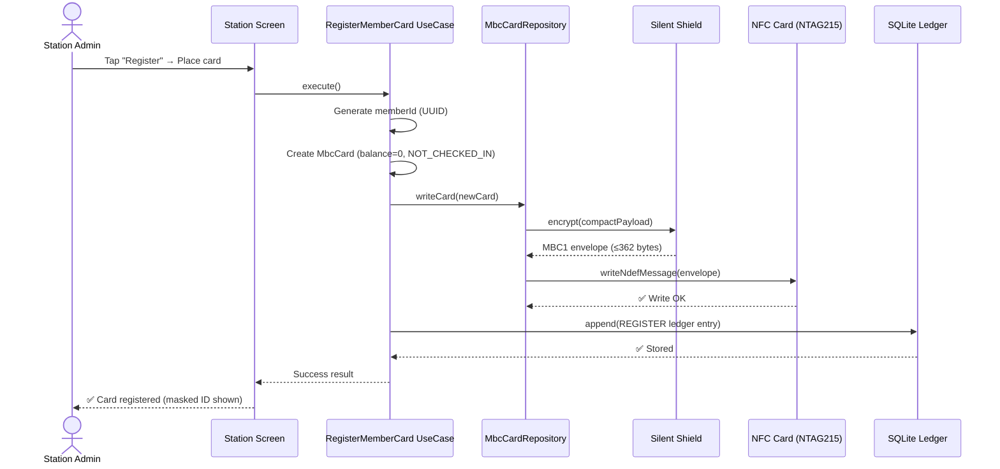

## 5.2 Station: Top-Up Balance

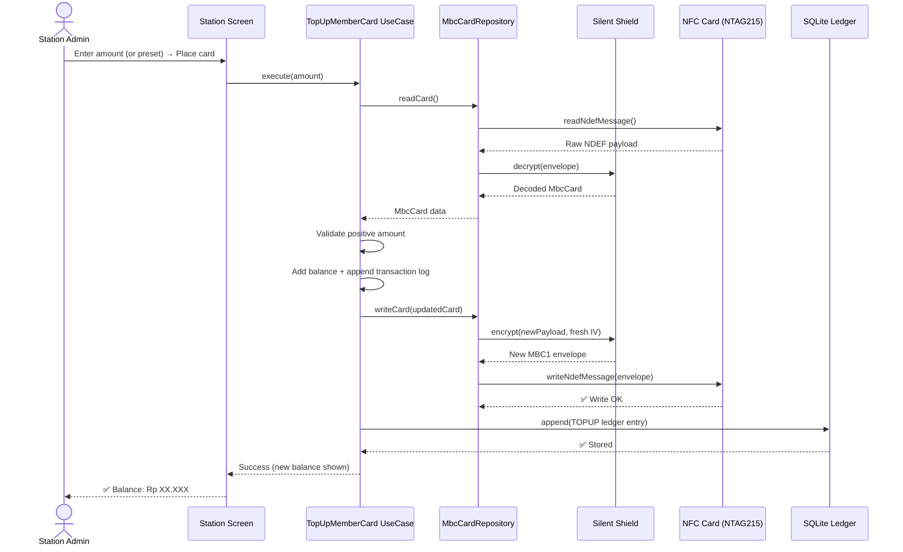

## 5.3 Gate: Check-In to Parking

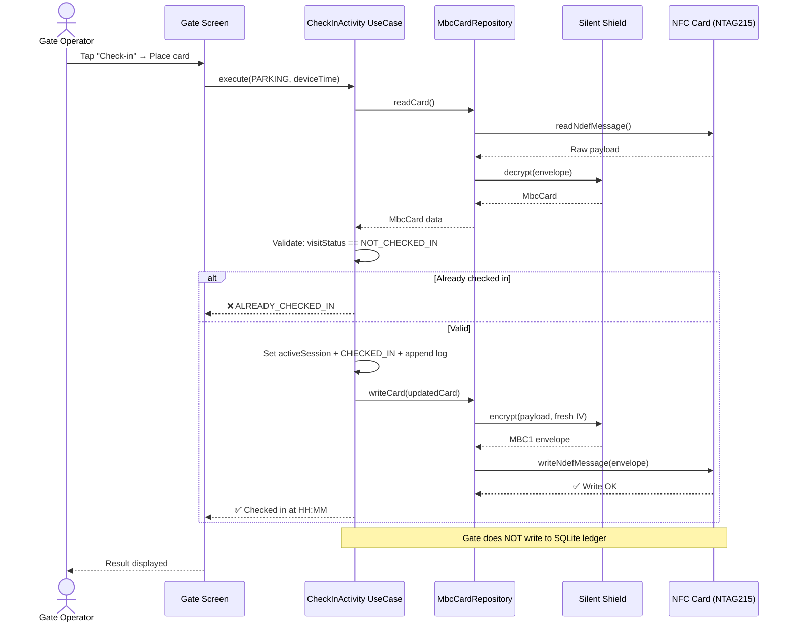

## 5.4 Terminal: Check-Out from Parking

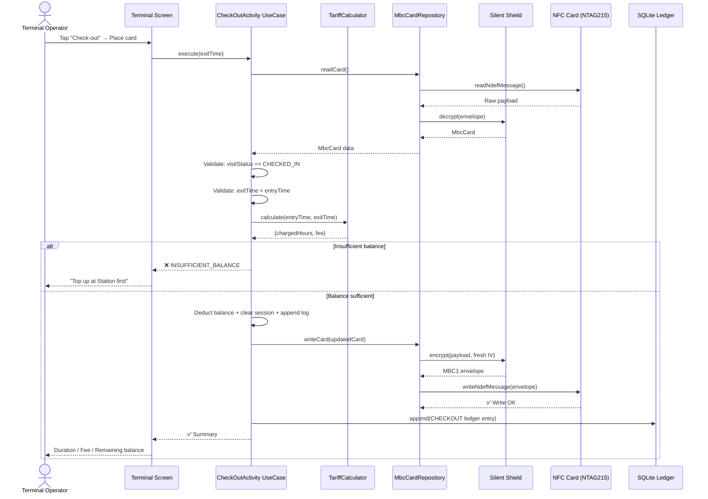

## 5.5 Scout: Inspect Card (Read-Only)

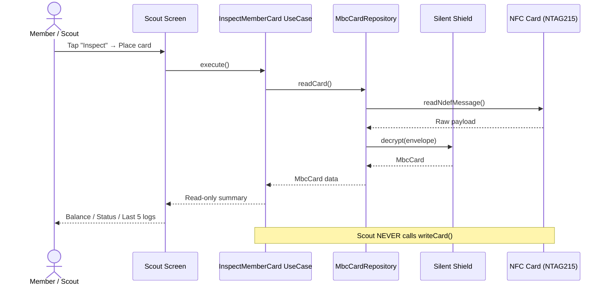

---

# 6. Software Design — Clean Architecture

## Architecture Layers

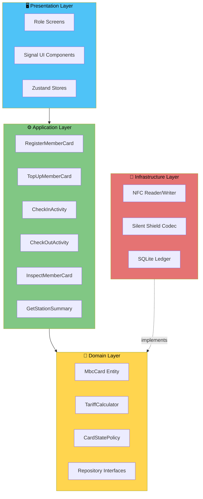

## The Dependency Rule

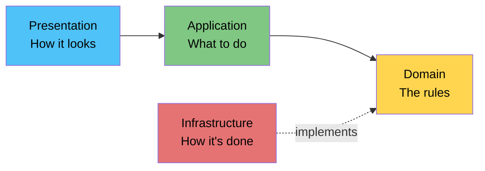

> **Golden Rule:** Inner layers never know about outer layers. Business rules don't care if data comes from NFC or a test mock.

| Layer              | Responsibility                                   | Key Files                                        |
| ------------------ | ------------------------------------------------ | ------------------------------------------------ |
| **Domain**         | Entities, tariff rules, state policy, interfaces | `domain/entities/`, `domain/rules/`              |
| **Application**    | Use case orchestration (6 use cases)             | `application/use-cases/`                         |
| **Infrastructure** | NFC, crypto, SQLite implementations              | `infrastructure/nfc/`, `crypto/`, `persistence/` |
| **Presentation**   | Screens, stores, navigation, Signal UI           | `presentation/screens/`, `components/`           |

## Code Audit Results — Grade: A-

| Category                  | Result     | Details                           |
| ------------------------- | ---------- | --------------------------------- |
| Layer boundary compliance | ✅ PASS    | All 30+ files respect boundaries  |
| Single Responsibility     | ⚠️ 2 minor | Station hook manages 3 flows      |
| Open/Closed               | ✅ PASS    | New activities = config only      |
| Liskov Substitution       | ✅ PASS    | Mock ↔ Real repos interchangeable |
| Interface Segregation     | ✅ PASS    | 3 focused interfaces              |
| Dependency Inversion      | ✅ PASS    | Use cases depend on abstractions  |

> **0 critical violations · 0 major violations · 2 minor observations**

---

# 7. SOLID Design Principles

| Principle                     | Rule                                        | MBC Implementation                                                                              |
| ----------------------------- | ------------------------------------------- | ----------------------------------------------------------------------------------------------- |
| **S** — Single Responsibility | Each class has one job                      | `TariffCalculator` only computes cost; `CardStatePolicy` only validates state                   |
| **O** — Open/Closed           | Open for extension, closed for modification | New activities (gym, library) need zero changes to use cases                                    |
| **L** — Liskov Substitution   | Implementations are interchangeable         | `MockCardRepository` and `RealMbcCardRepository` both satisfy `MbcCardRepository`               |
| **I** — Interface Segregation | Don't depend on unused methods              | 3 focused interfaces: `MbcCardRepository`, `LocalLedgerRepository`, `NfcAvailabilityRepository` |
| **D** — Dependency Inversion  | Depend on abstractions                      | Use cases define interfaces; Infrastructure implements them                                     |

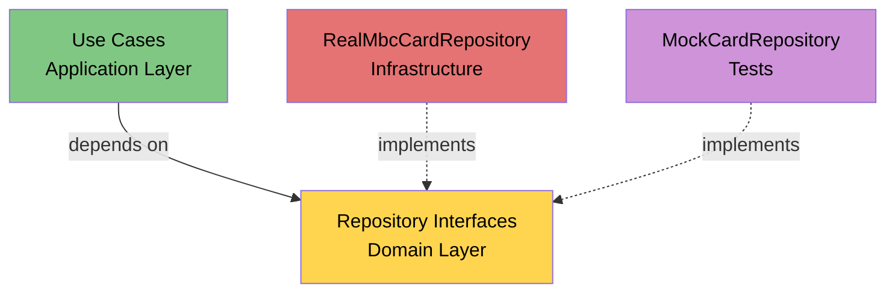

## Package Principles

| Principle                     | MBC Example                                                          |
| ----------------------------- | -------------------------------------------------------------------- |
| **Reuse/Release Equivalency** | Card codec, tariff rules, state policy are independently versionable |
| **Common Closure**            | Tariff logic + card encoding live in same boundary                   |
| **Common Reuse**              | Each role screen imports only needed use cases                       |

---

# 8. Software Security — Silent Shield

## Threat & Solution

| Threat               | Without Protection       | With Silent Shield            |
| -------------------- | ------------------------ | ----------------------------- |
| Generic NFC reader   | ❌ Reads all member data | ✅ Only opaque binary blob    |
| Card cloning         | ❌ Copy-paste attack     | ✅ Auth tag detects tampering |
| Balance manipulation | ❌ Edit balance freely   | ✅ Integrity validation fails |
| Replay attack        | ❌ Reuse old payload     | ✅ Fresh random IV per write  |

## Encryption Flow

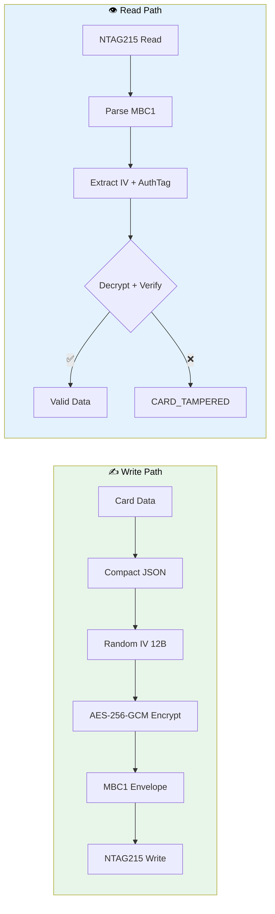

## MBC1 Envelope Format

```
┌────────┬─────┬───────┬──────┬──────────┬─────────────┬────────────┐
│ MBC1   │ Ver │ KeyID │ Algo │ IV (12B) │ AuthTag(16B)│ Ciphertext │
│ 4 bytes│ 1B  │  1B   │  1B  │  random  │  integrity  │  variable  │
└────────┴─────┴───────┴──────┴──────────┴─────────────┴────────────┘
Total overhead: 35 bytes fixed + ciphertext
```

## What's Protected on Card

| Data                | Protection           | Logging Rule   |
| ------------------- | -------------------- | -------------- |
| Member ID           | 🔒 Encrypted on card | Masked in logs |
| Balance             | 🔒 Encrypted on card | Never logged   |
| Visit status        | 🔒 Encrypted on card | Status only    |
| Entry timestamp     | 🔒 Encrypted on card | Never logged   |
| Transaction history | 🔒 Encrypted on card | Never logged   |

---

# 9. NFC Card Payload — NTAG215 Compact Design

## Capacity Analysis

| Metric                       | Value           | Status         |
| ---------------------------- | --------------- | -------------- |
| NTAG215 raw capacity         | 504 bytes       | —              |
| NDEF usable capacity         | 480 bytes       | —              |
| Worst-case encrypted payload | 362 bytes       | ✅ Fits        |
| Safety margin                | 118 bytes (25%) | ✅ Comfortable |

## Compact Payload Fields

| Field | Name         | Content                                 | Example                   |
| ----- | ------------ | --------------------------------------- | ------------------------- |
| `v`   | Version      | Payload version                         | `1`                       |
| `c`   | Counter      | Write counter (monotonic)               | `5`                       |
| `m`   | Member ID    | UUID identifier                         | `"abc-123..."`            |
| `b`   | Balance      | Current balance (IDR)                   | `20000`                   |
| `i`   | Visit info   | `{s, a, t}` — status, activity, time    | `{s:"I", a:"P", t:"..."}` |
| `x`   | Extra        | Reserved                                | `null`                    |
| `n`   | Transactions | Last 5 logs `[activity, nominal, time]` | `[["U",20000,"..."]]`     |

## Activity Codes (Compact)

| Code | Meaning   |
| ---- | --------- |
| `R`  | Register  |
| `U`  | Top-Up    |
| `I`  | Check-In  |
| `O`  | Check-Out |

## Data Transformation Pipeline

```
MbcCard Object → Compact JSON → AES-256-GCM Encrypt → MBC1 Envelope → NDEF Message → NFC Tag
     ~200B          ~327B            +35B overhead         362B             362B         ✅
```

---

# 10. UI/UX Design — Signal UI System

## Design System Adoption

Based on **Telkomsel Signal UI** design system (Figma source).

| Token Category      | Key Values                                      |
| ------------------- | ----------------------------------------------- |
| **Primary Color**   | `#FF0025` (Telkomsel Red)                       |
| **Secondary Color** | `#001A41` (Dark Navy)                           |
| **Typography**      | Telkomsel Batik Sans (headers) + Poppins (body) |
| **Shadows**         | 3 elevation levels                              |
| **Radius**          | Consistent corner radius tokens                 |

## Screen Mapping

| Screen        | Signal UI Components Used                                          |
| ------------- | ------------------------------------------------------------------ |
| Role Switcher | SignalOptionCard (4 role cards)                                    |
| Station       | SignalTextField, SignalButton, SegmentedControl, SignalSurfaceCard |
| Gate          | SignalButton, SignalStatusBanner, RadarZone                        |
| Terminal      | SignalButton, SignalStatusBanner, CheckoutSummaryCard              |
| Scout         | MemberCardInfo, LatestLogsCard, SignalSurfaceCard                  |
| All Roles     | NfcActionSheet (ScanningRings), NfcLogPanel, BackgroundDecor       |

## Custom MBC Components

| Component              | Purpose                                                           |
| ---------------------- | ----------------------------------------------------------------- |
| **RadarZone**          | Dark immersive zone with concentric radar rings + sweep animation |
| **ScanningRings**      | 3 pulsing concentric rings + breathing NFC icon during scan       |
| **NfcActionSheet**     | Bottom sheet with states: scanning → success → error → confirm    |
| **NfcLogPanel**        | Toggleable operational log (timestamp + event text)               |
| **SignalStatusBanner** | Role-colored status feedback (success/error/info)                 |

---

# 11. Software Quality

## 📊 Test Metrics

| Metric                    | Value      | Target |
| ------------------------- | ---------- | ------ |
| Automated tests           | **444+**   | —      |
| Test suites               | **65**     | —      |
| Line coverage             | **100%**   | ≥99%   |
| Statement coverage        | **99%+**   | ≥99%   |
| Branch coverage           | **99%+**   | ≥99%   |
| npm audit vulnerabilities | **0**      | 0      |
| SonarCloud quality gate   | **PASSED** | Pass   |
| Code audit grade          | **A-**     | —      |

## Test Strategy (6 Levels)

| Level              | Scope                              | Environment         |
| ------------------ | ---------------------------------- | ------------------- |
| **Unit**           | Domain rules, tariff, state, codec | Jest (no hardware)  |
| **Application**    | Use case orchestration             | Jest + mock repos   |
| **Infrastructure** | NFC repo, SQLite, crypto           | Jest + mocks        |
| **Presentation**   | Screens, hooks, stores             | Jest + RNTL         |
| **Device**         | Real NFC read/write flows          | ASUS ROG Phone 9 FE |
| **Security**       | Tamper detection, encryption       | Jest + device       |

## How 444+ Tests Run Without NFC Hardware

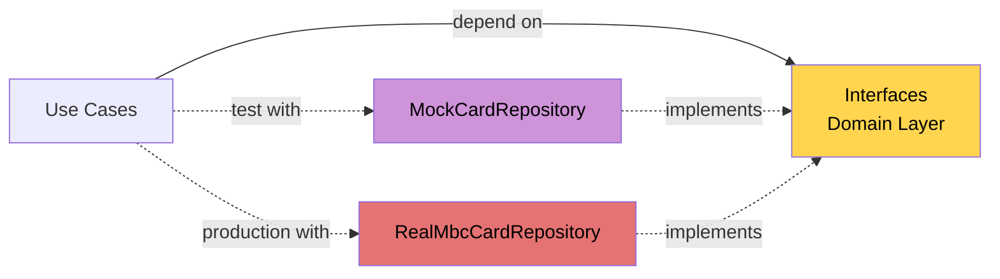

> Clean Architecture makes this possible: mock repositories replace real NFC/SQLite. All 444+ tests run in CI without physical devices.

## Quality Gates Enforced

- ✅ `jest.config.js` — 99% threshold (build fails if coverage drops)
- ✅ SonarCloud — quality gate on every PR
- ✅ Husky pre-commit hooks — lint + test
- ✅ PR requires QA screenshot evidence
- ✅ `npm audit` — 0 vulnerabilities enforced

---

# 12. Software Deployment — CI/CD Pipeline

## Release Automation

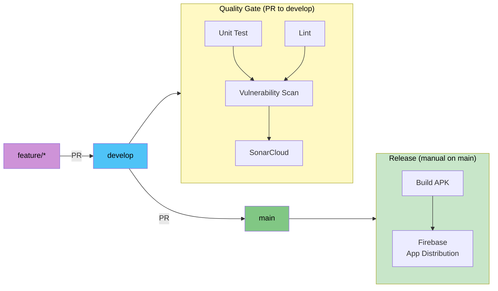

## CI/CD Behavior

| Trigger                       | Pipeline Stages                                                                        | Purpose                   |
| ----------------------------- | -------------------------------------------------------------------------------------- | ------------------------- |
| **PR to `develop`**           | Unit Test → Lint → Vulnerability Scan → SonarCloud                                     | Quality gate before merge |
| **Manual dispatch on `main`** | Unit Test → Lint → Vulnerability Scan → SonarCloud → Build APK → Firebase Distribution | Release to testers        |

### PR to `develop` — Quality Gate

```
┌───────────┐     ┌──────┐
│ Unit Test │     │ Lint │    (parallel)
└─────┬─────┘     └──┬───┘
      └───────┬───────┘
              ▼
    ┌───────────────────┐
    │ Vulnerability Scan│    npm audit --audit-level=high
    └─────────┬─────────┘
              ▼
    ┌───────────────────┐
    │   SonarCloud Scan │    Coverage + code quality
    └───────────────────┘
```

All 4 jobs must pass before PR can be merged.

### Manual Dispatch on `main` — Build & Distribute

```
Quality Gate (same as above)
              │
              ▼
    ┌───────────────────┐
    │     Build APK     │    Bundle JS → Gradle assembleDebug
    └─────────┬─────────┘
              ▼
    ┌───────────────────┐
    │ Firebase App Dist │    Upload to "testers" group
    └───────────────────┘
```

Build and distribution only run on `main` branch via manual workflow dispatch.

## Required Secrets

| Secret                          | Purpose             |
| ------------------------------- | ------------------- |
| `GOOGLE_SERVICES_JSON`          | Firebase config     |
| `FIREBASE_APP_ID`               | Distribution target |
| `FIREBASE_SERVICE_ACCOUNT_JSON` | Auth for upload     |
| `SONAR_TOKEN`                   | SonarCloud analysis |

## Branching Strategy

| Branch      | Purpose                         | Protection         |
| ----------- | ------------------------------- | ------------------ |
| `main`      | Release (triggers distribution) | Protected, PR-only |
| `develop`   | Integration                     | PR-only            |
| `feature/*` | Implementation                  | Developer branches |

---

# 13. Risk Management

## Risk Register — 20/20 Closed ✅

| ID    | Risk                              | Impact | Mitigation                         | Status    |
| ----- | --------------------------------- | ------ | ---------------------------------- | --------- |
| R-001 | NTAG215 capacity exceeded         | High   | Compact codec: 362B < 480B         | ✅ Closed |
| R-002 | iOS NFC write unsupported         | Medium | Deferred — Android-first MVP       | ✅ Closed |
| R-003 | Sensitive data exposed via NFC    | High   | Silent Shield AES-256-GCM          | ✅ Closed |
| R-004 | Demo key confused with production | Medium | Documented + ADR                   | ✅ Closed |
| R-005 | Write interrupted mid-operation   | Medium | writeNdefMessage throws on failure | ✅ Closed |
| R-006 | Double check-in/out               | Medium | CardStatePolicy validation         | ✅ Closed |
| R-007 | Coverage gaps                     | Medium | 100% achieved (444+ tests)         | ✅ Closed |
| R-008 | Clock manipulation                | Low    | Operational procedure documented   | ✅ Closed |
| R-009 | Card removed during write         | Medium | NFC session error handling         | ✅ Closed |
| R-010 | Insufficient balance at exit      | Medium | Clear top-up guidance shown        | ✅ Closed |

> Full 20-risk register with all mitigations in `.codex/specs/RISKS.md`

## Edge Cases Handled (20 total)

| Category               | Edge Cases                                                                           | Count | Handling                                               |
| ---------------------- | ------------------------------------------------------------------------------------ | :---: | ------------------------------------------------------ |
| **State conflicts**    | Double check-in tap · Double check-out tap · Re-register existing card               |   3   | Reject duplicate check-in/out with clear error         |
| **Balance & input**    | Insufficient balance at exit · Top-up while checked in · Invalid top-up input        |   3   | Guidance shown, state preserved, input validated       |
| **Card integrity**     | Unknown card tapped · Tampered payload · Unsupported schema version                  |   3   | CARD_TAMPERED / CARD_UNSUPPORTED / version rejection   |
| **NFC failures**       | Card removed mid-write · Buffer polyfill missing · Sheet dismissed mid-scan          |   3   | Error recovery + retry guidance + clean session cancel |
| **Capacity & storage** | Payload exceeds capacity · More than 5 logs · Ledger deleted · Multi-device use      |   4   | Compact payload, log rotation, card as source of truth |
| **Time & edge**        | Exit before entry time · Future time removed · Readback removed · Wrong device clock |   4   | INVALID_DURATION rejection, boundary validation        |

> Full edge case definitions in `.codex/specs/EDGE_CASES.md`

---

# 14. Way of Working — Delivery Workflow

## 12 Specialized Delivery Roles

| Role                     | Responsibility                          |
| ------------------------ | --------------------------------------- |
| Product Owner            | Scope decisions, acceptance criteria    |
| Project Manager          | Milestones, coordination, demo prep     |
| System Analyst           | Requirements, edge cases, traceability  |
| Software Architect       | Architecture, module boundaries, ADRs   |
| Senior React Native FE   | Implementation, refactoring             |
| NFC Native Specialist    | NFC integration, tag compatibility      |
| UI/UX Designer           | Signal UI, role flows, screen states    |
| Senior QA                | Test cases, evidence, release readiness |
| Test Automation Engineer | Jest tests, coverage, CI                |
| Security Pentester       | Threat model, Silent Shield audit       |
| Technical Writer         | Documentation, presentation             |
| Demo/Release Engineer    | CI/CD, Firebase, demo scripts           |

## Delivery Pipeline

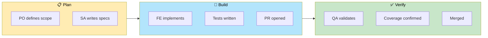

## Task State Machine

```
TODO → IN_PROGRESS → DEV_DONE → UNIT_TEST_DONE → QA_READY → QA_PASSED → PR_READY → MERGED → DONE
```

## Execution Phases (10 Phases)

| Phase | Focus                    | Status |
| ----- | ------------------------ | ------ |
| 0     | Project setup & specs    | ✅     |
| 1     | Domain layer             | ✅     |
| 2     | Application layer        | ✅     |
| 3     | Infrastructure layer     | ✅     |
| 4     | Presentation layer       | ✅     |
| 5     | Integration & NFC        | ✅     |
| 6     | Security (Silent Shield) | ✅     |
| 7     | Quality & coverage       | ✅     |
| 8     | Real device validation   | ✅     |
| 9     | Polish & documentation   | ✅     |

---

# 15. Architecture Decision Records (Key ADRs)

| ADR     | Decision                      | Rationale                                        |
| ------- | ----------------------------- | ------------------------------------------------ |
| ADR-001 | React Native CLI (not Expo)   | Full native module access for NFC                |
| ADR-003 | NFC Card as core data store   | Offline-first — no server dependency             |
| ADR-004 | Clean Architecture            | Testable, maintainable, replaceable layers       |
| ADR-005 | Silent Shield (AES-256-GCM)   | Production-grade authenticated encryption        |
| ADR-007 | Fixed parking tariff          | Single isolated constant, not magic numbers      |
| ADR-009 | Auto-generated member ID      | No manual input errors, UUID uniqueness          |
| ADR-011 | Reusable activity flow        | Parking first, extensible for future             |
| ADR-013 | SQLite as device-local ledger | Audit trail without replacing card truth         |
| ADR-016 | Feature branch promotion      | Controlled release via main → Firebase           |
| ADR-017 | Standardized payload v1       | Compact fields + Silent Shield + ledger boundary |
| ADR-021 | Firebase App Distribution     | Automated release channel                        |
| ADR-022 | QA screenshot evidence gate   | Visual proof before merge                        |

> 22 total ADRs documented in `.codex/specs/DECISIONS.md`

---

# 16. Tech Stack

| Area           | Choice                        | Rationale                                   |
| -------------- | ----------------------------- | ------------------------------------------- |
| **Framework**  | React Native CLI + TypeScript | Full native NFC access                      |
| **NFC**        | react-native-nfc-manager      | Industry standard RN NFC library            |
| **Crypto**     | react-native-quick-crypto     | Native-backed AES-256-GCM (not JS polyfill) |
| **Local DB**   | SQLite                        | Offline-first, no server dependency         |
| **UI**         | Signal UI design system       | Telkomsel brand consistency                 |
| **State**      | Zustand + React Context (DI)  | Lightweight state + dependency injection    |
| **Navigation** | React Navigation              | Standard RN navigation                      |
| **Testing**    | Jest (444+ tests)             | 100% coverage, CI-friendly                  |
| **Quality**    | SonarCloud + Husky            | Automated quality gates                     |
| **CI/CD**      | GitHub Actions → Firebase     | Automated distribution                      |

---

# 17. Real Device Validation

## Test Environment

| Component        | Specification                     |
| ---------------- | --------------------------------- |
| **Device**       | ASUS ROG Phone 9 FE (Android 14+) |
| **NFC Tag**      | NTAG215 (504B raw / 480B NDEF)    |
| **Cards Tested** | 3 physical NTAG215 cards          |

## Device Test Results — All PASS ✅

| Test Case | Flow                           | Result                   |
| --------- | ------------------------------ | ------------------------ |
| DTM-001   | Register new card              | ✅ PASS                  |
| DTM-002   | Top-up balance                 | ✅ PASS                  |
| DTM-003   | Check-in to parking            | ✅ PASS                  |
| DTM-004   | Check-out from parking         | ✅ PASS                  |
| DTM-005   | Scout inspection               | ✅ PASS                  |
| DTM-006   | Silent Shield encryption       | ✅ PASS                  |
| DTM-007   | Generic NFC reader test        | ✅ Opaque data confirmed |
| DTM-008   | Double check-in rejection      | ✅ PASS                  |
| DTM-009   | Insufficient balance rejection | ✅ PASS                  |
| DTM-010   | Tampered card rejection        | ✅ PASS                  |
| DTM-011   | Unregistered card handling     | ✅ PASS                  |
| DTM-012   | NFC log panel toggle           | ✅ PASS                  |
| DTM-013   | Payload capacity validation    | ✅ 362B < 480B           |

---

# 18. Demo Session — Complete Parking Cycle

## Demo Script

| Step | Role     | Action                         | Expected Result                 |
| ---- | -------- | ------------------------------ | ------------------------------- |
| 1    | —        | Open app                       | Role Switcher (4 roles visible) |
| 2    | Station  | Register → Tap card            | ✅ New member ID shown          |
| 3    | Station  | Top-up Rp 20.000 → Tap card    | ✅ Balance: Rp 20.000           |
| 4    | Gate     | Check-in → Tap card            | ✅ Checked in at HH:MM          |
| 5    | —        | Wait ~1-2 minutes              | Time passes for fee             |
| 6    | Terminal | Check-out → Tap card           | ✅ Fee shown, balance deducted  |
| 7    | Scout    | Inspect → Tap card             | ✅ Balance, status, 4 logs      |
| 8    | —        | Generic NFC reader → Scan card | ❌ Only opaque MBC1 binary      |

## Demo Sequence Diagram

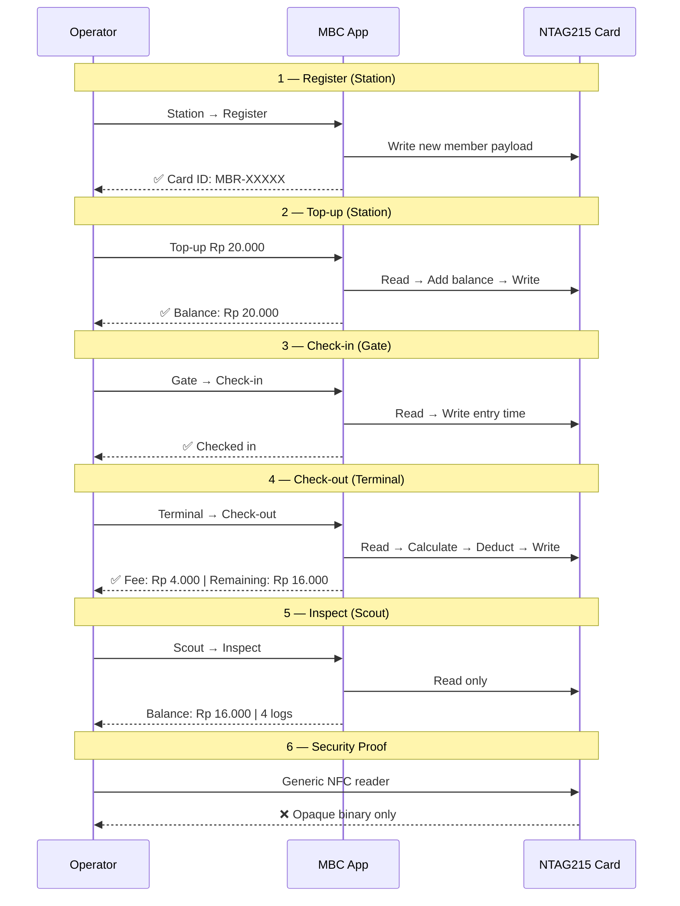

## Security Verification

| What's Visible (Generic Reader) | What's NOT Visible     |
| ------------------------------- | ---------------------- |
| NDEF record exists              | ❌ Member name/ID      |
| Binary blob (MBC1 header)       | ❌ Balance amount      |
| ~362 bytes encrypted data       | ❌ Transaction history |
| Opaque byte sequence            | ❌ Check-in timestamp  |

---

# 19. Key Achievements

## 📊 Numbers at a Glance

| Metric                    | Value     |
| ------------------------- | --------- |
| 🧪 Automated tests        | **444+**  |
| 📦 Test suites            | **65**    |
| 📈 Line coverage          | **100%**  |
| 🔒 Vulnerabilities        | **0**     |
| ⚠️ Risks closed           | **20/20** |
| 🏗️ Phases complete        | **10/10** |
| 👥 Roles implemented      | **4/4**   |
| ✅ Device flows validated | **5/5**   |
| 📋 Edge cases handled     | **20/20** |
| 🏆 Code audit grade       | **A-**    |
| 📐 ADRs documented        | **22**    |
| 🎯 Requirements traced    | **All**   |

## Architecture Benefits Delivered

| Promise                   | Evidence                                          |
| ------------------------- | ------------------------------------------------- |
| Offline-first             | All flows work without internet                   |
| Testable without hardware | 444+ tests in CI, no NFC needed                   |
| Secure                    | AES-256-GCM, tamper detection validated on device |
| Extensible                | New activities = config change only               |
| Simple for staff          | Role-based UI, one action per screen              |
| Maintainable              | Grade A- audit, 0 critical violations             |

---

# 20. Known Limitations & Production Gaps

## Prototype Scope Limitations

| Limitation              | Impact                | Mitigation                                 |
| ----------------------- | --------------------- | ------------------------------------------ |
| iOS NFC write deferred  | Android-only MVP      | iOS read possible; write needs entitlement |
| Demo AES key bundled    | Not production-secure | Documented; production needs HSM           |
| SQLite is device-local  | No cross-device sync  | Sufficient for single-station              |
| Device clock dependency | Fee accuracy          | Operational procedure                      |

## Production Hardening Roadmap

| Gap                     | What's Needed               | Priority |
| ----------------------- | --------------------------- | -------- |
| Key management          | HSM / secure enclave        | High     |
| Fleet key rotation      | Re-encrypt protocol         | High     |
| Backend reconciliation  | Optional server sync        | Medium   |
| Operator authentication | Login/PIN for staff         | Medium   |
| Multi-tag support       | DESFire for higher security | Low      |
| iOS NFC write           | Apple NFC entitlement       | Low      |
| Multi-device ledger     | Cloud sync for reporting    | Low      |

---

# 21. Definition of Done — Submission Checklist

| Category          | Criteria                                                          | Status |
| ----------------- | ----------------------------------------------------------------- | ------ |
| **Repository**    | Source code on GitHub                                             | ✅     |
| **App**           | Working build, no crashes in demo flows                           | ✅     |
| **Demo**          | Screenshot/video evidence of all flows                            | ✅     |
| **Documentation** | Technical + non-technical docs                                    | ✅     |
| **Presentation**  | Covers UI/UX, Design, Construction, Quality, Deployment, Security | ✅     |
| **Tests**         | 444+ tests, 100% coverage, 0 vulnerabilities                      | ✅     |
| **Quality**       | SonarCloud PASSED, Code Audit A-                                  | ✅     |
| **Security**      | Silent Shield validated, tamper detection working                 | ✅     |
| **Device**        | Real NFC validated (ASUS ROG + NTAG215)                           | ✅     |
| **CI/CD**         | GitHub Actions → Firebase App Distribution                        | ✅     |
| **Specs**         | All requirements traced and verified                              | ✅     |
| **Risks**         | 20/20 risks mitigated and closed                                  | ✅     |

---

# 📌 Summary

> **In one sentence:** Clean Architecture + SOLID keeps the village cooperative's business rules **safe at the center**, while NFC hardware, encryption, and screens are **replaceable outer shells** that can evolve independently.

### Assessment Coverage

| Presentation Topic       | Section                                   |
| ------------------------ | ----------------------------------------- |
| 🎨 UI/UX Design          | §10 Signal UI System                      |
| 🏗️ Software Design       | §6 Clean Architecture, §7 SOLID, §15 ADRs |
| 🔨 Software Construction | §5 Sequence Diagrams, §9 Card Payload     |
| ✅ Software Quality      | §11 Testing, §13 Risk Management          |
| 🚀 Software Deployment   | §12 CI/CD Pipeline                        |
| 🔒 Software Security     | §8 Silent Shield, §9 NTAG215 Capacity     |

---

_Membership Benefit Card — Assessment Presentation_
_Built with Clean Architecture · SOLID Principles · Offline-First Design · Silent Shield Security_
