# Membership Benefit Card (MBC)

## 📋 Assessment Presentation

> _"One app, four roles, zero internet required"_

---

# 1. Project Overview

## Membership Benefit Card

**Offline-first NFC membership card application for a village cooperative**

| Concept           | Description                                  |
| ----------------- | -------------------------------------------- |
| **One App**       | Single React Native application              |
| **Four Roles**    | Station · Gate · Terminal · Scout            |
| **NFC Card**      | Portable source of truth — no backend needed |
| **Offline-First** | Works without internet by design             |
| **MVP Activity**  | Member Parking (Rp 2.000/started hour)       |

```
  ┌──────────┐     NFC tap      ┌──────────┐
  │  Phone   │ ◄──────────────► │  Card    │
  │  (App)   │   read/write     │ (NTAG215)│
  └──────────┘                  └──────────┘
       │  All data lives on the card
       │  No server, no internet needed
       ▼
  ┌──────────┐
  │ OP-SQLite│  Local audit ledger (device-only)
  └──────────┘
```

### Key Stats

| Metric           | Value                            |
| ---------------- | -------------------------------- |
| Automated tests  | 472+                             |
| Test suites      | 75                               |
| Line coverage    | 100%                             |
| Encryption       | AES-256-GCM                      |
| Payload size     | 362 bytes (worst-case encrypted) |
| Tag capacity     | 480 bytes NDEF (NTAG215)         |
| Validated device | ASUS ROG Phone 9 FE + NTAG215    |

---

# 2. Problem Statement & Goals

## The Problem

> A village cooperative needs modern member services — identity, balance, activity tracking — but **internet connectivity is unstable and unreliable**.

## The Solution

An **offline-first NFC membership card** where the card itself stores all member data, the phone app reads/writes via NFC, and no backend server is required.

| Goal                 | Description                                                       |
| -------------------- | ----------------------------------------------------------------- |
| 🔌 **Offline-First** | All operations work without internet                              |
| 🔒 **Secure**        | AES-256-GCM encryption — unreadable by generic NFC apps           |
| 👤 **Simple**        | Cooperative staff can operate with minimal training               |
| 🔄 **Extensible**    | Parking is first activity; more can be added without code changes |
| 🧪 **Testable**      | Simulation mode for demo without waiting real parking duration    |

---

# 3. Requirements Coverage

## 📊 Requirements at a Glance

| Category                    | Count                                          | Status         |
| --------------------------- | ---------------------------------------------- | -------------- |
| Business Requirements       | 12 requirements                                | ✅ All covered |
| System Requirements         | 14 requirements                                | ✅ All covered |
| Functional Requirements     | 17 requirements (incl. FR-005 Simulation Mode) | ✅ All covered |
| Non-Functional Requirements | 23 requirements                                | ✅ All covered |
| User Stories                | 15 stories (all Must priority)                 | ✅ All covered |
| Edge Cases                  | 20 scenarios                                   | ✅ All handled |

## Key Business Requirements

| #   | Requirement                                        | Verification                 |
| --- | -------------------------------------------------- | ---------------------------- |
| 1   | Offline operation — no internet dependency         | ✅ All flows tested offline  |
| 2   | MBC as portable member identity and benefit card   | ✅ NFC card stores all state |
| 3   | Staff can register cards and top-up balances       | ✅ Station role              |
| 4   | Tap-based entry and exit flows for members         | ✅ Gate + Terminal roles     |
| 5   | Sensitive data not readable by external NFC apps   | ✅ Silent Shield AES-256-GCM |
| 6   | Offline device-side audit trail and income summary | ✅ OP-SQLite ledger          |

## Key System Requirements

| #   | Requirement                                       | Verification             |
| --- | ------------------------------------------------- | ------------------------ |
| 1   | One app with four switchable roles                | ✅ Role Switcher         |
| 2   | NFC read/write without backend API                | ✅ Single-tap operations |
| 3   | Reject tampered, malformed, or unregistered cards | ✅ CARD_TAMPERED error   |
| 4   | Authenticated encryption (Silent Shield)          | ✅ AES-256-GCM           |
| 5   | Local SQLite ledger for offline audit             | ✅ Station reporting     |
| 6   | Toggleable NFC operational log panel              | ✅ All role screens      |

## 🎯 Traceability Matrix (Summary)

Every requirement traces through: **Requirement → Design → Task → Test → Evidence**

| Layer               | Coverage                                   |
| ------------------- | ------------------------------------------ |
| BR → FR mapping     | 12/12 business requirements traced         |
| FR → Design mapping | 17/17 functional requirements traced       |
| FR → Test mapping   | All FRs have unit + device tests           |
| NFR → Verification  | 23/23 non-functional requirements verified |

> Full traceability matrix available in `.codex/specs/TRACEABILITY.md`

---

# 4. Application Flow & Role Responsibilities

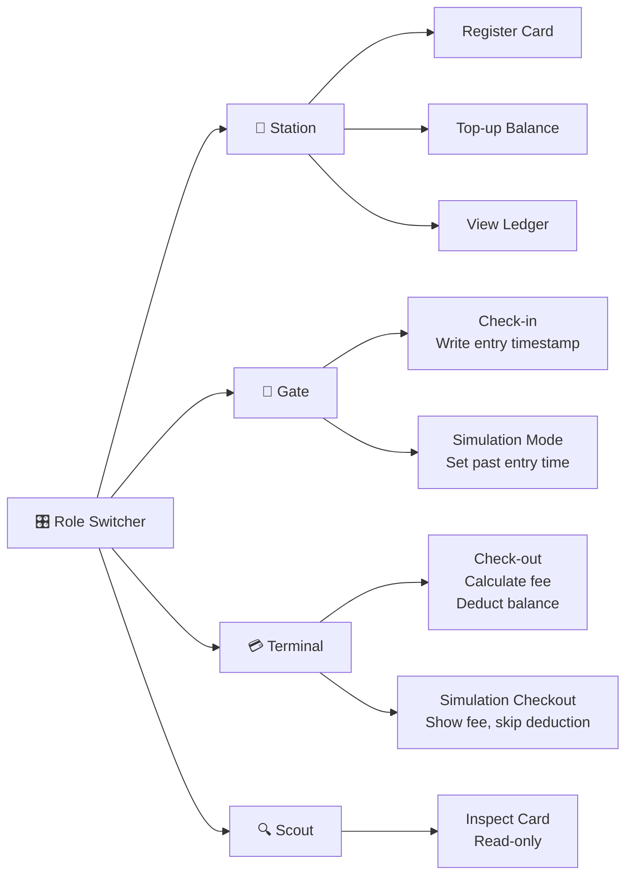
```mermaid
flowchart LR
    RS[🎛️ Role Switcher] --> S[🏪 Station]
    RS --> G[🚧 Gate]
    RS --> T[💳 Terminal]
    RS --> SC[🔍 Scout]

    S --> S1[Register Card]
    S --> S2[Top-up Balance]
    S --> S3[View Ledger]

    G --> G1[Check-in<br/>Write entry timestamp]
    G --> G2[Simulation Mode<br/>Set past entry time]

    T --> T1[Check-out<br/>Calculate fee<br/>Deduct balance]
    T --> T2[Simulation Checkout<br/>Show fee, skip deduction]

    SC --> SC1[Inspect Card<br/>Read-only]
```

| Role         | Purpose               | NFC Actions  | Ledger Write            | Special Feature                         |
| ------------ | --------------------- | ------------ | ----------------------- | --------------------------------------- |
| **Station**  | Member administration | Read + Write | ✅ Register, Top-up     | Balance cap (Rp 5M), Wipe & Re-register |
| **Gate**     | Entry point           | Read + Write | ❌ Card-only            | Simulation mode (past timestamp)        |
| **Terminal** | Exit point            | Read + Write | ✅ Checkout (real only) | Simulation-aware (skip deduction)       |
| **Scout**    | Inspection            | Read only    | ❌ Never writes         | Shows "(S)" for simulation sessions     |

## Fee Calculation

```
Fee = Rp 2.000 × ⌈duration in hours⌉

Examples:
  1 second    → 1 started hour  → Rp 2.000
  61 minutes  → 2 started hours → Rp 4.000
  3.5 hours   → 4 started hours → Rp 8.000
```

## Simulation Mode Flow

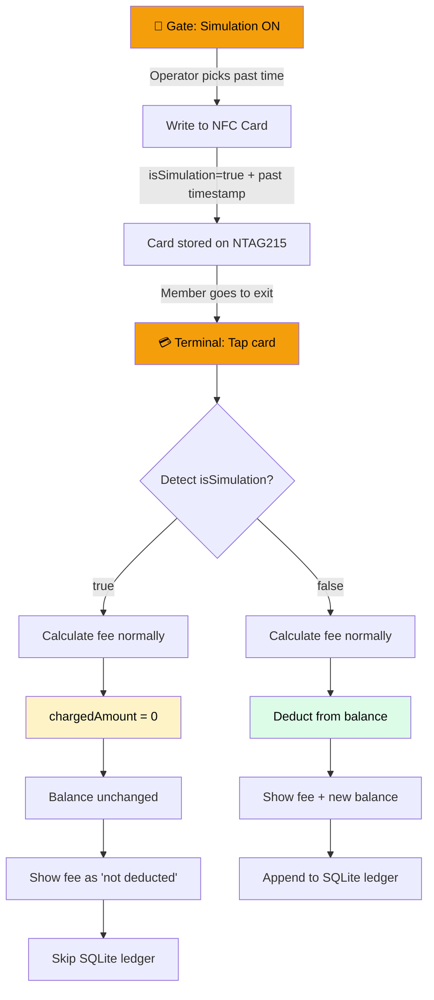
```mermaid
flowchart TD
    A[🚧 Gate: Simulation ON] -->|Operator picks past time| B[Write to NFC Card]
    B -->|isSimulation=true + past timestamp| C[Card stored on NTAG215]
    C -->|Member goes to exit| D[💳 Terminal: Tap card]
    D --> E{Detect isSimulation?}
    E -->|true| F[Calculate fee normally]
    F --> G[chargedAmount = 0]
    G --> H[Balance unchanged]
    H --> I[Show fee as 'not deducted']
    I --> J[Skip SQLite ledger]
    E -->|false| K[Calculate fee normally]
    K --> L[Deduct from balance]
    L --> M[Show fee + new balance]
    M --> N[Append to SQLite ledger]

    style A fill:#F59E0B,color:#000
    style D fill:#F59E0B,color:#000
    style G fill:#FEF3C7,color:#000
    style L fill:#DCFCE7,color:#000
```

---

# 5. Sequence Diagrams — All Role Flows

## 5.1 Station: Register Member Card

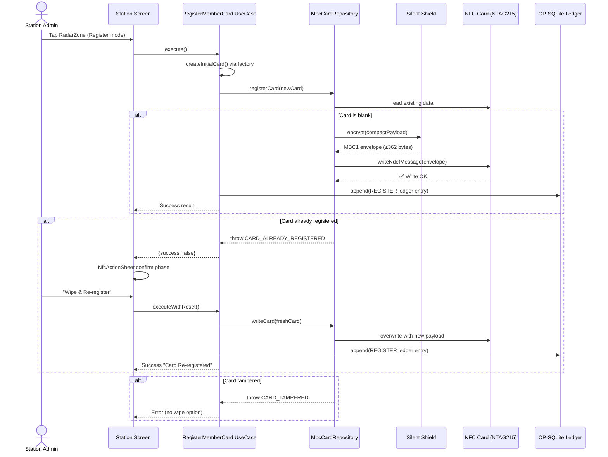
```mermaid
sequenceDiagram
    actor Admin as Station Admin
    participant UI as Station Screen
    participant UC as RegisterMemberCard UseCase
    participant Repo as MbcCardRepository
    participant Shield as Silent Shield
    participant Card as NFC Card (NTAG215)
    participant DB as OP-SQLite Ledger

    Admin->>UI: Tap RadarZone (Register mode)
    UI->>UC: execute()
    UC->>UC: createInitialCard() via factory
    UC->>Repo: registerCard(newCard)
    Repo->>Card: read existing data
    alt Card is blank
        Repo->>Shield: encrypt(compactPayload)
        Shield-->>Repo: MBC1 envelope (≤362 bytes)
        Repo->>Card: writeNdefMessage(envelope)
        Card-->>Repo: ✅ Write OK
        UC->>DB: append(REGISTER ledger entry)
        UC-->>UI: Success result
    end
    alt Card already registered
        Repo-->>UC: throw CARD_ALREADY_REGISTERED
        UC-->>UI: {success: false}
        UI->>UI: NfcActionSheet confirm phase
        Admin->>UI: "Wipe & Re-register"
        UI->>UC: executeWithReset()
        UC->>Repo: writeCard(freshCard)
        Repo->>Card: overwrite with new payload
        UC->>DB: append(REGISTER ledger entry)
        UC-->>UI: Success "Card Re-registered"
    end
    alt Card tampered
        Repo-->>UC: throw CARD_TAMPERED
        UC-->>UI: Error (no wipe option)
    end
```

## 5.2 Station: Top-Up Balance

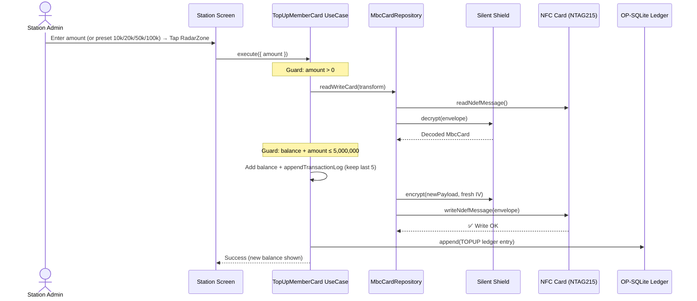
```mermaid
sequenceDiagram
    actor Admin as Station Admin
    participant UI as Station Screen
    participant UC as TopUpMemberCard UseCase
    participant Repo as MbcCardRepository
    participant Shield as Silent Shield
    participant Card as NFC Card (NTAG215)
    participant DB as OP-SQLite Ledger

    Admin->>UI: Enter amount (or preset 10k/20k/50k/100k) → Tap RadarZone
    UI->>UC: execute({ amount })
    Note over UC: Guard: amount > 0
    UC->>Repo: readWriteCard(transform)
    Repo->>Card: readNdefMessage()
    Repo->>Shield: decrypt(envelope)
    Shield-->>Repo: Decoded MbcCard
    Note over UC: Guard: balance + amount ≤ 5,000,000
    UC->>UC: Add balance + appendTransactionLog (keep last 5)
    Repo->>Shield: encrypt(newPayload, fresh IV)
    Repo->>Card: writeNdefMessage(envelope)
    Card-->>Repo: ✅ Write OK
    UC->>DB: append(TOPUP ledger entry)
    UC-->>UI: Success (new balance shown)
```

## 5.3 Gate: Check-In to Parking

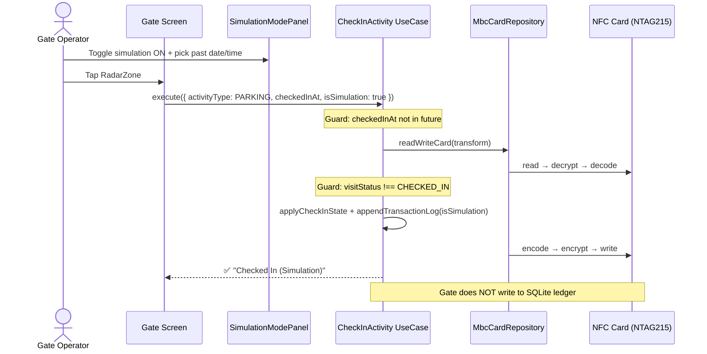
```mermaid
sequenceDiagram
    actor Op as Gate Operator
    participant UI as Gate Screen
    participant Sim as SimulationModePanel
    participant UC as CheckInActivity UseCase
    participant Repo as MbcCardRepository
    participant Card as NFC Card (NTAG215)

    Op->>Sim: Toggle simulation ON + pick past date/time
    Op->>UI: Tap RadarZone
    UI->>UC: execute({ activityType: PARKING, checkedInAt, isSimulation: true })
    Note over UC: Guard: checkedInAt not in future
    UC->>Repo: readWriteCard(transform)
    Repo->>Card: read → decrypt → decode
    Note over UC: Guard: visitStatus !== CHECKED_IN
    UC->>UC: applyCheckInState + appendTransactionLog(isSimulation)
    Repo->>Card: encode → encrypt → write
    UC-->>UI: ✅ "Checked In (Simulation)"
    Note over UC,Card: Gate does NOT write to SQLite ledger
```

## 5.4 Terminal: Check-Out from Parking

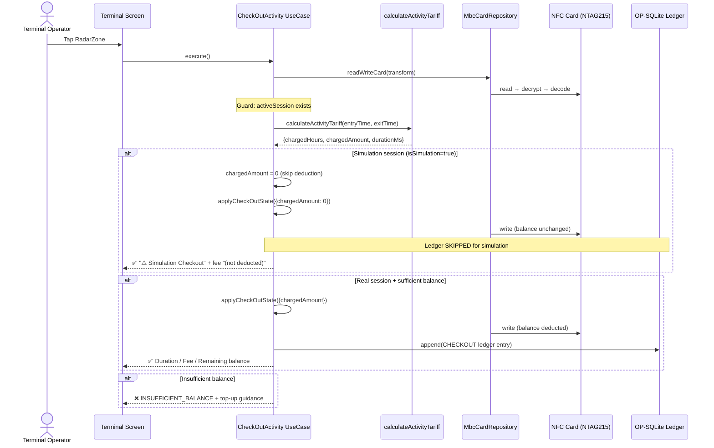
```mermaid
sequenceDiagram
    actor Op as Terminal Operator
    participant UI as Terminal Screen
    participant UC as CheckOutActivity UseCase
    participant Tariff as calculateActivityTariff
    participant Repo as MbcCardRepository
    participant Card as NFC Card (NTAG215)
    participant DB as OP-SQLite Ledger

    Op->>UI: Tap RadarZone
    UI->>UC: execute()
    UC->>Repo: readWriteCard(transform)
    Repo->>Card: read → decrypt → decode
    Note over UC: Guard: activeSession exists
    UC->>Tariff: calculateActivityTariff(entryTime, exitTime)
    Tariff-->>UC: {chargedHours, chargedAmount, durationMs}
    alt Simulation session (isSimulation=true)
        UC->>UC: chargedAmount = 0 (skip deduction)
        UC->>UC: applyCheckOutState({chargedAmount: 0})
        Repo->>Card: write (balance unchanged)
        Note over UC,DB: Ledger SKIPPED for simulation
        UC-->>UI: ✅ "⚠️ Simulation Checkout" + fee "(not deducted)"
    end
    alt Real session + sufficient balance
        UC->>UC: applyCheckOutState({chargedAmount})
        Repo->>Card: write (balance deducted)
        UC->>DB: append(CHECKOUT ledger entry)
        UC-->>UI: ✅ Duration / Fee / Remaining balance
    end
    alt Insufficient balance
        UC-->>UI: ❌ INSUFFICIENT_BALANCE + top-up guidance
    end
```

## 5.5 Scout: Inspect Card (Read-Only)

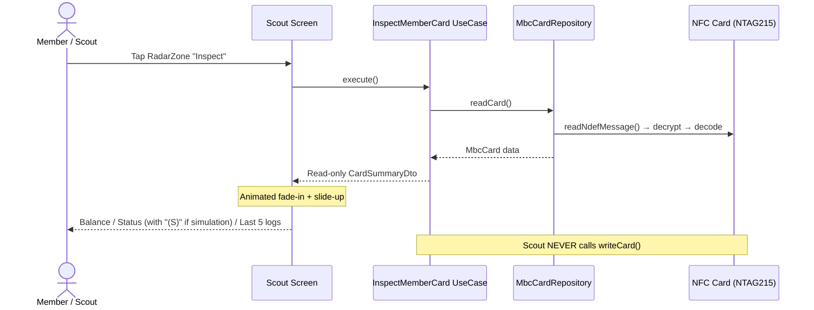
```mermaid
sequenceDiagram
    actor Member as Member / Scout
    participant UI as Scout Screen
    participant UC as InspectMemberCard UseCase
    participant Repo as MbcCardRepository
    participant Card as NFC Card (NTAG215)

    Member->>UI: Tap RadarZone "Inspect"
    UI->>UC: execute()
    UC->>Repo: readCard()
    Repo->>Card: readNdefMessage() → decrypt → decode
    Repo-->>UC: MbcCard data
    UC-->>UI: Read-only CardSummaryDto
    Note over UI: Animated fade-in + slide-up
    UI-->>Member: Balance / Status (with "(S)" if simulation) / Last 5 logs
    Note over UC,Card: Scout NEVER calls writeCard()
```

---

# 6. Software Design — Clean Architecture

## Architecture Layers

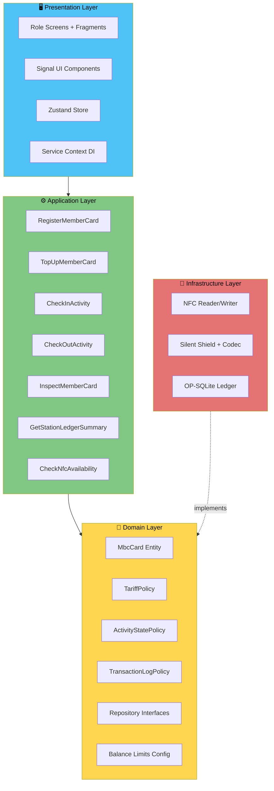
```mermaid
graph TB
    subgraph Presentation["🖥️ Presentation Layer"]
        direction LR
        P1[Role Screens + Fragments]
        P2[Signal UI Components]
        P3[Zustand Store]
        P4[Service Context DI]
    end

    subgraph Application["⚙️ Application Layer"]
        direction LR
        A1[RegisterMemberCard]
        A2[TopUpMemberCard]
        A3[CheckInActivity]
        A4[CheckOutActivity]
        A5[InspectMemberCard]
        A6[GetStationLedgerSummary]
        A7[CheckNfcAvailability]
    end

    subgraph Domain["💎 Domain Layer"]
        direction LR
        D1[MbcCard Entity]
        D2[TariffPolicy]
        D3[ActivityStatePolicy]
        D4[TransactionLogPolicy]
        D5[Repository Interfaces]
        D6[Balance Limits Config]
    end

    subgraph Infrastructure["🔧 Infrastructure Layer"]
        direction LR
        I1[NFC Reader/Writer]
        I2[Silent Shield + Codec]
        I3[OP-SQLite Ledger]
    end

    Presentation --> Application
    Application --> Domain
    Infrastructure -.->|implements| Domain

    style Presentation fill:#4FC3F7,color:#000
    style Application fill:#81C784,color:#000
    style Domain fill:#FFD54F,color:#000
    style Infrastructure fill:#E57373,color:#000
```

## The Dependency Rule

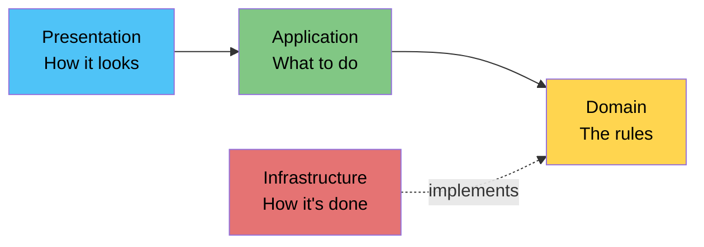
```mermaid
graph LR
    P["Presentation<br/>How it looks"] --> A["Application<br/>What to do"]
    A --> D["Domain<br/>The rules"]
    I["Infrastructure<br/>How it's done"] -.->|implements| D

    style D fill:#FFD54F,color:#000
    style A fill:#81C784,color:#000
    style P fill:#4FC3F7,color:#000
    style I fill:#E57373,color:#000
```

> **Golden Rule:** Inner layers never know about outer layers. Business rules don't care if data comes from NFC or a test mock.

| Layer              | Responsibility                                       | Key Paths                                                     |
| ------------------ | ---------------------------------------------------- | ------------------------------------------------------------- |
| **Domain**         | Entities, policies, factories, types, interfaces     | `domain/membership/entities/`, `policies/`, `repositories/`   |
| **Application**    | Use case orchestration (7 use cases) + DTOs          | `application/use-cases/`, `application/dto/`                  |
| **Infrastructure** | NFC, Silent Shield, codec, OP-SQLite implementations | `infrastructure/nfc/`, `infrastructure/local-ledger/`         |
| **Presentation**   | Screens, stores, context, navigation, Signal UI      | `presentation/screens/`, `components/`, `stores/`, `context/` |

## Role-Grouped Dependency Injection

```ts
// Each role gets ONLY the services it needs (Interface Segregation)
type StationServices = {
  registerMemberCardUseCase;
  topUpMemberCardUseCase;
  getStationLedgerSummaryUseCase;
  checkNfcAvailabilityUseCase;
  cancelNfc;
};
type GateServices = {
  checkInActivityUseCase;
  checkNfcAvailabilityUseCase;
  cancelNfc;
};
type TerminalServices = {
  checkOutActivityUseCase;
  checkNfcAvailabilityUseCase;
  cancelNfc;
};
type ScoutServices = {
  inspectMemberCardUseCase;
  checkNfcAvailabilityUseCase;
  cancelNfc;
};
```

Accessed via typed hooks: `useStationServices()`, `useGateServices()`, `useTerminalServices()`, `useScoutServices()`

## Domain Folder Structure

```
domain/membership/
├── entities/          MbcCard, ActivitySession, TransactionLog, LedgerEntry, StationLedgerSummary
├── policies/          tariff-policy, activity-state-policy, transaction-log-policy
├── factories/         membership-card.factory (createInitialCard)
├── errors/            DomainError, CardRepositoryError
├── types/             VisitStatus, MbcActivity, BenefitActivityType, MbcRole, CurrencyCode
├── config/            balance-limits (MAX_CARD_BALANCE = 5,000,000)
└── repositories/      MbcCardRepository, LocalLedgerRepository, NfcAvailabilityRepository
```

---

# 7. SOLID Design Principles

| Principle                     | Rule                                        | MBC Implementation                                                                                                                   |
| ----------------------------- | ------------------------------------------- | ------------------------------------------------------------------------------------------------------------------------------------ |
| **S** — Single Responsibility | Each module has one job                     | `calculateActivityTariff` only computes cost; `applyCheckInState` only validates state; `SimulationModePanel` only handles UI toggle |
| **O** — Open/Closed           | Open for extension, closed for modification | New activities need zero changes to use cases — add TariffStrategy config only                                                       |
| **L** — Liskov Substitution   | Implementations are interchangeable         | Mock repositories and `RealMbcCardRepository` both satisfy `MbcCardRepository`                                                       |
| **I** — Interface Segregation | Don't depend on unused methods              | Role-grouped services: Gate can't call `topUpMemberCardUseCase`; Scout can't call `writeCard`                                        |
| **D** — Dependency Inversion  | Depend on abstractions                      | Use cases define interfaces in domain; Infrastructure implements them                                                                |

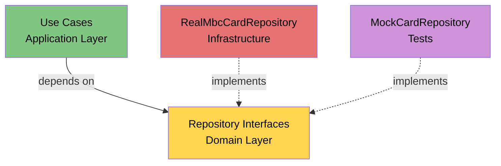
```mermaid
graph TB
    UC[Use Cases<br/>Application Layer] -->|depends on| IF[Repository Interfaces<br/>Domain Layer]
    REAL[RealMbcCardRepository<br/>Infrastructure] -.->|implements| IF
    MOCK[MockCardRepository<br/>Tests] -.->|implements| IF

    style UC fill:#81C784,color:#000
    style IF fill:#FFD54F,color:#000
    style REAL fill:#E57373,color:#000
    style MOCK fill:#CE93D8,color:#000
```

## Package Principles

| Principle                     | MBC Example                                                                    |
| ----------------------------- | ------------------------------------------------------------------------------ |
| **Reuse/Release Equivalency** | Card codec, tariff policy, state policy are independently testable/versionable |
| **Common Closure**            | Tariff logic + card encoding live in same bounded context                      |
| **Common Reuse**              | Each role screen imports only needed use cases via typed service hooks         |

---

# 8. Software Security — Silent Shield

## Threat & Solution

| Threat               | Without Protection       | With Silent Shield            |
| -------------------- | ------------------------ | ----------------------------- |
| Generic NFC reader   | ❌ Reads all member data | ✅ Only opaque binary blob    |
| Card cloning         | ❌ Copy-paste attack     | ✅ Auth tag detects tampering |
| Balance manipulation | ❌ Edit balance freely   | ✅ Integrity validation fails |
| Replay attack        | ❌ Reuse old payload     | ✅ Fresh random IV per write  |

## Encryption Flow

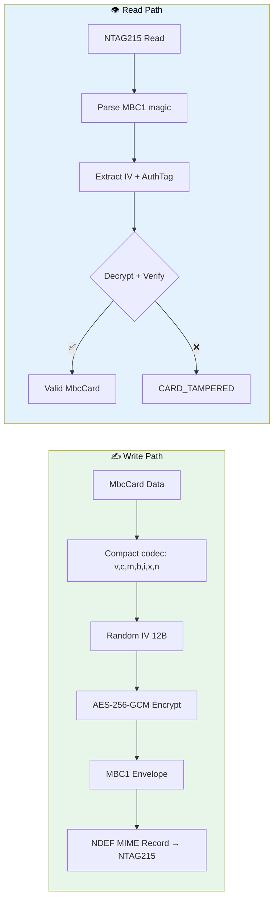
```mermaid
flowchart LR
    subgraph Write["✍️ Write Path"]
        direction TB
        W1[MbcCard Data] --> W2[Compact codec: v,c,m,b,i,x,n]
        W2 --> W3[Random IV 12B]
        W3 --> W4[AES-256-GCM Encrypt]
        W4 --> W5[MBC1 Envelope]
        W5 --> W6[NDEF MIME Record → NTAG215]
    end

    subgraph Read["👁️ Read Path"]
        direction TB
        R1[NTAG215 Read] --> R2[Parse MBC1 magic]
        R2 --> R3[Extract IV + AuthTag]
        R3 --> R4{Decrypt + Verify}
        R4 -->|✅| R5[Valid MbcCard]
        R4 -->|❌| R6[CARD_TAMPERED]
    end

    style Write fill:#E8F5E9,color:#000
    style Read fill:#E3F2FD,color:#000
```

## MBC1 Envelope Format

```
┌────────┬─────┬───────┬──────┬──────────┬─────────────┬────────────┐
│ MBC1   │ Ver │ KeyID │ Alg  │ IV (12B) │ AuthTag(16B)│ Ciphertext │
│ 4 bytes│ 1B  │  1B   │  1B  │  random  │  integrity  │  variable  │
└────────┴─────┴───────┴──────┴──────────┴─────────────┴────────────┘
Total fixed overhead: 35 bytes + ciphertext
```

## Security Layers

| Layer               | Protection                                                               |
| ------------------- | ------------------------------------------------------------------------ |
| Card payload        | AES-256-GCM authenticated encryption                                     |
| Envelope format     | Binary `MBC1` — opaque to generic readers                                |
| Tamper detection    | GCM auth tag; any modification → `CARD_TAMPERED` rejection               |
| Write safety        | `writeNdefMessage` throws on failure; capacity guard (480 bytes)         |
| Registration safety | Already-registered cards require explicit user confirmation to overwrite |
| Balance safety      | `MAX_CARD_BALANCE = 5,000,000` cap prevents overfilling                  |
| Logging             | Identity and balance redacted from all NFC operational logs              |
| Member ID           | System-generated, masked in UI (`MBC-***`), never exposed in full        |

## Prototype vs Production — Honest Separation

| Capability        | Prototype (this build)            | Production (future)                     |
| ----------------- | --------------------------------- | --------------------------------------- |
| Encryption        | AES-256-GCM with bundled demo key | Hardware-backed Keystore + key rotation |
| Operator auth     | Role switcher only                | PIN/biometric per operator              |
| Backend           | None (offline-only)               | Server audit trail + reconciliation     |
| Card authenticity | Payload integrity only            | Physical card verification              |
| Key rotation      | Not implemented                   | Remote provisioning                     |
| Simulation mode   | Dev-only (`__DEV__` guard)        | Removed or admin-gated                  |

---

# 9. NFC Card Payload — NTAG215 Compact Design

## Capacity Analysis

| Metric                       | Value           | Status         |
| ---------------------------- | --------------- | -------------- |
| NTAG215 raw capacity         | 504 bytes       | —              |
| NDEF usable capacity         | 480 bytes       | —              |
| Worst-case encrypted payload | 362 bytes       | ✅ Fits        |
| Safety margin                | 118 bytes (25%) | ✅ Comfortable |

## Compact Payload Fields

| Field | Name             | Type                          | Description                                                         |
| ----- | ---------------- | ----------------------------- | ------------------------------------------------------------------- |
| `v`   | Version          | `number`                      | Payload schema version (always `1`)                                 |
| `c`   | Card ID          | `string`                      | Short internal card identifier                                      |
| `m`   | Member ID        | `string`                      | Generated member ID reference                                       |
| `b`   | Balance          | `number`                      | Current balance in IDR (max 5,000,000)                              |
| `i`   | Active Session   | `object \| null`              | Check-in state with `isSimulation` flag; `null` when not checked in |
| `x`   | Transaction Logs | `[activity, nominal, time][]` | Last 5 logs as compact tuples (includes simulation marker)          |
| `n`   | Write Counter    | `number`                      | Monotonic write counter (increments per write)                      |

## Data Transformation Pipeline


```mermaid
flowchart LR
    A[MbcCard Type] -->|mbc-card-codec| B[Compact Format<br/>v,c,m,b,i,x,n<br/>≤327B]
    B -->|AES-256-GCM| C[Ciphertext<br/>+ 35B overhead]
    C -->|wrap| D[MBC1 Envelope<br/>≤362B]
    D -->|NDEF MIME| E[NFC Tag Write<br/>NTAG215]

    E -->|read| F[Raw NDEF bytes]
    F -->|parse MBC1| G[Extract IV + AuthTag]
    G -->|decrypt + verify| H{Valid?}
    H -->|✅| I[MbcCard Type]
    H -->|❌| J[CARD_TAMPERED]

    style A fill:#FFD54F,color:#000
    style B fill:#FFF9C4,color:#000
    style C fill:#E8F5E9,color:#000
    style D fill:#C8E6C9,color:#000
    style E fill:#81C784,color:#000
    style I fill:#FFD54F,color:#000
    style J fill:#FFCDD2,color:#000
```

---

# 10. UI/UX Design — Signal UI System

## Design System Adoption

Based on **Telkomsel Signal UI** design system with vibrant theme extensions.

| Token Category      | Key Values                                           |
| ------------------- | ---------------------------------------------------- |
| **Primary Color**   | `#FF0025` (Signal Red — RadarZone accent)            |
| **Secondary Color** | `#001A41` (Dark Navy)                                |
| **Simulation**      | `#F59E0B` (Amber — simulation indicators)            |
| **Glass Effect**    | `rgba(255,255,255,0.55)` bg + white border           |
| **Background**      | `ImageBackground` + `blurRadius={15}` on all screens |

## Shared UI Components

| Component             | Purpose                                                                         | Used By          |
| --------------------- | ------------------------------------------------------------------------------- | ---------------- |
| **RadarZone**         | Animated NFC trigger (3 breathing rings + sweep line + pulse + gradient button) | All 4 roles      |
| **ScreenHeader**      | Title + subtitle + colored badge + back navigation                              | All role screens |
| **NfcActionSheet**    | Bottom sheet: scanning (PulseRing + nfc-orb) / success / error / confirm        | All roles        |
| **NfcLogPanel**       | Dev-only toggleable operational log (`variant="light"` glassmorphic)            | All screens      |
| **SignalButton**      | Primary/secondary action button                                                 | All screens      |
| **SignalBottomSheet** | Reusable bottom sheet container                                                 | NfcActionSheet   |

## Screen-Specific Fragments

| Screen       | Fragments                                                                                                                                                        |
| ------------ | ---------------------------------------------------------------------------------------------------------------------------------------------------------------- |
| **Station**  | `SegmentedControl` (Register\|TopUp), `AmountInput` (presets + free-text), `LatestResultCard`, `LocalStationLedgerCard` (collapsible accordion)                  |
| **Gate**     | `SimulationModePanel` (toggle + DateTimePicker + animated pulse dot), `GateResultState` (success/error + "Scan Another Card"), `SelectedActivityCard`            |
| **Terminal** | `TariffPreviewCard`, `CheckoutSummaryCard` (duration/fee/balance), `InsufficientBalanceCard` (top-up guidance), `GenericFailureCard`, animated simulation banner |
| **Scout**    | `MemberCardInfo` (ID/balance/status with "(S)" suffix), `LatestLogsCard` (5 logs with simulation markers), `ScoutErrorCard`, animated result reveal (fade+slide) |

## State Management

| Concern              | Solution                                                          |
| -------------------- | ----------------------------------------------------------------- |
| App state            | Zustand store (selectedRole, nfcLogs bounded 200, nfcLogEnabled)  |
| Dependency injection | React Context with role-grouped typed hooks                       |
| Navigation           | React Navigation native-stack (5 screens)                         |
| NFC sheet state      | Local hook state per screen (idle/scanning/success/error/confirm) |

---

# 11. Software Quality

## 📊 Test Metrics

| Metric                    | Value      | Target |
| ------------------------- | ---------- | ------ |
| Automated tests           | **472+**   | —      |
| Test suites               | **75**     | —      |
| Statement coverage        | **100%**   | ≥99%   |
| Line coverage             | **100%**   | ≥99%   |
| Branch coverage           | **99%+**   | ≥99%   |
| Function coverage         | **96%+**   | ≥96%   |
| npm audit vulnerabilities | **0**      | 0      |
| SonarCloud quality gate   | **PASSED** | Pass   |

## Coverage Thresholds (jest.config.js)

```json
{
  "statements": 99,
  "lines": 99,
  "functions": 96,
  "branches": 99
}
```

Build fails automatically if coverage drops below these thresholds.

## Test Strategy (6 Levels)

| Level              | Scope                                     | Environment         |
| ------------------ | ----------------------------------------- | ------------------- |
| **Unit**           | Domain policies, tariff, state            | Jest (no hardware)  |
| **Application**    | Use case orchestration + simulation paths | Jest + mock repos   |
| **Infrastructure** | NFC repo, OP-SQLite, codec, shield        | Jest + mocks        |
| **Presentation**   | Screens, hooks, stores, components        | Jest + RNTL         |
| **Device**         | Real NFC read/write flows                 | ASUS ROG Phone 9 FE |
| **Security**       | Tamper detection, encryption              | Jest + device       |

## Key Test Files (New Since Phase 9B/9C)

| Test File                                     | What It Covers                             |
| --------------------------------------------- | ------------------------------------------ |
| `check-in-simulation.use-case.test.ts`        | Simulation check-in, future-time rejection |
| `check-out-simulation.use-case.test.ts`       | Simulation checkout skips deduction        |
| `top-up-balance-cap.use-case.test.ts`         | MAX_CARD_BALANCE enforcement               |
| `register-member-card-reset.use-case.test.ts` | Wipe & re-register flow                    |
| `useGateActions-simulation.test.ts`           | Gate hook simulation state management      |

## How 472+ Tests Run Without NFC Hardware

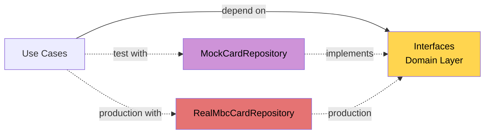
```mermaid
graph LR
    UC[Use Cases] -->|depend on| IF[Interfaces<br/>Domain Layer]
    MOCK[MockCardRepository] -.->|implements| IF
    REAL[RealMbcCardRepository] -.->|production| IF

    UC -.->|test with| MOCK
    UC -.->|production with| REAL

    style MOCK fill:#CE93D8,color:#000
    style REAL fill:#E57373,color:#000
    style IF fill:#FFD54F,color:#000
```

> Clean Architecture makes this possible: mock repositories replace real NFC/OP-SQLite. All 472+ tests run in CI without physical devices.

## Quality Gates Enforced

- ✅ `jest.config.js` — coverage thresholds (99%/99%/99%/96%)
- ✅ SonarCloud — quality gate on every PR
- ✅ Husky pre-commit hooks — lint-staged (eslint + prettier)
- ✅ PR requires QA screenshot evidence
- ✅ `npm audit` — 0 vulnerabilities enforced
- ✅ Maestro autonomous E2E — full parking MVP cycle validated

## 🤖 Autonomous E2E Testing — Maestro

Maestro provides **autonomous, scriptable E2E testing** that validates the full parking MVP cycle without manual intervention or real NFC hardware.

### How It Works

```
src/infrastructure/utils/e2e.config.ts (E2E_MODE = true)
  → container.ts reads flag
  → MockMbcCardRepository (in-memory singleton)
  → Maestro drives UI flows autonomously
```

### Flows Covered

| Flow                 | Scenario                 | Validation               |
| -------------------- | ------------------------ | ------------------------ |
| Role Switch          | Navigate all 4 roles     | All roles accessible     |
| Register             | Station register card    | Success state            |
| Top-Up               | Station top-up Rp 50.000 | Balance updated          |
| Check-In             | Gate parking entry       | Checked-in status        |
| Check-Out            | Terminal parking exit    | Fee calculated, deducted |
| Inspect              | Scout read card          | Balance, status, logs    |
| Double Check-In      | Gate error case          | Rejection shown          |
| Insufficient Balance | Terminal error case      | Top-up guidance          |

### Execution

```bash
# Set E2E_MODE = true in src/infrastructure/utils/e2e.config.ts, then:
npm run e2e:android   # Build with mock NFC
npm run e2e:test      # Run all Maestro flows
```

> Runs on Android emulator — no NFC hardware needed. CI-compatible.

---

# 12. Software Deployment — CI/CD Pipeline

## Release Automation

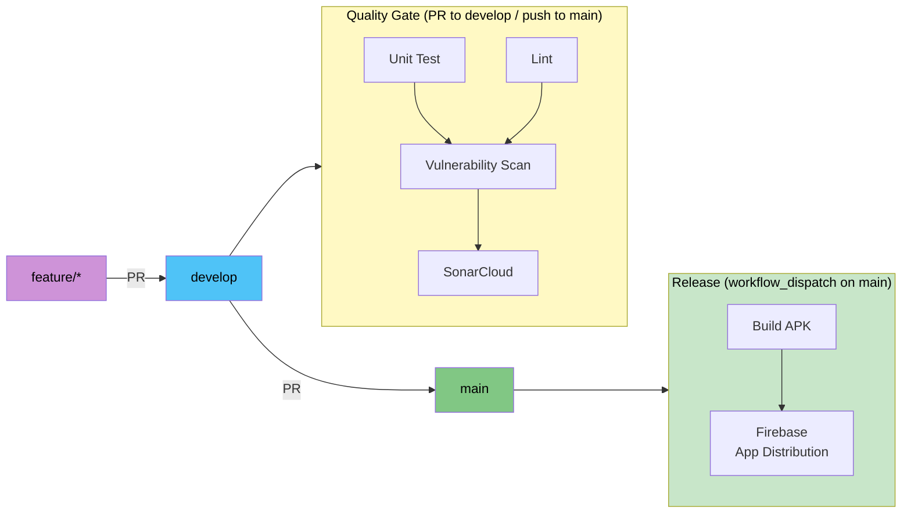
```mermaid
flowchart LR
    F[feature/*] -->|PR| DEV[develop]
    DEV -->|PR| MAIN[main]

    subgraph QG["Quality Gate (PR to develop / push to main)"]
        direction TB
        UT[Unit Test] --> VS[Vulnerability Scan]
        LT[Lint] --> VS
        VS --> SC[SonarCloud]
    end

    subgraph REL["Release (workflow_dispatch on main)"]
        direction TB
        BA[Build APK] --> FD[Firebase<br/>App Distribution]
    end

    DEV --> QG
    MAIN --> REL

    style F fill:#CE93D8,color:#000
    style DEV fill:#4FC3F7,color:#000
    style MAIN fill:#81C784,color:#000
    style QG fill:#FFF9C4,color:#000
    style REL fill:#C8E6C9,color:#000
```

## Pipeline Stages

```
┌───────────┐     ┌──────┐
│ unit_test │     │ lint │    (parallel)
└─────┬─────┘     └──┬───┘
      └───────┬───────┘
              ▼
    ┌───────────────────────┐
    │  vulnerability_scan   │    npm audit --audit-level=high
    └─────────┬─────────────┘
              ▼
    ┌───────────────────────┐
    │     sonarcloud         │    Coverage + code quality
    └─────────┬─────────────┘
              ▼  (only on workflow_dispatch + main)
    ┌───────────────────────┐
    │      build_apk         │    Bundle JS → Gradle assembleDebug
    └─────────┬─────────────┘
              ▼
    ┌───────────────────────┐
    │    distribute_apk      │    Upload to Firebase "testers" group
    └───────────────────────┘
```

## Branching Strategy

| Branch      | Purpose                         | Protection         |
| ----------- | ------------------------------- | ------------------ |
| `main`      | Release (triggers distribution) | Protected, PR-only |
| `develop`   | Integration                     | PR-only            |
| `feature/*` | Implementation                  | Developer branches |

---

# 13. Risk Management

## Risk Register — 20/20 Closed ✅

| ID    | Risk                              | Impact | Mitigation                                      | Status    |
| ----- | --------------------------------- | ------ | ----------------------------------------------- | --------- |
| R-001 | NTAG215 capacity exceeded         | High   | Compact codec: 362B < 480B                      | ✅ Closed |
| R-002 | iOS NFC write unsupported         | Medium | Deferred — Android-first MVP                    | ✅ Closed |
| R-003 | Sensitive data exposed via NFC    | High   | Silent Shield AES-256-GCM                       | ✅ Closed |
| R-004 | Demo key confused with production | Medium | Documented + ADR                                | ✅ Closed |
| R-005 | Write interrupted mid-operation   | Medium | writeNdefMessage throws on failure              | ✅ Closed |
| R-006 | Double check-in/out               | Medium | applyCheckInState/applyCheckOutState validation | ✅ Closed |
| R-007 | Coverage gaps                     | Medium | 100% achieved (472+ tests)                      | ✅ Closed |
| R-008 | Clock manipulation                | Low    | Operational procedure documented                | ✅ Closed |
| R-009 | Card removed during write         | Medium | NFC session error handling                      | ✅ Closed |
| R-010 | Insufficient balance at exit      | Medium | Clear top-up guidance shown                     | ✅ Closed |

> Full 20-risk register with all mitigations in `.codex/specs/RISKS.md`

## Edge Cases Handled (20 total)

| Category               | Edge Cases                                                         | Handling                                              |
| ---------------------- | ------------------------------------------------------------------ | ----------------------------------------------------- |
| **State conflicts**    | Double check-in · Double check-out · Re-register existing card     | Reject with error / Confirm dialog for re-register    |
| **Balance & input**    | Insufficient balance · Balance cap exceeded · Invalid top-up input | Guidance shown, cap enforced at Rp 5M                 |
| **Card integrity**     | Unknown card · Tampered payload · Unsupported schema               | UNREGISTERED_CARD / CARD_TAMPERED / version rejection |
| **NFC failures**       | Card removed mid-write · Scan cancelled · Scan timeout             | Error recovery + retry + clean session cancel         |
| **Capacity & storage** | Payload exceeds capacity · More than 5 logs · Multi-device use     | Capacity guard, FIFO log rotation, card as truth      |
| **Time & simulation**  | Exit before entry · Future simulation time · Zero duration         | INVALID_DURATION / future-time rejection              |

---

# 14. Way of Working — Delivery Workflow

## Delivery Pipeline

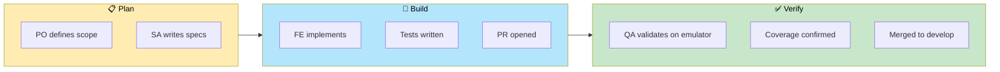
```mermaid
flowchart LR
    subgraph Plan["📋 Plan"]
        T1[PO defines scope]
        T2[SA writes specs]
    end

    subgraph Build["🔨 Build"]
        IP1[FE implements]
        IP2[Tests written]
        IP3[PR opened]
    end

    subgraph Verify["✅ Verify"]
        D1[QA validates on emulator]
        D2[Coverage confirmed]
        D3[Merged to develop]
    end

    Plan --> Build --> Verify

    style Plan fill:#FFECB3,color:#000
    style Build fill:#B3E5FC,color:#000
    style Verify fill:#C8E6C9,color:#000
```

## Execution Phases (10 Phases — All Complete)

| Phase | Focus                  | Key Deliverables                                    | Status |
| ----- | ---------------------- | --------------------------------------------------- | ------ |
| 0     | Project setup & specs  | Repo, UML, configs                                  | ✅     |
| 1     | Domain layer           | Entities, policies, interfaces                      | ✅     |
| 2     | Station feature        | Register, top-up, ledger                            | ✅     |
| 3     | Gate feature           | Check-in flow                                       | ✅     |
| 4     | Terminal feature       | Checkout + tariff                                   | ✅     |
| 5     | Scout feature          | Read-only inspect                                   | ✅     |
| 6     | Shared app experience  | Role switcher, Signal UI                            | ✅     |
| 7     | Quality & verification | 472+ tests, SonarCloud, Firebase CI                 | ✅     |
| 8     | Real NFC integration   | Silent Shield, codec, device tests                  | ✅     |
| 9     | Design hardening       | RadarZone, ScreenHeader, fragments                  | ✅     |
| 9B    | Feature enhancements   | **Simulation mode**                                 | ✅     |
| 9C    | Bug fixes & hardening  | **Balance cap, registration safety, vibrant theme** | ✅     |

---

# 15. Architecture Decision Records (Key ADRs)

| ADR     | Decision                         | Rationale                                        |
| ------- | -------------------------------- | ------------------------------------------------ |
| ADR-001 | React Native CLI (not Expo)      | Full native module access for NFC                |
| ADR-003 | NFC Card as core data store      | Offline-first — no server dependency             |
| ADR-004 | Clean Architecture               | Testable, maintainable, replaceable layers       |
| ADR-005 | Silent Shield (AES-256-GCM)      | Production-grade authenticated encryption        |
| ADR-006 | Fixed Rp 2.000 parking tariff    | Single isolated constant, not magic numbers      |
| ADR-008 | Auto-generated member ID         | No manual input errors, system-controlled        |
| ADR-011 | Reusable activity flow           | Parking first, extensible for future             |
| ADR-015 | OP-SQLite as device-local ledger | Audit trail without replacing card truth         |
| ADR-016 | Feature branch promotion         | Controlled release via main → Firebase           |
| ADR-017 | Standardized payload v1          | Compact fields + Silent Shield + ledger boundary |
| ADR-021 | Firebase App Distribution        | Automated release channel                        |
| ADR-022 | QA screenshot evidence gate      | Visual proof before merge                        |

> 22 total ADRs documented in `.codex/specs/DECISIONS.md`

---

# 16. Tech Stack

| Area           | Choice                                         | Rationale                                    |
| -------------- | ---------------------------------------------- | -------------------------------------------- |
| **Framework**  | React Native CLI + TypeScript                  | Full native NFC access + type safety         |
| **NFC**        | react-native-nfc-manager                       | Industry standard RN NFC library             |
| **Crypto**     | react-native-quick-crypto                      | Native-backed AES-256-GCM (not JS polyfill)  |
| **Local DB**   | @op-engineering/op-sqlite                      | High-performance offline SQLite              |
| **UI**         | Signal UI + NativeWind (Tailwind CSS)          | Brand consistency + utility-first styling    |
| **State**      | Zustand + React Context (DI)                   | Lightweight state + dependency injection     |
| **Navigation** | React Navigation (native-stack)                | Standard RN navigation                       |
| **Animation**  | react-native-reanimated + Animated API         | RadarZone, SimulationModePanel, Scout reveal |
| **Date/Time**  | @react-native-community/datetimepicker + dayjs | Simulation mode date picking                 |
| **Icons**      | react-native-vector-icons (MaterialIcons)      | ScreenHeader badges, UI elements             |
| **Gradients**  | react-native-linear-gradient                   | RadarZone button gradient                    |
| **Testing**    | Jest + React Native Testing Library            | 472+ tests, CI-friendly                      |
| **Quality**    | SonarCloud + Husky + lint-staged               | Automated quality gates                      |
| **CI/CD**      | GitHub Actions → Firebase                      | Automated distribution                       |

---

# 17. Real Device Validation

## Test Environment

| Component        | Specification                     |
| ---------------- | --------------------------------- |
| **Device**       | ASUS ROG Phone 9 FE (Android 14+) |
| **NFC Tag**      | NTAG215 (504B raw / 480B NDEF)    |
| **Cards Tested** | 3 physical NTAG215 cards          |

## Device Test Results — All PASS ✅

| Test Case | Flow                           | Result                   |
| --------- | ------------------------------ | ------------------------ |
| DTM-001   | Register new card              | ✅ PASS                  |
| DTM-002   | Top-up balance                 | ✅ PASS                  |
| DTM-003   | Check-in to parking            | ✅ PASS                  |
| DTM-004   | Check-out from parking         | ✅ PASS                  |
| DTM-005   | Scout inspection               | ✅ PASS                  |
| DTM-006   | Silent Shield encryption       | ✅ PASS                  |
| DTM-007   | Generic NFC reader test        | ✅ Opaque data confirmed |
| DTM-008   | Double check-in rejection      | ✅ PASS                  |
| DTM-009   | Insufficient balance rejection | ✅ PASS                  |
| DTM-010   | Tampered card rejection        | ✅ PASS                  |
| DTM-011   | Unregistered card handling     | ✅ PASS                  |
| DTM-012   | NFC log panel toggle           | ✅ PASS                  |
| DTM-013   | Payload capacity validation    | ✅ 362B < 480B           |

---

# 18. Demo Session — Complete Parking Cycle

## Demo Script

| Step | Role     | Action                               | Expected Result                                  |
| ---- | -------- | ------------------------------------ | ------------------------------------------------ |
| 1    | —        | Open app                             | Role Switcher (4 roles visible)                  |
| 2    | Station  | Register tab → Tap RadarZone         | ✅ New member card registered                    |
| 3    | Station  | Top Up tab → 20k preset → Tap        | ✅ Balance: Rp 20.000                            |
| 4    | Gate     | Simulation ON → Pick past time → Tap | ✅ Checked in (Simulation)                       |
| 5    | Terminal | Tap RadarZone                        | ✅ Fee shown "(not deducted)", balance unchanged |
| 6    | Gate     | Simulation OFF → Tap RadarZone       | ✅ Checked in at real time                       |
| 7    | Terminal | Tap RadarZone                        | ✅ Fee deducted, balance updated                 |
| 8    | Scout    | Tap RadarZone "Inspect"              | ✅ Balance, status, logs (with "(S)" markers)    |
| 9    | —        | Generic NFC reader → Scan card       | ❌ Only opaque MBC1 binary                       |

## Demo Sequence Diagram

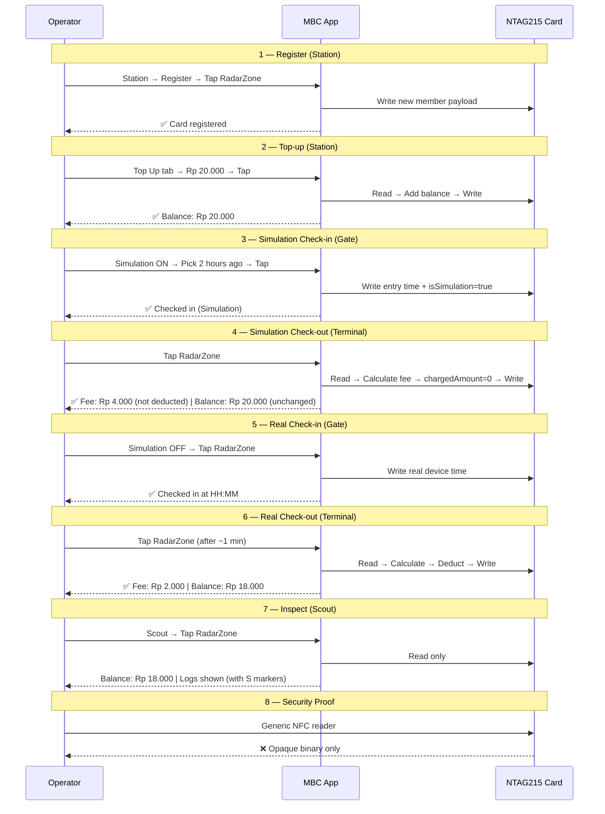
```mermaid
sequenceDiagram
    participant User as Operator
    participant App as MBC App
    participant Card as NTAG215 Card

    Note over User,Card: 1 — Register (Station)
    User->>App: Station → Register → Tap RadarZone
    App->>Card: Write new member payload
    App-->>User: ✅ Card registered

    Note over User,Card: 2 — Top-up (Station)
    User->>App: Top Up tab → Rp 20.000 → Tap
    App->>Card: Read → Add balance → Write
    App-->>User: ✅ Balance: Rp 20.000

    Note over User,Card: 3 — Simulation Check-in (Gate)
    User->>App: Simulation ON → Pick 2 hours ago → Tap
    App->>Card: Write entry time + isSimulation=true
    App-->>User: ✅ Checked in (Simulation)

    Note over User,Card: 4 — Simulation Check-out (Terminal)
    User->>App: Tap RadarZone
    App->>Card: Read → Calculate fee → chargedAmount=0 → Write
    App-->>User: ✅ Fee: Rp 4.000 (not deducted) | Balance: Rp 20.000 (unchanged)

    Note over User,Card: 5 — Real Check-in (Gate)
    User->>App: Simulation OFF → Tap RadarZone
    App->>Card: Write real device time
    App-->>User: ✅ Checked in at HH:MM

    Note over User,Card: 6 — Real Check-out (Terminal)
    User->>App: Tap RadarZone (after ~1 min)
    App->>Card: Read → Calculate → Deduct → Write
    App-->>User: ✅ Fee: Rp 2.000 | Balance: Rp 18.000

    Note over User,Card: 7 — Inspect (Scout)
    User->>App: Scout → Tap RadarZone
    App->>Card: Read only
    App-->>User: Balance: Rp 18.000 | Logs shown (with S markers)

    Note over User,Card: 8 — Security Proof
    User->>Card: Generic NFC reader
    Card-->>User: ❌ Opaque binary only
```

---

# 19. Key Achievements

## 📊 Numbers at a Glance

| Metric                    | Value            |
| ------------------------- | ---------------- |
| 🧪 Automated tests        | **472+**         |
| 📦 Test suites            | **65**           |
| 📈 Line coverage          | **100%**         |
| 🔒 Vulnerabilities        | **0**            |
| ⚠️ Risks closed           | **20/20**        |
| 🏗️ Phases complete        | **12/12** (0–9C) |
| 👥 Roles implemented      | **4/4**          |
| ✅ Device flows validated | **13/13**        |
| 📋 Edge cases handled     | **20/20**        |
| 📐 ADRs documented        | **22**           |
| 🎯 Requirements traced    | **All**          |
| ⚙️ Use cases              | **7**            |

## Architecture Benefits Delivered

| Promise                   | Evidence                                          |
| ------------------------- | ------------------------------------------------- |
| Offline-first             | All flows work without internet                   |
| Testable without hardware | 472+ tests in CI, no NFC needed                   |
| Secure                    | AES-256-GCM, tamper detection validated on device |
| Extensible                | New activities = TariffStrategy config only       |
| Simple for staff          | Role-based UI, RadarZone one-tap actions          |
| Demo-friendly             | Simulation mode for instant fee demonstration     |
| Maintainable              | Clean Architecture, 0 critical violations         |

---

# 20. Known Limitations & Production Gaps

## Prototype Scope Limitations

| Limitation                | Impact                | Mitigation                                 |
| ------------------------- | --------------------- | ------------------------------------------ |
| iOS NFC write deferred    | Android-only MVP      | iOS read possible; write needs entitlement |
| Demo AES key bundled      | Not production-secure | Documented; production needs HSM           |
| OP-SQLite is device-local | No cross-device sync  | Sufficient for single-station audit        |
| Device clock dependency   | Fee accuracy          | Operational procedure                      |
| Simulation mode dev-only  | Not in prod builds    | `__DEV__` guard removes from release       |

## Production Hardening Roadmap

| Gap                     | What's Needed               | Priority |
| ----------------------- | --------------------------- | -------- |
| Key management          | HSM / secure enclave        | High     |
| Fleet key rotation      | Re-encrypt protocol         | High     |
| Backend reconciliation  | Optional server sync        | Medium   |
| Operator authentication | Login/PIN for staff         | Medium   |
| Multi-tag support       | DESFire for higher security | Low      |
| iOS NFC write           | Apple NFC entitlement       | Low      |
| Multi-device ledger     | Cloud sync for reporting    | Low      |

---

# 21. Summary & Submission Checklist

## Definition of Done

| Category          | Criteria                                                          | Status |
| ----------------- | ----------------------------------------------------------------- | ------ |
| **Repository**    | Source code on GitHub                                             | ✅     |
| **App**           | Working build, no crashes in demo flows                           | ✅     |
| **Demo**          | Screenshot/video evidence of all flows                            | ✅     |
| **Documentation** | Technical + non-technical docs + 6 explainer guides               | ✅     |
| **Presentation**  | Covers UI/UX, Design, Construction, Quality, Deployment, Security | ✅     |
| **Tests**         | 472+ tests, 100% coverage, 0 vulnerabilities                      | ✅     |
| **Quality**       | SonarCloud PASSED                                                 | ✅     |
| **Security**      | Silent Shield validated, tamper detection working                 | ✅     |
| **Device**        | Real NFC validated (ASUS ROG Phone 9 FE + NTAG215)                | ✅     |
| **CI/CD**         | GitHub Actions → Firebase App Distribution                        | ✅     |
| **Specs**         | All requirements traced and verified                              | ✅     |
| **Risks**         | 20/20 risks mitigated and closed                                  | ✅     |

## Assessment Coverage

| Presentation Topic       | Section                                               |
| ------------------------ | ----------------------------------------------------- |
| 🎨 UI/UX Design          | §10 Signal UI System                                  |
| 🏗️ Software Design       | §6 Clean Architecture, §7 SOLID, §15 ADRs             |
| 🔨 Software Construction | §5 Sequence Diagrams, §9 Card Payload, §16 Tech Stack |
| ✅ Software Quality      | §11 Testing, §13 Risk Management                      |
| 🚀 Software Deployment   | §12 CI/CD Pipeline                                    |
| 🔒 Software Security     | §8 Silent Shield                                      |

---

> **In one sentence:** Clean Architecture + SOLID keeps the village cooperative's business rules **safe at the center**, while NFC hardware, encryption, and screens are **replaceable outer shells** that can evolve independently.

---

_Membership Benefit Card — Assessment Presentation_
_Built with Clean Architecture · SOLID Principles · Offline-First Design · Silent Shield Security · Simulation Mode_
