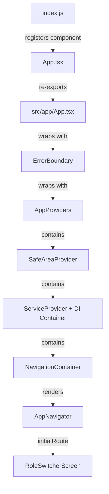

# App Boot Flow

This document explains what happens from the moment the app launches to when you see the Role Switcher screen. Think of it like a relay race — each file passes the baton to the next until the UI is ready.

## Boot Sequence Overview



## Step-by-Step Breakdown

### 1. `index.js` — The Entry Point

This is the very first file React Native executes. It sets up polyfills and registers the root component.

```js
import 'react-native-reanimated';
import { Buffer } from 'buffer';
global.Buffer = Buffer;
import './global.css';
import { AppRegistry } from 'react-native';
import App from './App';
import { name as appName } from './app.json';

AppRegistry.registerComponent(appName, () => App);
```

What's happening:

- **`react-native-reanimated`** — Must be imported first for bottom sheet animations to work.
- **`Buffer` polyfill** — React Native doesn't have Node's `Buffer` by default. We need it for binary crypto operations (encrypting/decrypting NFC card data).
- **`global.css`** — Loads NativeWind (Tailwind for RN) styles.
- **`AppRegistry.registerComponent`** — Tells React Native "here's the root component to render."

> **Analogy:** Think of `index.js` as the ignition key. It doesn't drive the car, but nothing starts without it.

### 2. `App.tsx` — The Re-export

```tsx
import App from './src/app/App';
export default App;
```

This file exists at the project root purely as a bridge. React Native expects a root `App.tsx`, but our real app lives inside `src/app/`. This keeps the source organized without fighting the framework.

### 3. `src/app/App.tsx` — The Real Root Component

```tsx
function App(): React.JSX.Element {
  return (
    <ErrorBoundary>
      <AppProviders>
        <StatusBar barStyle="dark-content" />
        <AppNavigator />
      </AppProviders>
    </ErrorBoundary>
  );
}
```

Three layers wrap the navigator:

| Layer           | Purpose                                                                           |
| --------------- | --------------------------------------------------------------------------------- |
| `ErrorBoundary` | Catches any unhandled JS error and shows a "Try Again" screen instead of crashing |
| `AppProviders`  | Sets up all context providers (DI, navigation, safe area)                         |
| `AppNavigator`  | The actual screen stack                                                           |

> **Analogy:** `ErrorBoundary` is the safety net under a trapeze artist. `AppProviders` is the stage setup. `AppNavigator` is the performance.

### 4. `src/app/providers.tsx` — Context Providers

```tsx
export function AppProviders({ children }: Readonly<AppProvidersProps>) {
  const services = useMemo(() => createAppServices(), []);

  return (
    <SafeAreaProvider>
      <ServiceProvider services={services}>
        <NavigationContainer>{children}</NavigationContainer>
      </ServiceProvider>
    </SafeAreaProvider>
  );
}
```

Provider nesting (outside → inside):

1. **`SafeAreaProvider`** — Handles notches, status bars, and rounded corners on modern phones.
2. **`ServiceProvider`** — Our dependency injection (DI) container. Makes use cases available to any screen via React Context.
3. **`NavigationContainer`** — React Navigation's root. Manages navigation state and linking.

The `useMemo(() => createAppServices(), [])` ensures the DI container is created only once during the app's lifetime.

### 5. `src/app/container.ts` — The DI Container

This is where all the "real" implementations are wired together:

```ts
export function createAppServices(): AppServices {
  const db = open({ name: 'mbc-ledger.db', location: 'default' });
  const cardRepository = createRealMbcCardRepository();
  const nfcStatusRepository = createDeviceNfcStatusRepository();
  const ledgerRepository = createSqliteLedgerRepository(db);

  return {
    station: {
      registerMemberCardUseCase: createRegisterMemberCardUseCase(
        cardRepository,
        ledgerRepository,
      ),
      topUpMemberCardUseCase: createTopUpMemberCardUseCase(
        cardRepository,
        ledgerRepository,
      ),
      // ...
    },
    gate: {
      /* ... */
    },
    terminal: {
      /* ... */
    },
    scout: {
      /* ... */
    },
  };
}
```

What gets created:

- **SQLite database** (`mbc-ledger.db`) — for local audit ledger
- **`RealMbcCardRepository`** — talks to real NFC hardware
- **`DeviceNfcStatusRepository`** — checks if NFC is available on the device
- **`SqliteLedgerRepository`** — reads/writes ledger entries
- **Use cases** — grouped by role (station, gate, terminal, scout)

The container is cached (`cachedServices`) so it's only built once even if `createAppServices()` is called multiple times.

> **Analogy:** The container is like a toolbox. It assembles all the tools (repositories, use cases) once, then any screen can grab what it needs.

### 6. `src/app/navigation.tsx` — The Screen Stack

```tsx
export function AppNavigator(): React.JSX.Element {
  return (
    <Stack.Navigator
      initialRouteName="roleSwitcher"
      screenOptions={{
        headerShown: false,
        contentStyle: { backgroundColor: '#F7F9FC' },
      }}
    >
      <Stack.Screen name="gate" component={GateScreen} />
      <Stack.Screen name="roleSwitcher" component={RoleSwitcherScreen} />
      <Stack.Screen name="scout" component={ScoutScreen} />
      <Stack.Screen name="station" component={StationScreen} />
      <Stack.Screen name="terminal" component={TerminalScreen} />
    </Stack.Navigator>
  );
}
```

Key points:

- **`initialRouteName="roleSwitcher"`** — The first screen the user sees.
- **`headerShown: false`** — We use custom headers, not the default React Navigation bar.
- All five screens are registered but only `roleSwitcher` renders initially.

### 7. `RoleSwitcherScreen` — What the User Sees First

```tsx
export function RoleSwitcherScreen({ navigation }: Props) {
  const selectedRole = useAppStore(state => state.selectedRole);
  const setSelectedRole = useAppStore(state => state.setSelectedRole);

  const handleSelectRole = roleKey => {
    setSelectedRole(roleKey);
    navigation?.navigate?.(roleKey);
  };

  return (
    <View>
      <AppHeaderCard title="MBC Card" subTitle="Select Operating Role" />
      <RoleOptionList
        activeRoleKey={selectedRole}
        roles={roleOptions}
        onSelect={handleSelectRole}
      />
      <NfcLogPanel />
    </View>
  );
}
```

The user picks a role (Station, Gate, Terminal, or Scout) and the app navigates to that screen. The selected role is stored in a Zustand store (`useAppStore`) so it persists across navigation.

## Complete Boot Timeline

| Step | File                 | What Happens                                   | Time    |
| ---- | -------------------- | ---------------------------------------------- | ------- |
| 1    | `index.js`           | Polyfills loaded, component registered         | ~0ms    |
| 2    | `App.tsx`            | Re-export (no logic)                           | ~0ms    |
| 3    | `src/app/App.tsx`    | ErrorBoundary + Providers + Navigator composed | ~1ms    |
| 4    | `providers.tsx`      | DI container created, SQLite opened            | ~5-10ms |
| 5    | `container.ts`       | Repositories and use cases instantiated        | ~2ms    |
| 6    | `navigation.tsx`     | Stack navigator initialized                    | ~5ms    |
| 7    | `RoleSwitcherScreen` | UI rendered, ready for interaction             | ~10ms   |

## Key Architectural Decisions

- **Single DI container** — All dependencies are created once and shared via React Context. No global singletons scattered around.
- **ErrorBoundary at the top** — Any crash anywhere in the tree gets caught gracefully.
- **Buffer polyfill in index.js** — Must be loaded before any crypto code runs, so it goes in the very first file.
- **`enableScreens()`** — Called in `providers.tsx` to use native screen containers for better navigation performance.
