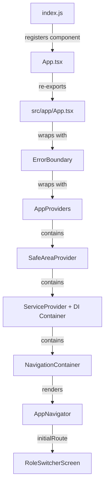

# App Boot Flow

This document explains what happens from the moment the app launches to when you see the Role Switcher screen. Think of it like a relay race — each file passes the baton to the next until the UI is ready.

## What Changed Since May 13

| Area             | Before                           | After                                                                    |
| ---------------- | -------------------------------- | ------------------------------------------------------------------------ |
| DI Container     | Flat services object             | Role-grouped: `station`, `gate`, `terminal`, `scout`                     |
| Service Access   | Single `useServices()` hook      | Typed hooks: `useStationServices()`, `useGateServices()`, etc.           |
| State Management | Basic Zustand store              | Full store with `selectedRole`, `nfcLogEnabled`, `nfcLogs` (bounded 200) |
| Role Screens     | `AppHeaderCard` + `SignalButton` | `ScreenHeader` + `RadarZone` + `ImageBackground` with blur               |
| NFC Log Panel    | Dark variant only                | `variant` prop: `'dark'` or `'light'` (glassmorphic)                     |
| NfcActionSheet   | Basic scanning animation         | `PulseRing` animation + `nfc-orb` image + `confirm` phase                |
| RoleSwitcher     | Plain background                 | `ImageBackground` with blur, info button, safe area insets               |

---

## Boot Sequence Overview


```mermaid
graph TD
    A[index.js] -->|registers component| B[App.tsx]
    B -->|re-exports| C[src/app/App.tsx]
    C -->|wraps with| D[ErrorBoundary]
    D -->|wraps with| E[AppProviders]
    E -->|contains| F[SafeAreaProvider]
    F -->|contains| G[ServiceProvider + DI Container]
    G -->|contains| H[NavigationContainer]
    H -->|renders| I[AppNavigator]
    I -->|initialRoute| J[RoleSwitcherScreen]
```

---

## Step-by-Step Breakdown

### 1. `index.js` — The Entry Point

This is the very first file React Native executes. It sets up polyfills and registers the root component.

```js
import 'react-native-reanimated';
import { Buffer } from 'buffer';
global.Buffer = Buffer;
import './global.css';
import { AppRegistry } from 'react-native';
import App from './App';
import { name as appName } from './app.json';

AppRegistry.registerComponent(appName, () => App);
```

What's happening:

- **`react-native-reanimated`** — Must be imported first for animations (RadarZone sweep, PulseRing, SimulationModePanel dot).
- **`Buffer` polyfill** — React Native doesn't have Node's `Buffer`. We need it for Silent Shield AES-256-GCM crypto operations.
- **`global.css`** — Loads NativeWind (Tailwind for RN) styles used across all screens.
- **`AppRegistry.registerComponent`** — Tells React Native "here's the root component to render."

> **Analogy:** Think of `index.js` as the ignition key. It doesn't drive the car, but nothing starts without it.

### 2. `App.tsx` (root) — The Re-export

```tsx
import App from './src/app/App';
export default App;
```

This file exists at the project root purely as a bridge. React Native expects a root `App.tsx`, but our real app lives inside `src/app/`. This keeps the source organized without fighting the framework.

### 3. `src/app/App.tsx` — The Real Root Component

```tsx
function App(): React.JSX.Element {
  return (
    <ErrorBoundary>
      <AppProviders>
        <StatusBar barStyle="dark-content" />
        <AppNavigator />
      </AppProviders>
    </ErrorBoundary>
  );
}
```

Three layers wrap the navigator:

| Layer           | Purpose                                                                           |
| --------------- | --------------------------------------------------------------------------------- |
| `ErrorBoundary` | Catches any unhandled JS error and shows a "Try Again" screen instead of crashing |
| `AppProviders`  | Sets up all context providers (DI, navigation, safe area)                         |
| `AppNavigator`  | The actual screen stack                                                           |

> **Analogy:** `ErrorBoundary` is the safety net under a trapeze artist. `AppProviders` is the stage setup. `AppNavigator` is the performance.

### 4. `src/app/providers.tsx` — Context Providers

```tsx
export function AppProviders({ children }: Readonly<AppProvidersProps>) {
  const services = useMemo(() => createAppServices(), []);

  return (
    <SafeAreaProvider>
      <ServiceProvider services={services}>
        <NavigationContainer>{children}</NavigationContainer>
      </ServiceProvider>
    </SafeAreaProvider>
  );
}
```

Provider nesting (outside → inside):

1. **`SafeAreaProvider`** — Handles notches, status bars, and rounded corners on modern phones.
2. **`ServiceProvider`** — Our dependency injection (DI) container. Makes use cases available to any screen via React Context.
3. **`NavigationContainer`** — React Navigation's root. Manages navigation state.

The `useMemo(() => createAppServices(), [])` ensures the DI container is created only once during the app's lifetime.

`enableScreens()` is called at module level in `providers.tsx` to use native screen containers for better navigation performance.

### 5. `src/app/container.ts` — The DI Container (Role-Grouped)

This is where all the "real" implementations are wired together. The container is **role-grouped** — each role gets exactly the services it needs:

```ts
export function createAppServices(): AppServices {
  const db = open({ name: 'mbc-ledger.db', location: 'default' });
  const cardRepository = createRealMbcCardRepository();
  const nfcStatusRepository = createDeviceNfcStatusRepository();
  const ledgerRepository = createSqliteLedgerRepository(db);
  const cancelNfc = () => cardRepository.cancel();

  return {
    station: {
      checkNfcAvailabilityUseCase: ...,
      registerMemberCardUseCase: ...,
      topUpMemberCardUseCase: ...,
      getStationLedgerSummaryUseCase: ...,
      cancelNfc,
    },
    gate: {
      checkNfcAvailabilityUseCase: ...,
      checkInActivityUseCase: ...,
      cancelNfc,
    },
    terminal: {
      checkNfcAvailabilityUseCase: ...,
      checkOutActivityUseCase: ...,
      cancelNfc,
    },
    scout: {
      checkNfcAvailabilityUseCase: ...,
      inspectMemberCardUseCase: ...,
      cancelNfc,
    },
  };
}
```

**Why role-grouped?** This follows the **Interface Segregation Principle** (ISP) — each role screen only sees the services it needs. The Gate screen can't accidentally call `topUpMemberCardUseCase` because it's not in `GateServices`.

The container is cached (`cachedServices`) so it's only built once even if `createAppServices()` is called multiple times.

> **Analogy:** The container is like a toolbox with labeled drawers. The Station drawer has registration and top-up tools. The Gate drawer has check-in tools. You can't accidentally grab the wrong tool.

### 6. `src/presentation/context/service-context.tsx` — Typed Service Hooks

```tsx
export function useStationServices(): StationServices {
  return useServices().station;
}
export function useGateServices(): GateServices {
  return useServices().gate;
}
export function useTerminalServices(): TerminalServices {
  return useServices().terminal;
}
export function useScoutServices(): ScoutServices {
  return useServices().scout;
}
```

Each role screen calls its own typed hook. TypeScript enforces that you can only access the use cases assigned to your role.

### 7. `src/presentation/stores/app-store.ts` — Global Presentation State (Zustand)

```ts
interface AppStore {
  selectedRole: AppRole; // 'station' | 'gate' | 'terminal' | 'scout' | null
  nfcLogEnabled: boolean; // toggle for NFC log panel visibility
  nfcLogs: NfcLogEntry[]; // bounded to latest 200 entries
  setSelectedRole: (role) => void;
  toggleNfcLogEnabled: () => void;
  appendNfcLog: (message) => void; // auto-trims to 200
  clearNfcLogs: () => void;
}
```

Key design decisions:

- **Bounded log list** (200 max) prevents unbounded memory growth during long demo sessions.
- **No domain state** — Zustand only holds presentation concerns. Business state lives on the NFC card.

### 8. `src/app/navigation.tsx` — The Screen Stack

```tsx
export function AppNavigator(): React.JSX.Element {
  return (
    <Stack.Navigator
      initialRouteName="roleSwitcher"
      screenOptions={{
        headerShown: false,
        contentStyle: { backgroundColor: '#F7F9FC' },
      }}
    >
      <Stack.Screen name="gate" component={GateScreen} />
      <Stack.Screen name="roleSwitcher" component={RoleSwitcherScreen} />
      <Stack.Screen name="scout" component={ScoutScreen} />
      <Stack.Screen name="station" component={StationScreen} />
      <Stack.Screen name="terminal" component={TerminalScreen} />
    </Stack.Navigator>
  );
}
```

Key points:

- **`initialRouteName="roleSwitcher"`** — The first screen the user sees.
- **`headerShown: false`** — We use `ScreenHeader` (custom), not the default React Navigation bar.
- All five screens are registered but only `roleSwitcher` renders initially.

### 9. `RoleSwitcherScreen` — What the User Sees First

```tsx
export function RoleSwitcherScreen({ navigation }: Props): React.JSX.Element {
  const insets = useSafeAreaInsets();
  const selectedRole = useAppStore(state => state.selectedRole);
  const setSelectedRole = useAppStore(state => state.setSelectedRole);

  const handleSelectRole = roleKey => {
    setSelectedRole(roleKey);
    navigation?.navigate?.(roleKey);
  };

  return (
    <ImageBackground
      source={bgImage}
      className="flex-1"
      resizeMode="cover"
      blurRadius={15}
    >
      {/* Header with title + info button */}
      <RoleOptionList
        activeRoleKey={selectedRole}
        roles={roleOptions}
        onSelect={handleSelectRole}
      />
      <NfcLogPanel variant="light" />
    </ImageBackground>
  );
}
```

The user picks a role (Station, Gate, Terminal, or Scout) and the app navigates to that screen. The selected role is stored in Zustand so it persists across navigation.

**New UI pattern:** All screens (including RoleSwitcher) now use `ImageBackground` with `blurRadius={15}` for a frosted-glass aesthetic. The `NfcLogPanel` uses `variant="light"` for a glassmorphic card style that blends with the blurred background.

---

## Complete Boot Timeline

| Step | File                 | What Happens                                           | Time    |
| ---- | -------------------- | ------------------------------------------------------ | ------- |
| 1    | `index.js`           | Polyfills loaded, component registered                 | ~0ms    |
| 2    | `App.tsx`            | Re-export (no logic)                                   | ~0ms    |
| 3    | `src/app/App.tsx`    | ErrorBoundary + Providers + Navigator composed         | ~1ms    |
| 4    | `providers.tsx`      | DI container created, SQLite opened                    | ~5-10ms |
| 5    | `container.ts`       | Repositories and use cases instantiated (role-grouped) | ~2ms    |
| 6    | `navigation.tsx`     | Stack navigator initialized                            | ~5ms    |
| 7    | `RoleSwitcherScreen` | UI rendered, ready for interaction                     | ~10ms   |

---

## Key Architectural Decisions

| Decision                            | Why (SOLID Principle)                                                                   |
| ----------------------------------- | --------------------------------------------------------------------------------------- |
| Role-grouped DI container           | **Interface Segregation** — each role only sees its own services                        |
| Typed service hooks                 | **Dependency Inversion** — screens depend on abstractions, not concrete implementations |
| Zustand for presentation state only | **Single Responsibility** — business state lives on card, UI state in store             |
| ErrorBoundary at the top            | **Open/Closed** — new screens can crash without taking down the whole app               |
| Buffer polyfill in index.js         | Must be loaded before any crypto code runs (Silent Shield)                              |
| `enableScreens()`                   | Native screen containers for better navigation performance                              |
| Cached container singleton          | Prevents duplicate SQLite connections and NFC manager instances                         |

---

## Shared UI Components Used Across All Roles

| Component         | Purpose                                                              | File                                                   |
| ----------------- | -------------------------------------------------------------------- | ------------------------------------------------------ |
| `ScreenHeader`    | Title + subtitle + colored badge + back button                       | `src/presentation/components/ScreenHeader/index.tsx`   |
| `RadarZone`       | Animated NFC trigger (radar rings + sweep + pulse + gradient button) | `src/presentation/components/RadarZone/index.tsx`      |
| `NfcActionSheet`  | Bottom sheet for scan/success/error/confirm phases                   | `src/presentation/components/NfcActionSheet/index.tsx` |
| `NfcLogPanel`     | Dev-only operational log (toggle on/off, clear, bounded 200)         | `src/presentation/components/NfcLogPanel/index.tsx`    |
| `ImageBackground` | Blurred background image on all screens                              | React Native built-in                                  |

These components form the **visual language** of the app — every role screen looks consistent because they share the same building blocks.
