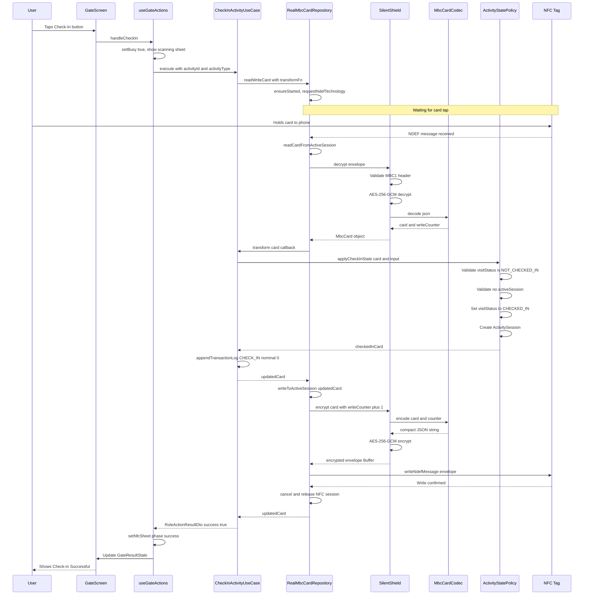
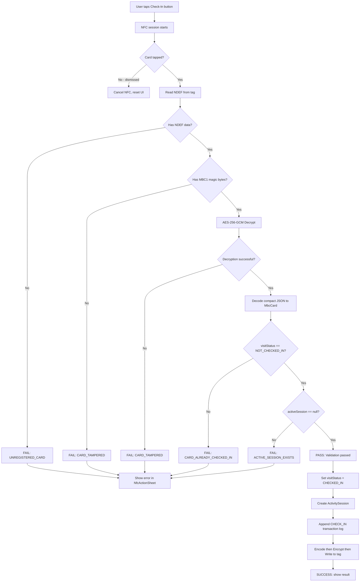

# Gate Check-In Flow — A Junior Developer's Guide

> **Analogy:** Think of the Gate like a parking garage entrance boom gate. You drive up, tap your membership card on the reader, the system validates your card, stamps it with "you're inside now," and lifts the barrier. That's exactly what this code does — digitally.

---

## Table of Contents

1. [Navigation: Getting to the Gate Screen](#1-navigation-getting-to-the-gate-screen)
2. [Gate Screen UI](#2-gate-screen-ui)
3. [Pressing the Check-In Button](#3-pressing-the-check-in-button)
4. [NfcActionSheet — The Scanning Phase](#4-nfcactionsheet--the-scanning-phase)
5. [CheckInActivityUseCase.execute()](#5-checkinactivityusecaseexecute)
6. [NFC Read: Decrypt → Decode → Get Card](#6-nfc-read-decrypt--decode--get-card)
7. [Domain Logic: Validation & State Transition](#7-domain-logic-validation--state-transition)
8. [NFC Write: Re-encode → Re-encrypt → Write Back](#8-nfc-write-re-encode--re-encrypt--write-back)
9. [SQLite Ledger Entry](#9-sqlite-ledger-entry)
10. [Success/Error Back to UI](#10-successerror-back-to-ui)
11. [Edge Cases](#11-edge-cases)
12. [Mermaid Diagrams](#12-mermaid-diagrams)

---

## 1. Navigation: Getting to the Gate Screen

The app starts at the **RoleSwitcher** screen (`src/presentation/screens/RoleSwitcher/index.tsx`). It shows four role cards: Station, Gate, Terminal, and Scout.

When the user taps the **Gate** card:

```tsx
// RoleSwitcherScreen
const handleSelectRole = roleKey => {
  setSelectedRole(roleKey); // saves "gate" in global store
  navigation?.navigate?.(roleKey); // navigates to the 'gate' route
};
```

The navigation stack is defined in `src/app/navigation.tsx`:

```tsx
export type RootStackParamList = {
  roleSwitcher: undefined;
  gate: undefined;
  // ...other screens
};
```

React Navigation pushes the `GateScreen` component onto the stack. No parameters are passed — the Gate screen is self-contained.

---

## 2. Gate Screen UI

**File:** `src/presentation/screens/Gate/index.tsx`

The Gate screen has these visual elements from top to bottom:

| Element                | Purpose                                                                       |
| ---------------------- | ----------------------------------------------------------------------------- |
| `AppHeaderCard`        | Blue header showing "The Gate" title and "Checking in for Parking" subtitle   |
| `SelectedActivityCard` | A white card showing the currently selected activity (hardcoded to "Parking") |
| `SignalButton`         | The main action button — "Tap Card to Check In"                               |
| `GateResultState`      | Shows success/error result after a check-in attempt                           |
| `NfcLogPanel`          | Debug log panel showing NFC events                                            |
| `NfcActionSheet`       | Bottom sheet overlay that appears during NFC operations                       |

**Activity Selection:** Currently, the activity is hardcoded to "Parking" in the `SelectedActivityCard` fragment. There's no dropdown or picker — the Gate always checks in for parking. The `activityId` is set to `'parking-main-gate'` and `activityType` to `'PARKING'` in the hook.

---

## 3. Pressing the Check-In Button

When the user presses "Tap Card to Check In", this happens:

```tsx
<SignalButton
  label={actions.busy ? 'Processing...' : 'Tap Card to Check In'}
  disabled={actions.busy}
  onPress={() => {
    void actions.handleCheckIn();
  }}
/>
```

The `handleCheckIn` function lives in the `useGateActions` hook (`src/presentation/screens/Gate/useGateActions.ts`). Here's what it does step by step:

```tsx
const handleCheckIn = useCallback(async () => {
  dismissedRef.current = false; // reset dismiss flag
  setBusy(true); // disable the button
  setNfcSheet({
    // show the scanning bottom sheet
    phase: 'scanning',
    message: 'Hold your NFC card to check in',
  });

  try {
    appendNfcLog('[NFC] Check-in flow started');

    // 👇 This is the core call — everything happens inside here
    const result = await services.checkInActivityUseCase.execute({
      activityId: 'parking-main-gate',
      activityType: 'PARKING',
    });

    // ... handle result (success or failure)
  } catch (error) {
    // ... handle unexpected errors
  } finally {
    setBusy(false);
  }
}, [appendNfcLog, services]);
```

**Key insight:** The button press triggers the NFC scan immediately. The phone starts listening for a card tap as soon as `execute()` is called.

---

## 4. NfcActionSheet — The Scanning Phase

The `NfcActionSheet` (`src/presentation/components/NfcActionSheet/index.tsx`) is a bottom sheet that slides up from the bottom of the screen. It has four possible phases:

| Phase      | What the user sees                                         |
| ---------- | ---------------------------------------------------------- |
| `idle`     | Nothing (sheet is hidden)                                  |
| `scanning` | Spinner + "Hold your NFC card to check in" message         |
| `success`  | Green box with "Checked In" + balance info + "Done" button |
| `error`    | Red box with error title + message + "Dismiss" button      |

The sheet state is managed by the `nfcSheet` state variable in `useGateActions`:

```tsx
type NfcActionState =
  | { phase: 'idle' }
  | { phase: 'scanning'; message?: string }
  | { phase: 'success'; title: string; message: string }
  | { phase: 'error'; title: string; message: string }
  | {
      phase: 'confirm';
      title: string;
      message: string;
      confirmLabel: string;
      onConfirm: () => void;
    };
```

The user can dismiss the sheet at any time. If they do, `dismissedRef.current` is set to `true` and the NFC session is cancelled — any pending result is ignored.

---

## 5. CheckInActivityUseCase.execute()

**File:** `src/application/use-cases/check-in-activity.use-case.ts`

This is the **application layer** — it orchestrates the entire check-in operation. Think of it as the "manager" that tells the NFC card repository what to do and handles the result.

```tsx
export class CheckInActivityUseCase {
  constructor(private readonly cardRepository: MbcCardRepository) {}

  async execute({
    activityId,
    activityType,
  }: CheckInActivityRequest): Promise<RoleActionResultDto> {
    const occurredAt = new Date().toISOString();

    const updatedCard = await this.cardRepository.readWriteCard(card => {
      // Step 1: Apply check-in state (domain validation + state change)
      const checkedInCard = applyCheckInState(card, {
        activityId,
        activityType,
        checkedInAt: occurredAt,
      });
      // Step 2: Append a CHECK_IN transaction log
      return createCheckInLog(checkedInCard, occurredAt);
    });

    return {
      success: true,
      role: 'GATE',
      message: 'Card checked in successfully.',
      card: toCardSummaryDto(updatedCard),
    };
  }
}
```

**The magic of `readWriteCard`:** This method reads the card, applies a transform function (our domain logic), and writes the result back — all in a single NFC session (one tap). The user doesn't need to tap twice.

---

## 6. NFC Read: Decrypt → Decode → Get Card

**File:** `src/infrastructure/nfc/real-mbc-card.repository.ts`

When `readWriteCard` is called, here's what happens at the NFC level:

```tsx
async readWriteCard(transform: (card: MbcCard) => MbcCard): Promise<MbcCard> {
  await this.ensureStarted();          // Initialize NFC manager
  try {
    await this.requestNdefTechnology(); // Wait for card tap (blocks here!)
    const card = await this.readCardFromActiveSession(); // Read + decrypt
    const updated = transform(card);    // Apply domain logic
    await this.writeToActiveSession(updated); // Encrypt + write
    return updated;
  } catch (error) {
    throw toReadableError(error);
  } finally {
    await this.cancel();                // Release NFC session
  }
}
```

### The Read Process (`readCardFromActiveSession`):

1. **Read NDEF message** from the physical NFC tag
2. **Check if card is blank** → throw `UNREGISTERED_CARD` if no data
3. **Check MBC envelope** → verify the `MBC1` magic bytes exist
4. **Decrypt with AES-256-GCM** using Silent Shield (`silent-shield.ts`)
5. **Decode compact JSON** using the codec (`mbc-card-codec.ts`)
6. **Return the `MbcCard` object** ready for domain logic

The decryption uses the **Silent Shield** module:

```tsx
// silent-shield.ts — decrypt flow
export function decrypt(
  envelope: Buffer,
): ShieldResult<{ card: MbcCard; writeCounter: number }> {
  // 1. Validate envelope header (magic, version, key ID, algorithm)
  // 2. Extract IV (12 bytes), authTag (16 bytes), ciphertext
  // 3. AES-256-GCM decrypt with DEMO_KEY
  // 4. Parse the resulting JSON with the codec's decode()
  // 5. Return { card, writeCounter }
}
```

**Analogy:** It's like opening a locked safe (decrypt), taking out a compressed letter (compact JSON), unfolding it (decode), reading what's written (MbcCard object).

---

## 7. Domain Logic: Validation & State Transition

**File:** `src/domain/services/activity-state-policy.ts`

The `applyCheckInState` function is the **domain guard**. It ensures the check-in is valid before allowing it:

```tsx
export function applyCheckInState(card: MbcCard, input: CheckInInput): MbcCard {
  // Guard 1: Card must NOT already be checked in
  if (card.visitStatus !== 'NOT_CHECKED_IN') {
    throw new DomainError(
      'CARD_ALREADY_CHECKED_IN',
      'Card is already checked in and cannot start another activity.',
    );
  }

  // Guard 2: Card must NOT have an existing active session
  if (card.activeSession) {
    throw new DomainError(
      'ACTIVE_SESSION_EXISTS',
      'Card already has an active activity session and cannot start another one.',
    );
  }

  // All good — create the new state
  const nextCard = cloneCard(card);
  nextCard.visitStatus = 'CHECKED_IN';
  nextCard.activeSession = createActivitySession(input);
  return nextCard;
}
```

After validation passes, the **transaction log** is appended:

```tsx
function createCheckInLog(card: MbcCard, occurredAt: string): MbcCard {
  return appendTransactionLog(
    card,
    createTransactionLog({
      id: createRandomId('LOG'),
      activity: 'CHECK_IN',
      nominal: 0, // Check-in doesn't cost anything
      occurredAt,
    }),
  );
}
```

The transaction log keeps only the **last 5 entries** (to fit within NTAG215's 504-byte memory):

```tsx
export function appendTransactionLog(
  card: MbcCard,
  log: TransactionLog,
): MbcCard {
  const nextLogs = [...card.transactionLogs, log].slice(-5);
  return { ...card, transactionLogs: nextLogs };
}
```

---

## 8. NFC Write: Re-encode → Re-encrypt → Write Back

After the domain logic produces the updated `MbcCard`, the repository writes it back to the physical tag:

```tsx
private async writeToActiveSession(card: MbcCard): Promise<void> {
  this.writeCounter++;
  const shieldResult = encrypt(card, this.writeCounter);
  // ... validate result
  const envelope = shieldResult.value;
  // ... check it fits in NTAG215 (504 bytes)
  const encoded = Ndef.encodeMessage([
    Ndef.record(Ndef.TNF_MIME_MEDIA, 'application/vnd.mbc.v1', '', Array.from(envelope)),
  ]);
  await NfcManager.ndefHandler.writeNdefMessage(encoded);
}
```

### The Write Process:

1. **Increment write counter** (anti-replay protection)
2. **Encode** the `MbcCard` into compact JSON (`v,c,m,b,i,x,n` format)
3. **Encrypt** with AES-256-GCM → produces the Silent Shield envelope
4. **Validate size** — must fit within 504 bytes (NTAG215 user memory)
5. **Write NDEF message** to the physical tag

The compact codec format keeps the payload small:

```json
{
  "v": 1, // version
  "c": "CARD-001", // cardId
  "m": "MEM-001", // memberId
  "b": 50000, // balance
  "i": { "a": 1, "t": "2026-..." }, // activeSession (null if not checked in)
  "x": [["I", 0, "2026-..."]], // transaction logs (compact)
  "n": 3 // write counter
}
```

---

## 9. SQLite Ledger Entry

Unlike Station and Terminal, the **Gate role does NOT write to the local SQLite ledger**. The `CheckInActivityUseCase` is constructed with only a `cardRepository` — no `localLedgerRepository` is injected.

```tsx
// From src/app/container.ts
gate: {
  checkInActivityUseCase: new CheckInActivityUseCase(cardRepository),
  cancelNfc,
},
```

The check-in event is recorded **on the NFC card itself** (as a `CHECK_IN` transaction log entry in the compact payload). The card remains the sole source of truth for check-in state. If audit reporting is needed for gate operations, it would be added by injecting a `LocalLedgerRepository` in the future — but currently, the Gate keeps things minimal.

---

## 10. Success/Error Back to UI

After `checkInActivityUseCase.execute()` resolves, the hook updates the UI:

**On success:**

```tsx
setLatestResult(result);
setNfcSheet({
  phase: 'success',
  title: 'Checked In',
  message: `${result.message}\nBalance: Rp ${result.card?.balance?.toLocaleString('id-ID') ?? '0'}`,
});
```

The `GateResultState` fragment renders a green success card showing:

- ✓ Check-in Successful
- Activity: Parking
- Balance: Rp 50,000
- Checked in at: 08-May-2026 14:30

**On failure:**

```tsx
setNfcSheet({
  phase: 'error',
  title: 'Check-In Failed',
  message: result.message,
});
```

The `GateResultState` fragment renders a red error card with the specific error message.

---

## 11. Edge Cases

### Unregistered Card (blank tag)

- **When:** The NFC tag has no NDEF data or no MBC envelope
- **Error thrown:** `CardRepositoryError('UNREGISTERED_CARD', 'Card is blank or not registered yet.')`
- **UI shows:** Red error sheet — "Card cannot be processed"
- **What to do:** Register the card at a Station first

### Already Checked In (double check-in)

- **When:** `card.visitStatus === 'CHECKED_IN'` or `card.activeSession` exists
- **Error thrown:** `DomainError('CARD_ALREADY_CHECKED_IN', ...)` or `DomainError('ACTIVE_SESSION_EXISTS', ...)`
- **UI shows:** Red error sheet with title "Blocked" and message explaining the card is already checked in
- **What to do:** Check out at a Terminal first, then check in again

### Tampered Card

- **When:** The card has data but decryption fails (wrong key, corrupted data, modified bytes)
- **Error thrown:** `CardRepositoryError('CARD_TAMPERED', 'Card data is invalid or modified. Please go to Station.')`
- **UI shows:** Red error sheet — "Card cannot be processed"
- **What to do:** Re-register the card at a Station

### Scan Cancelled

- **When:** User dismisses the NfcActionSheet before tapping a card
- **What happens:** `dismissedRef.current = true`, `services.cancelNfc()` is called
- **UI shows:** Sheet closes, button re-enables, no result shown

---

## 12. Mermaid Diagrams

### Sequence Diagram: Full Check-In Flow



### Flowchart: Validation & State Transition Logic



### Before/After Card State Comparison

```mermaid
graph LR
    subgraph BEFORE[Card BEFORE Check-In]
        direction TB
        B1[version: 1]
        B2[cardId: CARD-001]
        B3[member: memberId MEM-001]
        B4[balance: 50000]
        B5[visitStatus: NOT_CHECKED_IN]
        B6[activeSession: undefined]
        B7[transactionLogs: 1 entry - TOP_UP 50000]
    end

    subgraph AFTER[Card AFTER Check-In]
        direction TB
        A1[version: 1]
        A2[cardId: CARD-001]
        A3[member: memberId MEM-001]
        A4[balance: 50000]
        A5[visitStatus: CHECKED_IN]
        A6[activeSession: parking-main-gate PARKING]
        A7[transactionLogs: 2 entries - TOP_UP then CHECK_IN]
    end

    BEFORE -->|applyCheckInState + appendTransactionLog| AFTER
```



---

## Summary: The Complete Journey

Here's the entire check-in flow in plain English:

1. **User opens app** → sees RoleSwitcher → taps "Gate"
2. **Gate screen loads** → shows Parking activity card + "Tap Card to Check In" button
3. **User presses button** → bottom sheet slides up with spinner saying "Hold your NFC card"
4. **User taps physical card** → phone reads the encrypted data from the NTAG215 tag
5. **Decrypt & decode** → AES-256-GCM decryption → compact JSON parsing → `MbcCard` object
6. **Domain validation** → Is the card registered? ✓ Is it NOT already checked in? ✓
7. **State transition** → `visitStatus` changes from `NOT_CHECKED_IN` to `CHECKED_IN`, `activeSession` is created
8. **Transaction log** → A `CHECK_IN` entry is appended (keeps last 5 only)
9. **Encode & encrypt** → `MbcCard` → compact JSON → AES-256-GCM encryption → binary envelope
10. **Write back to card** → The updated encrypted data is written to the same NFC tag
11. **Release NFC** → Session closed, tag can be removed
12. **UI updates** → Bottom sheet shows green "✓ Checked In" with balance, result card appears

All of this happens in a **single tap** — the card never leaves the phone's NFC field during the read-validate-write cycle.

---

## Architecture Layers Involved

| Layer              | Files                                                                  | Responsibility                                |
| ------------------ | ---------------------------------------------------------------------- | --------------------------------------------- |
| **Presentation**   | `Gate/index.tsx`, `useGateActions.ts`, `NfcActionSheet`                | UI, user interaction, state display           |
| **Application**    | `check-in-activity.use-case.ts`                                        | Orchestration, error mapping, DTO creation    |
| **Domain**         | `activity-state-policy.ts`, `transaction-log-policy.ts`, `mbc-card.ts` | Business rules, validation, state transitions |
| **Infrastructure** | `real-mbc-card.repository.ts`, `silent-shield.ts`, `mbc-card-codec.ts` | NFC I/O, encryption, serialization            |
