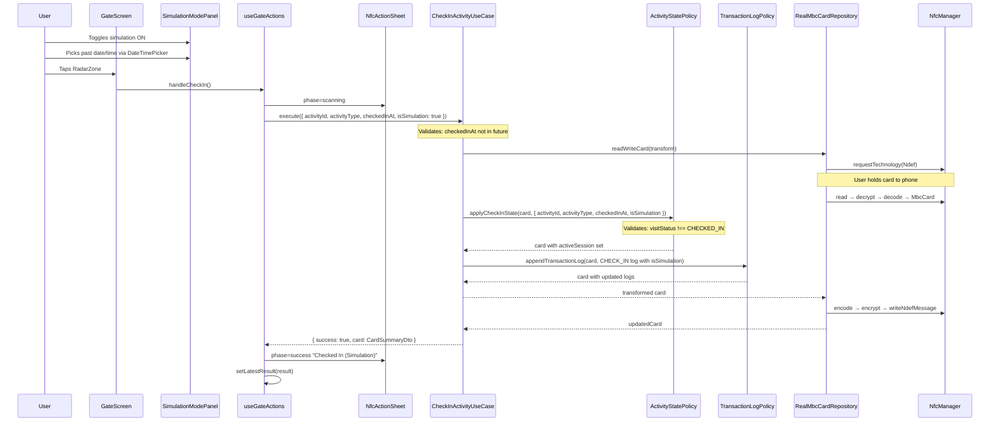
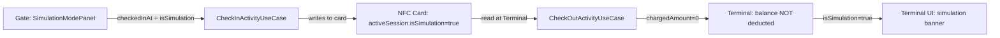

# Gate Check-In Flow

This document explains the complete flow when a gate operator checks in a member for parking at the Gate. It covers the standard real-time flow and the **Simulation Mode** — a major feature that allows operators to set a past entry time for testing and demo purposes.

> **Analogy:** Think of the Gate like a parking garage entrance boom gate. You drive up, tap your membership card on the reader, the system validates your card, stamps it with "you're inside now" and the entry time, and lifts the barrier. Simulation Mode is like a time machine — it lets you pretend the car arrived hours ago, so you can demo the checkout fee calculation without actually waiting.

## What Changed Since May 13

| Area                | Before                                 | After                                                                          |
| ------------------- | -------------------------------------- | ------------------------------------------------------------------------------ |
| NFC trigger         | `SignalButton` "Tap Card to Check In"  | `RadarZone` (animated radar with gradient button)                              |
| Header              | `AppHeaderCard`                        | `ScreenHeader` with blue badge                                                 |
| Background          | Plain color                            | `ImageBackground` with `blurRadius={15}`                                       |
| Result display      | `GateResultState` inline               | `GateResultState` fragment with success card + "Scan Another Card" reset       |
| **Simulation Mode** | Not implemented                        | `SimulationModePanel` (dev-only): toggle + DateTimePicker + animated pulse dot |
| Check-in use case   | Fixed `new Date()` timestamp           | Accepts optional `checkedInAt` + `isSimulation` params                         |
| Domain entity       | `activeSession` had no simulation flag | `activeSession.isSimulation?: boolean` stored on card                          |
| Result DTO          | No simulation awareness                | `isSimulation` field propagates to Terminal checkout                           |

---

## High-Level Summary

When the gate operator taps the RadarZone:

1. `NfcActionSheet` appears in scanning phase
2. The use case determines the check-in timestamp:
   - **Normal mode:** `new Date().toISOString()` (real device time)
   - **Simulation mode:** user-selected past date/time
3. Reads the card via `readWriteCard` (single NFC session)
4. Validates: card is registered, not already checked in, simulation time not in future
5. Writes `activeSession` with activity ID, type, timestamp, and `isSimulation` flag
6. Appends a CHECK_IN transaction log
7. Shows success (with "(Simulation)" label if applicable)

---

## Sequence Diagram


```mermaid
sequenceDiagram
    participant User
    participant UI as GateScreen
    participant Sim as SimulationModePanel
    participant Hook as useGateActions
    participant Sheet as NfcActionSheet
    participant UC as CheckInActivityUseCase
    participant Policy as ActivityStatePolicy
    participant LogPolicy as TransactionLogPolicy
    participant Repo as RealMbcCardRepository
    participant NFC as NfcManager

    User->>Sim: Toggles simulation ON
    User->>Sim: Picks past date/time via DateTimePicker
    User->>UI: Taps RadarZone
    UI->>Hook: handleCheckIn()
    Hook->>Sheet: phase=scanning

    Hook->>UC: execute({ activityId, activityType, checkedInAt, isSimulation: true })

    Note over UC: Validates: checkedInAt not in future

    UC->>Repo: readWriteCard(transform)
    Repo->>NFC: requestTechnology(Ndef)
    Note over Repo,NFC: User holds card to phone
    Repo->>NFC: read → decrypt → decode → MbcCard

    UC->>Policy: applyCheckInState(card, { activityId, activityType, checkedInAt, isSimulation })
    Note over Policy: Validates: visitStatus !== CHECKED_IN
    Policy-->>UC: card with activeSession set

    UC->>LogPolicy: appendTransactionLog(card, CHECK_IN log with isSimulation)
    LogPolicy-->>UC: card with updated logs

    UC-->>Repo: transformed card
    Repo->>NFC: encode → encrypt → writeNdefMessage
    Repo-->>UC: updatedCard

    UC-->>Hook: { success: true, card: CardSummaryDto }
    Hook->>Sheet: phase=success "Checked In (Simulation)"
    Hook->>Hook: setLatestResult(result)
```

---

## Step-by-Step Breakdown

### 1. Gate Screen UI Layout

**File:** `src/presentation/screens/Gate/index.tsx`

```tsx
<ImageBackground
  source={bgImage}
  style={{ flex: 1 }}
  resizeMode="cover"
  blurRadius={15}
>
  <ScreenHeader
    title="The Gate"
    subtitle="Checking in for Parking"
    badgeLabel="Gate"
    badgeColor="#3B82F6"
  />

  <SimulationModePanel
    enabled={actions.simulationEnabled}
    onToggle={actions.setSimulationEnabled}
    simulatedDate={actions.simulatedDate}
    onDateChange={actions.setSimulatedDate}
  />

  {actions.latestResult ? (
    <GateResultState
      latestResult={actions.latestResult}
      onReset={actions.resetResult}
    />
  ) : (
    <RadarZone
      color="#FF0025"
      label="Tap Card to Check In"
      onPress={handleCheckIn}
    />
  )}

  <NfcLogPanel variant="light" />
  <NfcActionSheet state={actions.nfcSheet} onDismiss={handleDismissSheet} />
</ImageBackground>
```

**State machine:** The screen alternates between two views:

- **Radar mode** (default): Shows RadarZone, waiting for tap
- **Result mode** (after scan): Shows `GateResultState` with success/error + "Scan Another Card" button

### 2. SimulationModePanel — The Time Machine

**File:** `src/presentation/screens/Gate/fragments/SimulationModePanel.tsx`

This component is **dev-only** (`if (!__DEV__) return null`) — it won't appear in production builds.

```tsx
<View
  style={{
    backgroundColor: 'rgba(255, 255, 255, 0.4)',
    borderColor: enabled ? amber : white,
  }}
>
  {enabled && <Animated.View /* pulsing amber dot */ />}
  <Text>Simulation</Text>
  {enabled && (
    <Pressable onPress={() => setShowDatePicker(true)}>
      <Text>{dayjs(simulatedDate).format('DD MMM HH:mm')}</Text>
    </Pressable>
  )}
  <Switch value={enabled} onValueChange={onToggle} />
</View>
```

Features:

- **Toggle switch** — enables/disables simulation mode
- **Animated pulse dot** — amber dot with `withRepeat(withTiming(...))` to indicate active simulation
- **Date button** — shows formatted date, opens DateTimePicker on press
- **Two-step picker** — first picks date (max 90 days back), then picks time
- **Visual indicator** — amber border when active, white when inactive

### 3. useGateActions — The Hook

**File:** `src/presentation/screens/Gate/useGateActions.ts`

```ts
const [simulationEnabled, setSimulationEnabled] = useState(false);
const [simulatedDate, setSimulatedDate] = useState<Date>(new Date());

const handleCheckIn = useCallback(async () => {
  const result = await services.checkInActivityUseCase.execute({
    activityId: 'parking-main-gate',
    activityType: 'PARKING',
    ...(simulationEnabled
      ? { checkedInAt: simulatedDate.toISOString(), isSimulation: true }
      : {}),
  });

  if (result.success) {
    const simLabel = simulationEnabled ? ' (Simulation)' : '';
    setNfcSheet({ phase: 'success', title: `Checked In${simLabel}`, ... });
  }
}, [simulationEnabled, simulatedDate, ...]);
```

**Key behavior:** When simulation is OFF, no `checkedInAt` or `isSimulation` is passed — the use case defaults to `new Date().toISOString()`.

### 4. CheckInActivityUseCase — Domain Logic

**File:** `src/application/use-cases/check-in-activity.use-case.ts`

```ts
export type CheckInActivityRequest = {
  activityId: string;
  activityType: BenefitActivityType;
  checkedInAt?: string;      // optional: simulation timestamp
  isSimulation?: boolean;    // optional: marks session as simulated
};

async execute({ activityId, activityType, checkedInAt, isSimulation }) {
  const occurredAt = checkedInAt ?? new Date().toISOString();

  // Guard: simulation time cannot be in the future
  if (checkedInAt) {
    const checkedInDate = new Date(checkedInAt);
    if (checkedInDate.getTime() > Date.now()) {
      return { success: false, message: 'Simulation time cannot be in the future.' };
    }
  }

  const updatedCard = await cardRepository.readWriteCard(card => {
    const checkedInCard = applyCheckInState(card, {
      activityId, activityType, checkedInAt: occurredAt, isSimulation,
    });
    return createCheckInLog(checkedInCard, occurredAt, isSimulation);
  });
}
```

**Validation rules:**

1. Simulation time must not be in the future (prevents nonsensical durations)
2. Card must not already be checked in (`CARD_ALREADY_CHECKED_IN`)
3. Card must be registered (not tampered, not unregistered)

### 5. What Gets Written to the Card

After check-in, the card's `activeSession` field contains:

```ts
activeSession: {
  activityId: 'parking-main-gate',
  activityType: 'PARKING',
  checkedInAt: '2026-05-21T14:30:00.000Z',  // real or simulated time
  isSimulation: true,                         // only present if simulated
}
```

The `isSimulation` flag is **stored on the physical NFC card**. This means when the Terminal reads the card later for checkout, it knows this was a simulation session and can skip balance deduction.

### 6. Transaction Log Entry

```ts
createTransactionLog({
  id: createRandomId('LOG'),
  activity: 'CHECK_IN',
  nominal: 0, // check-in has no monetary value
  occurredAt,
  isSimulation, // propagated to log
});
```

Note: Check-in does **NOT** append a local SQLite ledger entry. Only Station operations (REGISTER, TOP_UP) and Terminal (CHECK_OUT) write to the ledger.

### 7. GateResultState — Success/Error Display

**File:** `src/presentation/screens/Gate/fragments/GateResultState.tsx`

On success:

```
┌─────────────────────────────┐
│         ✓ (green)           │
│   Check-in Successful       │
│                             │
│  Activity: Parking          │
│  Balance: Rp 50.000        │
│  Checked in at: 21-May...  │
│                             │
│  [Scan Another Card]        │
└─────────────────────────────┘
```

On error (e.g., already checked in):

```
┌─────────────────────────────┐
│  BLOCKED                    │
│  Card is already checked in │
│  [Scan Another Card]        │
└─────────────────────────────┘
```

The "Scan Another Card" button calls `resetResult()` which clears `latestResult` and returns to RadarZone view.

---

## Simulation Mode — How It Propagates


```mermaid
graph LR
    A[Gate: SimulationModePanel] -->|checkedInAt + isSimulation| B[CheckInActivityUseCase]
    B -->|writes to card| C[NFC Card: activeSession.isSimulation=true]
    C -->|read at Terminal| D[CheckOutActivityUseCase]
    D -->|chargedAmount=0| E[Terminal: balance NOT deducted]
    E -->|isSimulation=true| F[Terminal UI: simulation banner]
```

The simulation flag flows through the entire system:

1. **Gate** sets it during check-in
2. **Card** stores it in `activeSession`
3. **Terminal** reads it during checkout and skips deduction
4. **Scout** displays it as "(S)" suffix on status

---

## Error Scenarios

| Error                  | Source                          | UI Behavior                      |
| ---------------------- | ------------------------------- | -------------------------------- |
| `ALREADY_CHECKED_IN`   | Card already has active session | Error: "Blocked"                 |
| `CARD_TAMPERED`        | Silent Shield integrity failure | Error with message               |
| `UNREGISTERED_CARD`    | Card has no MBC data            | Error with message               |
| Future simulation time | `checkedInAt > Date.now()`      | Error: "cannot be in the future" |
| NFC write failure      | Hardware/tag issue              | Error with message               |

---

## SOLID Principles in This Flow

| Principle                 | Application                                                               |
| ------------------------- | ------------------------------------------------------------------------- |
| **Single Responsibility** | SimulationModePanel handles only UI; use case handles only business logic |
| **Open/Closed**           | Adding new activity types doesn't change the check-in flow structure      |
| **Liskov Substitution**   | Mock repository works identically for simulation and real flows           |
| **Interface Segregation** | `GateServices` only exposes `checkInActivityUseCase` + `cancelNfc`        |
| **Dependency Inversion**  | Use case doesn't know about DateTimePicker or UI state                    |
