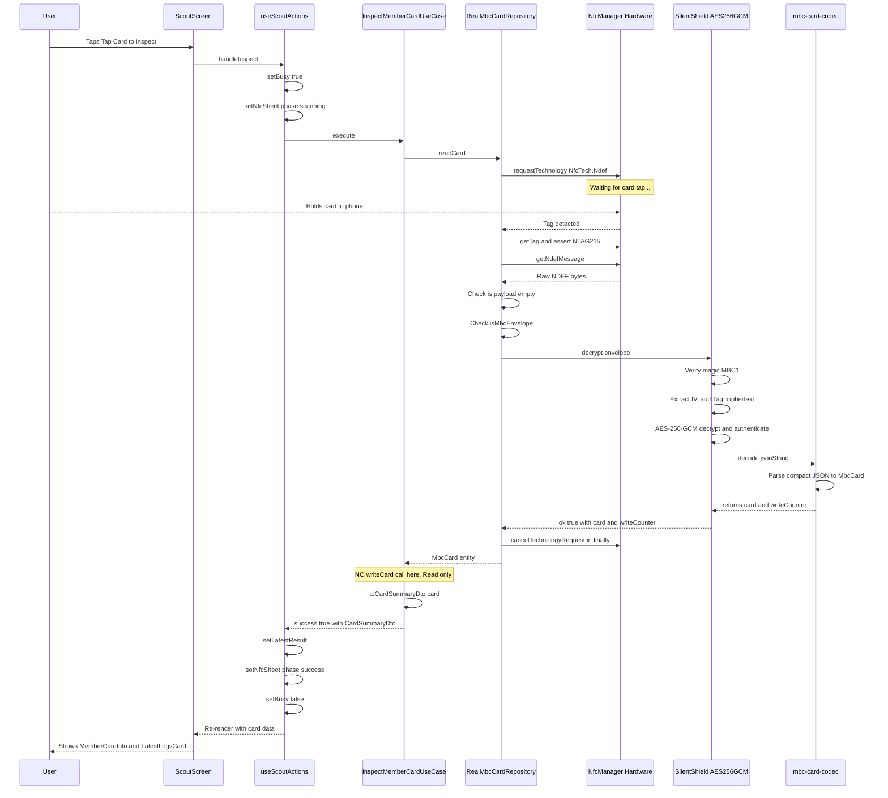
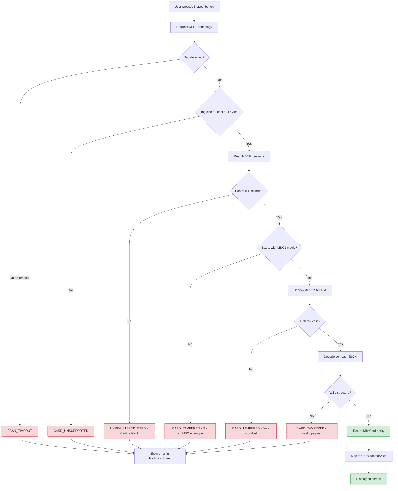
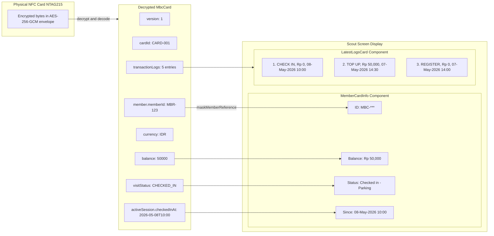

# Scout Inspect Flow — A Junior Developer's Guide

> **TL;DR:** The Scout role is like a security guard with a clipboard — it can **look** at a membership card but **never write** on it. It reads the NFC card, decrypts the data, and displays it on screen. That's it. No mutations. Ever.

---

## Table of Contents

1. [The Big Picture](#the-big-picture)
2. [Navigation: Getting to Scout](#navigation-getting-to-scout)
3. [Scout Screen UI](#scout-screen-ui)
4. [What Happens When You Press "Inspect"](#what-happens-when-you-press-inspect)
5. [The Use Case: InspectMemberCardUseCase](#the-use-case-inspectmembercardusecase)
6. [NFC Read Operation (Read-Only!)](#nfc-read-operation-read-only)
7. [Data Displayed to the User](#data-displayed-to-the-user)
8. [Edge Cases and Errors](#edge-cases-and-errors)
9. [Key Difference from Other Roles](#key-difference-from-other-roles)
10. [Sequence Diagram](#sequence-diagram)
11. [Read-Only Validation Flowchart](#read-only-validation-flowchart)
12. [Data Display Diagram](#data-display-diagram)

---

## The Big Picture

Think of the app as a building with four rooms (roles). Each room has different powers:

| Role      | Can Read Card? | Can Write Card? | Analogy                                     |
| --------- | :------------: | :-------------: | ------------------------------------------- |
| Station   |       ✅       |       ✅        | The front desk — registers and tops up      |
| Gate      |       ✅       |       ✅        | The parking gate — checks in/out            |
| Terminal  |       ✅       |       ✅        | The checkout counter — deducts balance      |
| **Scout** |       ✅       |       ❌        | **The inspector — looks but never touches** |

The Scout is the **only role that never calls `writeCard`, `readWriteCard`, or `registerCard`**. It exclusively uses `readCard()`.

---

## Navigation: Getting to Scout

The app starts at the **RoleSwitcher** screen. Here's how the user gets to Scout:

1. App launches → `AppNavigator` renders with `initialRouteName="roleSwitcher"`
2. User sees four role cards on the RoleSwitcher screen
3. User taps the **Scout** option
4. `handleSelectRole('scout')` is called
5. React Navigation pushes the `scout` route → `ScoutScreen` renders

From `src/presentation/screens/RoleSwitcher/index.tsx`:

```typescript
const handleSelectRole = (roleKey: (typeof roleOptions)[number]['key']) => {
  setSelectedRole(roleKey);
  navigation?.navigate?.(roleKey); // navigates to 'scout'
};
```

The navigation stack is defined in `src/app/navigation.tsx`:

```typescript
<Stack.Screen name="scout" component={ScoutScreen} />
```

---

## Scout Screen UI

The Scout screen (`src/presentation/screens/Scout/index.tsx`) is intentionally simple:

```typescript
export function ScoutScreen(): React.JSX.Element {
  const services = useScoutServices();
  const actions = useScoutActions(services);

  return (
    <View className="flex-1 bg-[#001A41]">
      {/* Header */}
      <AppHeaderCard
        title="The Scout"
        subTitle="Card Inspection and Member Info"
        hasBackButton={true}
      />

      {/* One big button — that's it */}
      <SignalButton
        label={actions.busy ? 'Inspecting...' : 'Tap Card to Inspect'}
        disabled={actions.busy}
        onPress={() => { void actions.handleInspect(); }}
      />

      {/* Results appear below after scan */}
      {actions.latestResult?.success === false && (
        <ScoutErrorCard message={actions.latestResult.message} />
      )}
      {actions.latestResult?.card && (
        <MemberCardInfo card={actions.latestResult.card} />
      )}
      {actions.latestResult?.card && (
        <LatestLogsCard logs={actions.latestResult.card.transactionLogs} />
      )}

      {/* NFC bottom sheet for scan feedback */}
      <NfcActionSheet state={actions.nfcSheet} onDismiss={...} />
    </View>
  );
}
```

**Key UI elements:**

- **One button** — "Tap Card to Inspect" (disabled while busy)
- **MemberCardInfo** — shows balance, visit status, active session
- **LatestLogsCard** — shows the last 5 transaction logs with timestamps
- **ScoutErrorCard** — shows error messages (unregistered, tampered, etc.)
- **NfcActionSheet** — the bottom sheet that guides the user through scanning

---

## What Happens When You Press "Inspect"

The `useScoutActions` hook (`src/presentation/screens/Scout/useScoutActions.ts`) orchestrates the entire flow:

```typescript
const handleInspect = useCallback(async () => {
  dismissedRef.current = false;
  setBusy(true);

  // 1. Show the scanning bottom sheet
  setNfcSheet({
    phase: 'scanning',
    message: 'Hold your NFC card to inspect',
  });

  try {
    appendNfcLog('[NFC] Inspect flow started');

    // 2. Execute the use case (READ ONLY)
    const result = await services.inspectMemberCardUseCase.execute();

    // 3. If user dismissed the sheet while waiting, bail out
    if (dismissedRef.current) {
      return;
    }

    // 4. Store result for display
    setLatestResult(result);

    // 5. Show success or error in the bottom sheet
    if (result.success) {
      setNfcSheet({
        phase: 'success',
        title: 'Card Read',
        message: result.message,
      });
    } else {
      setNfcSheet({
        phase: 'error',
        title: 'Inspect Failed',
        message: result.message,
      });
    }
  } catch (error) {
    // 6. Unexpected errors
    setNfcSheet({ phase: 'error', title: 'Error', message: msg });
  } finally {
    setBusy(false);
  }
}, [appendNfcLog, services]);
```

**The NfcActionSheet phases:**

| Phase      | What the user sees                           |
| ---------- | -------------------------------------------- |
| `scanning` | Spinner + "Hold your NFC card to inspect"    |
| `success`  | Green card with "Card Read" + Done button    |
| `error`    | Red card with error message + Dismiss button |
| `idle`     | Sheet is hidden                              |

The user can dismiss the sheet at any time. If they do, `dismissedRef.current` becomes `true` and the result is silently discarded.

---

## The Use Case: InspectMemberCardUseCase

This is the simplest use case in the entire app. From `src/application/use-cases/inspect-member-card.use-case.ts`:

```typescript
export function createInspectMemberCardUseCase(
  cardRepository: MbcCardRepository,
): InspectMemberCardUseCase {
  return {
    async execute(): Promise<RoleActionResultDto> {
      try {
        // ONLY reads — never writes
        const card = await cardRepository.readCard();

        return {
          success: true,
          role: 'SCOUT',
          message: 'Card inspected successfully.',
          card: toCardSummaryDto(card),
        };
      } catch (error) {
        if (isCardRepositoryError(error)) {
          return { success: false, role: 'SCOUT', message: error.message };
        }
        throw error;
      }
    },
  };
}
```

**Notice:** There is NO `writeCard()`, NO `readWriteCard()`, NO `registerCard()`. Just `readCard()`. The Scout use case is a pure read operation.

Compare this to other roles:

- **Station** calls `registerCard()` and `readWriteCard()` (for top-up)
- **Gate** calls `readWriteCard()` (for check-in)
- **Terminal** calls `readWriteCard()` (for check-out)
- **Scout** calls only `readCard()` ← **READ ONLY**

---

## NFC Read Operation (Read-Only!)

When `readCard()` is called on `RealMbcCardRepository`, here's what happens step by step:

### Step 1: Request NFC Technology

```typescript
await NfcManager.requestTechnology(NfcTech.Ndef);
```

This activates the NFC radio and waits for a tag to be tapped.

### Step 2: Validate Tag Type

```typescript
private async assertSupportedTag(): Promise<void> {
  const tag = await NfcManager.getTag();
  if (tag && typeof tag.maxSize === 'number' && tag.maxSize < 504) {
    throw new CardRepositoryError('CARD_UNSUPPORTED', '...');
  }
}
```

Ensures the tag is at least NTAG215 (504 bytes user memory).

### Step 3: Read NDEF Message

```typescript
const msg = await NfcManager.ndefHandler.getNdefMessage();
```

Reads the raw bytes from the card.

### Step 4: Check for Empty Card

```typescript
if (!ndefMessage?.length) {
  throw new CardRepositoryError(
    'UNREGISTERED_CARD',
    'Card is blank or not registered yet.',
  );
}
```

### Step 5: Verify MBC Envelope (Magic Bytes)

```typescript
if (!isMbcEnvelope(payloadBytes)) {
  throw new CardRepositoryError(
    'CARD_TAMPERED',
    'Card payload is not a valid MBC Silent Shield envelope.',
  );
}
```

Checks for the `MBC1` magic marker (4 bytes: `0x4D 0x42 0x43 0x31`).

### Step 6: Decrypt with AES-256-GCM

```typescript
const decryptResult = decrypt(payloadBytes);
if (!decryptResult.ok) {
  throw new CardRepositoryError(
    'CARD_TAMPERED',
    'Card data is invalid or modified.',
  );
}
```

The Silent Shield decryption:

1. Extracts IV (12 bytes) and auth tag (16 bytes) from the envelope
2. Decrypts ciphertext using AES-256-GCM with the shared key
3. If the auth tag doesn't match → **tampered card** (GCM provides authentication)

### Step 7: Decode Compact JSON

The decrypted plaintext is a compact JSON format:

```json
{
  "v": 1, // version
  "c": "CARD-001", // cardId
  "m": "MBR-123", // memberId
  "b": 50000, // balance (IDR)
  "i": { "a": 1, "t": "2026-05-08T10:00:00Z" }, // active session (or null)
  "x": [["I", 0, "2026-05-08T10:00:00Z"]], // transaction logs
  "n": 5 // write counter
}
```

This gets decoded into a full `MbcCard` domain entity.

### Step 8: Release NFC (finally block)

```typescript
finally {
  await cancel(); // NfcManager.cancelTechnologyRequest()
}
```

Always releases the NFC radio, whether success or failure.

**⚠️ CRITICAL: After reading, the `readCard()` method goes straight to `finally`. There is NO write step. The card data on the physical tag remains completely untouched.**

---

## Data Displayed to the User

After a successful read, the `toCardSummaryDto` mapper transforms the domain entity into a display-friendly DTO:

```typescript
export function toCardSummaryDto(card: MbcCard): CardSummaryDto {
  return {
    cardId: card.cardId,
    memberName: card.member.displayName,
    maskedMemberReference: maskMemberReference(card.member.memberId),
    balance: card.balance,
    currency: card.currency,
    visitStatus: card.visitStatus,
    activeSession: card.activeSession ? { ...card.activeSession } : undefined,
    transactionLogs: [...card.transactionLogs],
  };
}
```

### MemberCardInfo Component

Displays:

- **ID** — masked member reference (e.g., `MBC-***`)
- **Balance** — formatted as `Rp 50,000` (Indonesian Rupiah)
- **Status** — "Checked in - Parking" or "Not checked in"
- **Since** — check-in timestamp (only shown if currently checked in)

### LatestLogsCard Component

Displays the **last 5 transaction logs**, each showing:

- **Activity** — REGISTER, TOP_UP, CHECK_IN, or CHECK_OUT (with underscores replaced by spaces)
- **Nominal** — amount in Rp (e.g., `Rp 50,000`)
- **Timestamp** — formatted as `DD-MMM-YYYY HH:mm`

---

## Edge Cases and Errors

| Scenario                                   | Error Code          | User Sees                                                            |
| ------------------------------------------ | ------------------- | -------------------------------------------------------------------- |
| Card has no data (blank/factory-fresh)     | `UNREGISTERED_CARD` | "Card is blank or not registered yet."                               |
| Card has data but not MBC format           | `CARD_TAMPERED`     | "Card payload is not a valid MBC Silent Shield envelope."            |
| Card has MBC envelope but decryption fails | `CARD_TAMPERED`     | "Card data is invalid or modified. Please go to Station."            |
| Tag is too small (not NTAG215)             | `CARD_UNSUPPORTED`  | "This tag type is not supported. Use an NTAG215 or compatible card." |
| User pulls card away too fast              | `READ_FAILED`       | "Failed to read card. Ensure the card is held steady."               |
| User dismisses sheet before scan completes | `SCAN_CANCELLED`    | (silently discarded — no error shown)                                |
| NFC scan times out                         | `SCAN_TIMEOUT`      | "No NFC tag detected within the timeout period."                     |

All errors are caught by the use case and returned as `{ success: false, message: '...' }`. The UI shows them in the red `ScoutErrorCard` component.

---

## Key Difference from Other Roles

Here's a side-by-side comparison of what each role does with the NFC card:

| Role                 | Repository Method          | Reads? | Writes? |        Mutates Card State?         |
| -------------------- | -------------------------- | :----: | :-----: | :--------------------------------: |
| Station (Register)   | `registerCard(card)`       |   ✅   |   ✅    |        ✅ Creates new card         |
| Station (Top-Up)     | `readWriteCard(transform)` |   ✅   |   ✅    |        ✅ Increases balance        |
| Gate (Check-In)      | `readWriteCard(transform)` |   ✅   |   ✅    |         ✅ Sets CHECKED_IN         |
| Terminal (Check-Out) | `readWriteCard(transform)` |   ✅   |   ✅    | ✅ Deducts balance, clears session |
| **Scout (Inspect)**  | **`readCard()`**           |   ✅   |   ❌    |            ❌ **NEVER**            |

The Scout's `InspectMemberCardUseCase` is injected with the same `MbcCardRepository` interface, but it **only ever calls `readCard()`**. The TypeScript type system doesn't enforce this at compile time (the interface exposes write methods too), but the use case code simply never calls them.

**Analogy:** Imagine a library card scanner at the entrance. It reads your card to check if you're a member, but it doesn't stamp it, doesn't change your borrowing limit, and doesn't mark any books as returned. It just looks and reports.

---

## Sequence Diagram



---

## Read-Only Validation Flowchart



---

## Data Display Diagram



---

## Summary for Junior Developers

1. **Scout = Read-Only Inspector.** If you remember one thing, remember this.
2. The flow is: Button → NfcActionSheet (scanning) → `readCard()` → decrypt → decode → display.
3. There is **no transform function**, **no writeCard call**, **no card mutation** anywhere in the Scout path.
4. The same `RealMbcCardRepository` is used by all roles, but Scout only touches `readCard()`.
5. Errors are gracefully caught and shown in a red error card — the app never crashes from a bad card.
6. The NFC radio is always released in a `finally` block, even if something goes wrong.

If you're ever asked "can Scout modify the card?" — the answer is **no**, and you can prove it by looking at `InspectMemberCardUseCase`: it has exactly one repository call, and it's `readCard()`.
