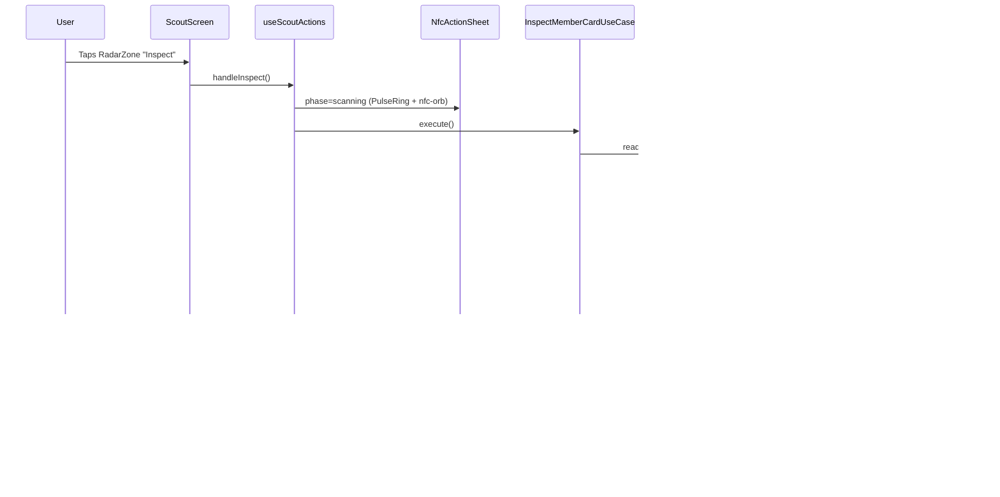
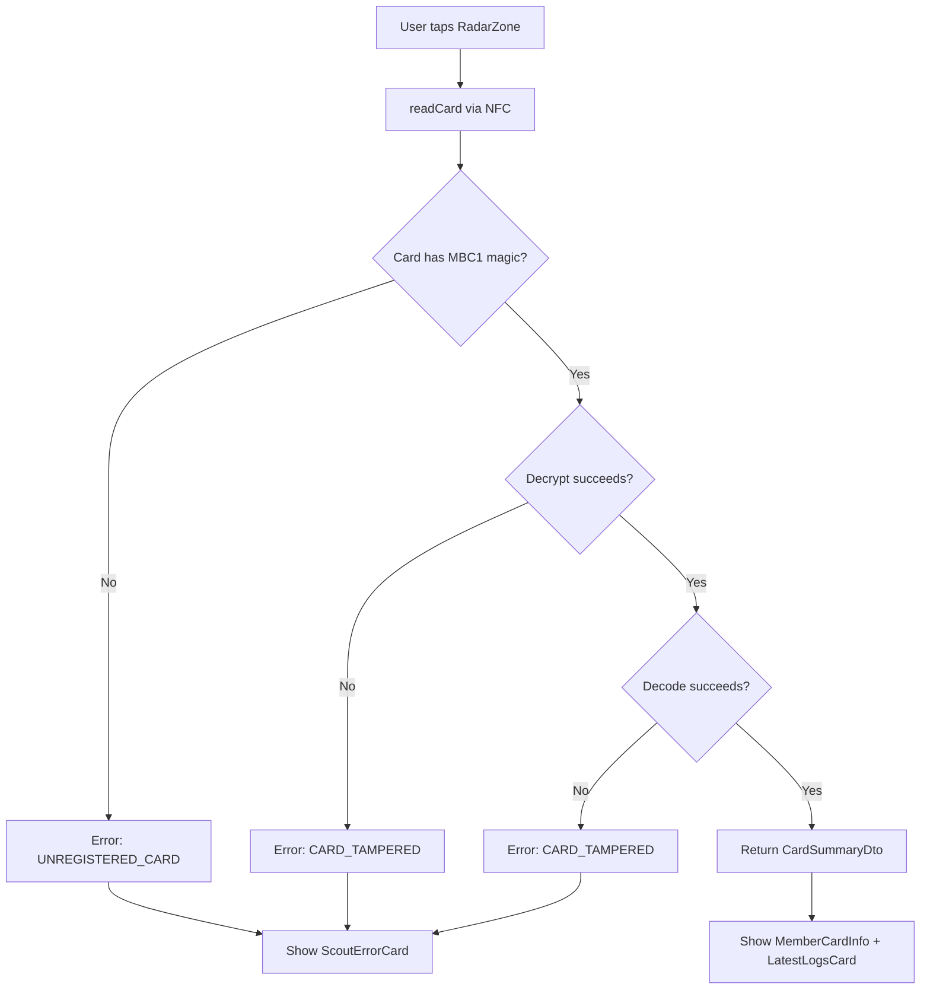

# Scout Inspect Flow

This document explains the complete flow when a member or operator uses the Scout role to inspect a card. Scout is the **only read-only role** — it can look at a card but never write to it.

> **Analogy:** The Scout is like a security guard with a clipboard — it can **look** at a membership card but **never write** on it. It reads the NFC card, decrypts the data, and displays it on screen. That's it. No mutations. Ever.

## What Changed Since May 13

| Area                 | Before              | After                                                                       |
| -------------------- | ------------------- | --------------------------------------------------------------------------- |
| NFC trigger          | `SignalButton`      | `RadarZone` (animated radar with gradient button)                           |
| Header               | `AppHeaderCard`     | `ScreenHeader` with cyan badge                                              |
| Background           | Plain color         | `ImageBackground` with `blurRadius={15}`                                    |
| Result display       | Inline card info    | 3 fragments: `MemberCardInfo`, `LatestLogsCard`, `ScoutErrorCard`           |
| Result animation     | None                | Animated fade-in + slide-up (opacity + translateY)                          |
| View state           | Always shows button | State machine: RadarZone ↔ ScrollView with results                          |
| Reset                | No reset            | "Scan Another Card" button returns to RadarZone                             |
| Simulation indicator | N/A                 | Shows "(S)" suffix on checked-in status when `isSimulation`                 |
| Log display          | Basic list          | `LatestLogsCard` with numbered entries, simulation markers, formatted dates |

---

## High-Level Summary

When the user taps the RadarZone in Scout mode:

1. `NfcActionSheet` appears in scanning phase
2. The use case calls `readCard()` — **read-only, no write**
3. Decrypts and decodes the card data
4. Returns `CardSummaryDto` with balance, status, active session, and logs
5. RadarZone hides, animated results appear (fade-in + slide-up)
6. User can tap "Scan Another Card" to reset back to RadarZone

---

## The Big Picture — Role Comparison

| Role      | Can Read? | Can Write? | Repository Method                   |
| --------- | :-------: | :--------: | ----------------------------------- |
| Station   |    ✅     |     ✅     | `registerCard()`, `readWriteCard()` |
| Gate      |    ✅     |     ✅     | `readWriteCard()`                   |
| Terminal  |    ✅     |     ✅     | `readWriteCard()`                   |
| **Scout** |    ✅     |     ❌     | **`readCard()` only**               |

Scout is the **only role that never calls `writeCard`, `readWriteCard`, or `registerCard`**. It exclusively uses `readCard()`.

---

## Sequence Diagram


```mermaid
sequenceDiagram
    participant User
    participant UI as ScoutScreen
    participant Hook as useScoutActions
    participant Sheet as NfcActionSheet
    participant UC as InspectMemberCardUseCase
    participant Repo as RealMbcCardRepository
    participant Shield as Silent Shield
    participant NFC as NfcManager

    User->>UI: Taps RadarZone "Inspect"
    UI->>Hook: handleInspect()
    Hook->>Sheet: phase=scanning (PulseRing + nfc-orb)
    Hook->>UC: execute()
    UC->>Repo: readCard()
    Repo->>NFC: requestTechnology(Ndef)
    Note over Repo,NFC: User holds card to phone
    Repo->>NFC: read NDEF message
    Repo->>Shield: decrypt(envelope)
    Shield-->>Repo: plaintext payload
    Repo->>Repo: decode compact format → MbcCard
    Repo-->>UC: MbcCard
    UC-->>Hook: { success: true, card: CardSummaryDto }
    Hook->>Sheet: phase=success "Card Read"
    Hook->>Hook: setLatestResult(result)
    Note over UI: RadarZone hides, animated results appear
```

---

## Step-by-Step Breakdown

### 1. Scout Screen UI — State Machine

**File:** `src/presentation/screens/Scout/index.tsx`

The screen has two mutually exclusive views controlled by `showResult`:

```tsx
{!showResult ? (
  // VIEW 1: RadarZone (waiting for scan)
  <View className="flex-1">
    <RadarZone color="#FF0025" label="Inspect" busyLabel="Scanning..." onPress={handleInspect} />
    <Text>{statusText}</Text>
  </View>
) : (
  // VIEW 2: Scrollable results (after scan)
  <ScrollView>
    <Animated.View style={{ opacity: resultOpacity, transform: [{ translateY: resultTranslateY }] }}>
      {latestResult.success === false && <ScoutErrorCard message={...} />}
      {latestResult.card && <MemberCardInfo card={...} />}
      {latestResult.card && <LatestLogsCard logs={...} />}
    </Animated.View>
    <Pressable onPress={handleScanAgain}>
      <Text>Scan Another Card</Text>
    </Pressable>
  </ScrollView>
)}
```

**State transitions:**

```
[RadarZone] --tap--> [Scanning] --result--> [Animated Results]
[Animated Results] --"Scan Another Card"--> [RadarZone]
```

### 2. Animated Result Reveal

```tsx
useEffect(() => {
  if (actions.latestResult) {
    setShowResult(true);
    Animated.parallel([
      Animated.timing(resultOpacity, {
        toValue: 1,
        duration: 400,
        useNativeDriver: true,
      }),
      Animated.timing(resultTranslateY, {
        toValue: 0,
        duration: 400,
        easing: Easing.out(Easing.cubic),
        useNativeDriver: true,
      }),
    ]).start();
  } else {
    resultOpacity.setValue(0);
    resultTranslateY.setValue(30);
  }
}, [actions.latestResult]);
```

Results fade in (0→1 opacity) and slide up (30px→0 translateY) over 400ms with a cubic ease-out curve. This gives a polished "card appearing" feel.

### 3. InspectMemberCardUseCase — Pure Read

**File:** `src/application/use-cases/inspect-member-card.use-case.ts`

```ts
async execute(): Promise<RoleActionResultDto> {
  const card = await cardRepository.readCard();
  return {
    success: true,
    role: 'SCOUT',
    message: 'Card inspected successfully.',
    card: toCardSummaryDto(card),
  };
}
```

This is the simplest use case in the app. No transforms, no writes, no ledger entries. Just read and return.

### 4. MemberCardInfo — Card Summary Display

**File:** `src/presentation/screens/Scout/fragments/MemberCardInfo.tsx`

```
┌─────────────────────────────────┐
│  Member Card Information        │
│                                 │
│  ID:      MBC-***              │
│  Balance: Rp 50.000            │
│  Status:  Checked in (S) - Parking  ← "(S)" for simulation
│  Since:   21-May-2026 14:30    │
└─────────────────────────────────┘
```

Key display logic:

```tsx
const simSuffix = card.activeSession?.isSimulation ? ' (S)' : '';
const statusLabel = isCheckedIn
  ? `Checked in${simSuffix}${activitySuffix}`
  : 'Not checked in';
```

- **"(S)" suffix** — indicates the check-in was a simulation (from Gate's SimulationModePanel)
- **Balance color** — green if > 0, red if 0
- **Status badge** — green background for checked in, gray for not checked in
- **"Since" row** — only shows if there's an active session with `checkedInAt`

### 5. LatestLogsCard — Transaction History

**File:** `src/presentation/screens/Scout/fragments/LatestLogsCard.tsx`

```
┌─────────────────────────────────────────────────┐
│  Latest Five Logs                               │
│                                                 │
│  1. CHECK IN (S)              21-May-2026 14:30 │
│  2. TOP UP        Rp 50.000  21-May-2026 10:00 │
│  3. REGISTER                  20-May-2026 09:15 │
└─────────────────────────────────────────────────┘
```

Features:

- Shows up to 5 most recent logs (reversed — newest first)
- Each log shows: numbered position, activity name, amount (if > 0), timestamp
- **"(S)" suffix** on activity name when `log.isSimulation` is true
- Underscores in activity names replaced with spaces for readability

### 6. ScoutErrorCard — Error Display

**File:** `src/presentation/screens/Scout/fragments/MemberCardError.tsx`

```
┌─────────────────────────────────┐
│  CARD CANNOT BE PROCESSED       │
│  [error message from use case]  │
└─────────────────────────────────┘
```

Red-tinted card with uppercase title. Shows for tampered cards, unregistered cards, or read failures.

### 7. "Scan Another Card" — Reset

```tsx
const handleScanAgain = useCallback(() => {
  setShowResult(false); // hides results, shows RadarZone again
}, []);
```

Note: this only resets the UI view. The `latestResult` in the hook is preserved until the next scan overwrites it. The animation values are reset to initial state (opacity=0, translateY=30) so the next result animates in fresh.

---

## useScoutActions — The Hook

**File:** `src/presentation/screens/Scout/useScoutActions.ts`

```ts
export function useScoutActions(services: ScoutServices) {
  const [latestResult, setLatestResult] = useState<RoleActionResultDto | null>(
    null,
  );
  const [busy, setBusy] = useState(false);
  const [nfcSheet, setNfcSheet] = useState<NfcActionState>({ phase: 'idle' });

  const handleInspect = useCallback(async () => {
    setBusy(true);
    setNfcSheet({
      phase: 'scanning',
      message: 'Hold your NFC card to inspect',
      color: '#FF0025',
    });

    const result = await services.inspectMemberCardUseCase.execute();
    setLatestResult(result);

    if (result.success) {
      setNfcSheet({
        phase: 'success',
        title: 'Card Read',
        message: result.message,
      });
    } else {
      setNfcSheet({
        phase: 'error',
        title: 'Inspect Failed',
        message: result.message,
      });
    }
    setBusy(false);
  }, [services]);

  return { latestResult, busy, nfcSheet, handleInspect, handleDismissSheet };
}
```

Simpler than other hooks — no simulation state, no ledger refresh, no mode switching.

---

## Read-Only Validation Flowchart


```mermaid
graph TD
    A[User taps RadarZone] --> B[readCard via NFC]
    B --> C{Card has MBC1 magic?}
    C -->|No| D[Error: UNREGISTERED_CARD]
    C -->|Yes| E{Decrypt succeeds?}
    E -->|No| F[Error: CARD_TAMPERED]
    E -->|Yes| G{Decode succeeds?}
    G -->|No| H[Error: CARD_TAMPERED]
    G -->|Yes| I[Return CardSummaryDto]
    I --> J[Show MemberCardInfo + LatestLogsCard]
    D --> K[Show ScoutErrorCard]
    F --> K
    H --> K
```

---

## Error Scenarios

| Error                | Source                 | UI Behavior          |
| -------------------- | ---------------------- | -------------------- |
| `UNREGISTERED_CARD`  | No MBC1 magic bytes    | ScoutErrorCard       |
| `CARD_TAMPERED`      | Decrypt/decode failure | ScoutErrorCard       |
| NFC read failure     | Hardware/tag issue     | Error sheet          |
| User dismisses sheet | Taps outside or cancel | Returns to RadarZone |

---

## Key Difference from Other Roles

| Aspect              | Station/Gate/Terminal                 | Scout               |
| ------------------- | ------------------------------------- | ------------------- |
| NFC method          | `readWriteCard()` or `registerCard()` | `readCard()` only   |
| Card mutation       | Yes                                   | **Never**           |
| Ledger entry        | Yes (Station/Terminal)                | No                  |
| Use case complexity | Multi-step transform                  | Single read         |
| Error recovery      | May retry with different action       | Can only scan again |

---

## SOLID Principles in This Flow

| Principle                 | Application                                                                    |
| ------------------------- | ------------------------------------------------------------------------------ |
| **Single Responsibility** | Each fragment handles one display concern (info, logs, error)                  |
| **Open/Closed**           | New card fields can be displayed without changing the inspect flow             |
| **Liskov Substitution**   | Mock repository returns same `MbcCard` shape as real NFC                       |
| **Interface Segregation** | `ScoutServices` only exposes `inspectMemberCardUseCase` — no write access      |
| **Dependency Inversion**  | Use case depends on `MbcCardRepository.readCard()` interface, not NFC hardware |
