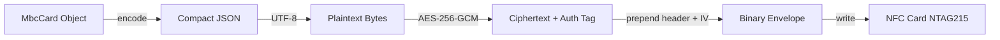
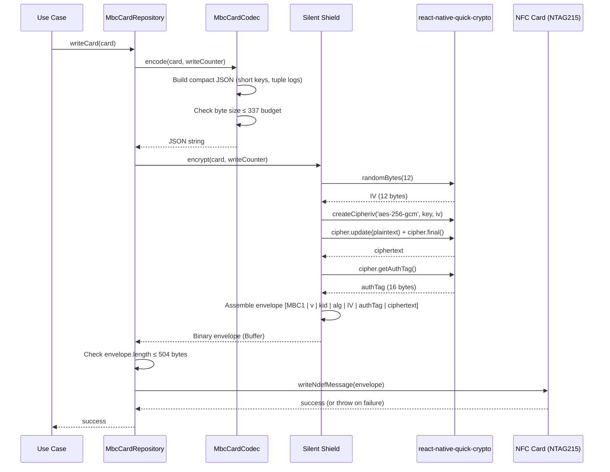
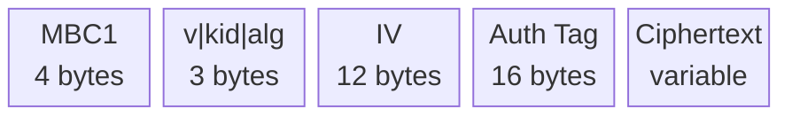
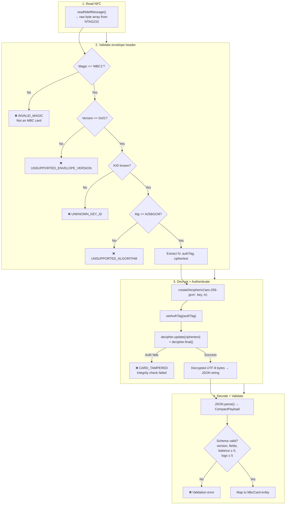
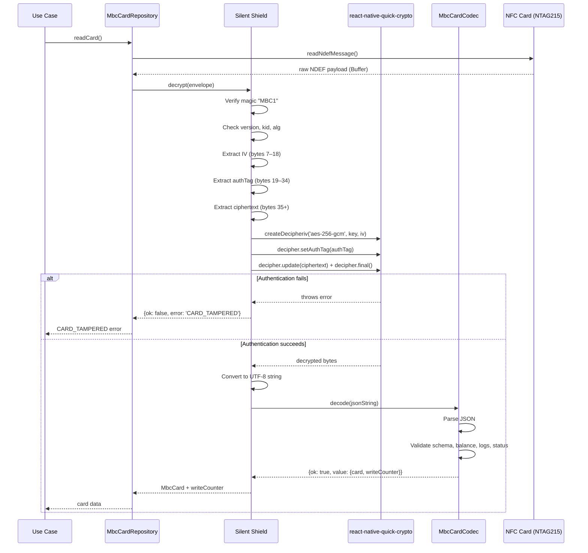
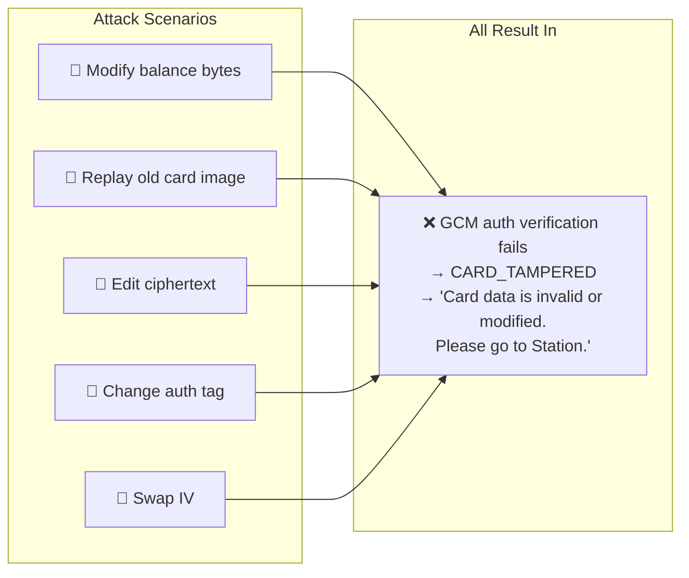
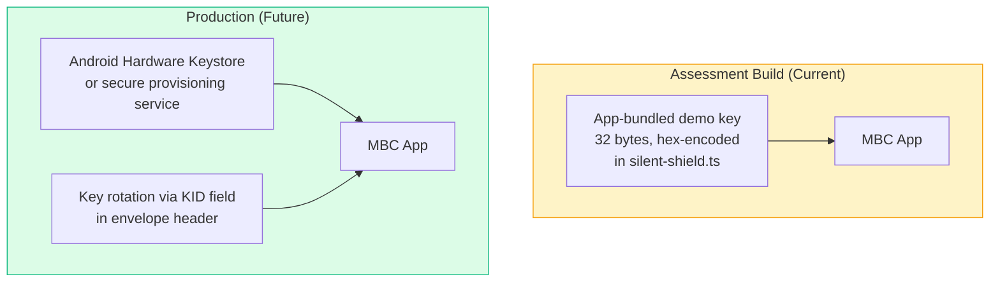
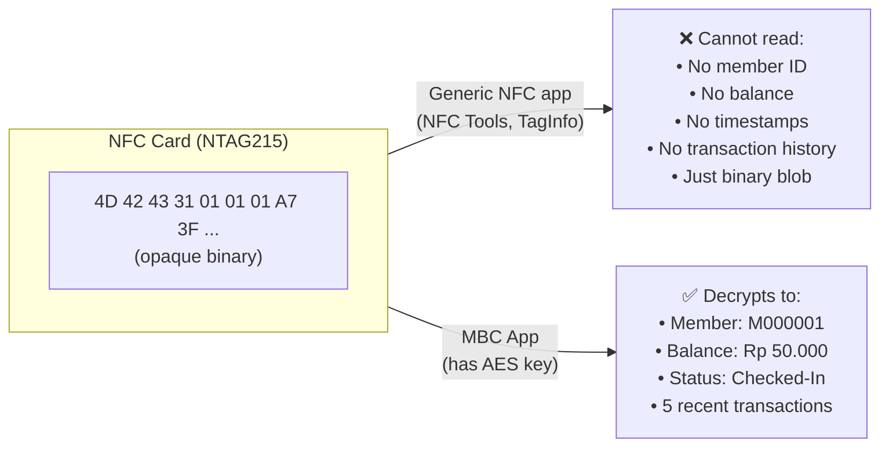

```mermaid
flowchart TD
    A[MbcCard Entity] --> B[encode]

    subgraph serialize["1. Serialize to Compact JSON"]
        B --> B1["Map cardId → 'c', memberId → 'm',\nbalance → 'b', activeSession → 'i',\ntransactionLogs → 'x', writeCounter → 'n'"]
        B1 --> B2["Map each log to tuple:\n['O', 2000, '2026-05-06T10:00:00+07:00']"]
        B2 --> B3["Enforce max 5 logs (FIFO)"]
        B3 --> B4["JSON.stringify(compactPayload)"]
    end

    subgraph validate["2. Validate Size"]
        B4 --> C1{"Buffer.byteLength(json, 'utf8')\n≤ 337 bytes?"}
        C1 -->|No| C2["❌ PAYLOAD_EXCEEDS_CAPACITY\nAbort write"]
        C1 -->|Yes| C3["✅ Plaintext ready"]
    end

    subgraph convert["3. Convert to Bytes"]
        C3 --> D1["Buffer.from(json, 'utf8')\n→ UTF-8 byte array"]
    end

    subgraph iv["4. Generate Fresh IV"]
        D1 --> E1["Crypto.randomBytes(12)\n→ 12 random bytes\n(unique per write, never reused)"]
    end

    subgraph encrypt["5. AES-256-GCM Encrypt"]
        E1 --> F1["createCipheriv('aes-256-gcm', key, iv)"]
        F1 --> F2["cipher.update(plaintextBytes)"]
        F2 --> F3["cipher.final()"]
        F3 --> F4["Concatenate → Ciphertext"]
        F3 --> F5["cipher.getAuthTag() → 16 bytes\n(proves data integrity)"]
    end

    subgraph assemble["6. Assemble Binary Envelope"]
        F4 --> G1["Buffer.concat:"]
        F5 --> G1
        E1 --> G1
        G1 --> G2["'MBC1' magic    (4 bytes) — identifies MBC payload"]
        G2 --> G3["Version 0x01    (1 byte)  — envelope schema"]
        G3 --> G4["KID 0x01        (1 byte)  — which key was used"]
        G4 --> G5["Alg 0x01        (1 byte)  — AES-256-GCM"]
        G5 --> G6["IV              (12 bytes) — random nonce"]
        G6 --> G7["Auth Tag        (16 bytes) — integrity proof"]
        G7 --> G8["Ciphertext      (variable) — encrypted data"]
    end

    subgraph write["7. Write to NFC"]
        G8 --> H1{"envelope.length ≤ 504 bytes?"}
        H1 -->|No| H2["❌ CARD_CAPACITY_INSUFFICIENT"]
        H1 -->|Yes| H3["writeNdefMessage(envelope)\n→ NTAG215 card"]
        H3 --> H4["✅ Card updated"]
    end
```

# Silent Shield Encryption Flow

This document explains how Silent Shield protects NFC card data using AES-256-GCM authenticated encryption. It covers the full encrypt/decrypt pipeline, byte-level envelope layout, tamper detection, and key management.

> **Analogy:** Think of Silent Shield like a sealed, tamper-evident envelope. The card data is your letter (plaintext). You put it in an envelope, seal it with a unique wax stamp (auth tag), and lock it with a key only the MBC app knows. If anyone opens or modifies the envelope, the seal breaks and the app knows the card was tampered with.

---

## High-Level Summary



Every piece of member data — identity, balance, activity status, transaction logs — is **never** stored as readable text on the NFC card. Generic NFC reader apps see only opaque binary data.

---

## Why AES-256-GCM?

| Considered               | Confidentiality | Integrity | Chosen? | Reason                                     |
| ------------------------ | :-------------: | :-------: | :-----: | ------------------------------------------ |
| Base64 encoding          |       ❌        |    ❌     |   ❌    | Not encryption, trivially reversible       |
| XOR / custom obfuscation |       ❌        |    ❌     |   ❌    | Easily broken, no integrity                |
| HMAC-only                |       ❌        |    ✅     |   ❌    | Data still readable, only tamper detection |
| **AES-256-GCM**          |       ✅        |    ✅     |   ✅    | Confidentiality + integrity in one pass    |

**Library:** `react-native-quick-crypto` — native-backed OpenSSL, not a JS polyfill.

---

## Encryption Flow (Write)

### Step-by-Step



### Sequence Diagram



---

## Binary Envelope Layout

```
Offset  Length  Field         Description
──────  ──────  ──────────    ─────────────────────────────────────────
0       4       Magic         "MBC1" (0x4D 0x42 0x43 0x31)
4       1       Version       Envelope version (0x01)
5       1       KID           Key identifier (0x01 = demo key)
6       1       Algorithm     Cipher algorithm (0x01 = AES-256-GCM)
7       12      IV            Random initialization vector (nonce)
19      16      Auth Tag      GCM authentication tag
35      var     Ciphertext    Encrypted compact JSON payload
```



**Total overhead:** 35 bytes fixed + ciphertext length ≈ plaintext length.

**Worst-case total:** 35 (envelope) + 327 (max 5-log JSON) = **362 bytes** — fits within NTAG215's 480-byte NDEF capacity.

---

## Decryption Flow (Read)

### Step-by-Step



### Sequence Diagram



---

## Tamper Detection

AES-256-GCM provides **authenticated encryption** — if even one bit of the envelope is changed, decryption fails.



**Why each attack fails:**

| Attack                     | Why it fails                                             |
| -------------------------- | -------------------------------------------------------- |
| Modify any ciphertext byte | Auth tag won't match recomputed tag                      |
| Modify the auth tag        | Decryption verification rejects mismatched tag           |
| Change the IV              | Produces wrong plaintext + auth tag mismatch             |
| Replay older envelope      | Different IV + different ciphertext (fresh IV per write) |
| Truncate/extend payload    | Length mismatch or auth verification fails               |

---

## Key Management



| Aspect        | Assessment (Current)               | Production (Future)                             |
| ------------- | ---------------------------------- | ----------------------------------------------- |
| Key storage   | App-bundled constant               | Android Keystore / secure provisioning          |
| Key rotation  | Not needed                         | KID field in envelope enables seamless rotation |
| Key size      | 256-bit (32 bytes)                 | 256-bit (32 bytes)                              |
| IV generation | `Crypto.randomBytes(12)` per write | Same — fresh IV every write                     |
| Key in repo   | Demo key only, clearly labeled     | Never committed                                 |

---

## Capacity Impact

Silent Shield adds a fixed **35-byte overhead** to every card payload:

```
Plaintext payload (compact JSON)     ≤ 337 bytes (budget)
+ Envelope header (magic+v+kid+alg)      7 bytes
+ IV                                     12 bytes
+ Auth Tag                               16 bytes
────────────────────────────────────────────────
Total on NFC card                    ≤ 372 bytes
NTAG215 NDEF capacity                  480 bytes
Remaining headroom                   ≥ 108 bytes ✅
```

---

## What Generic NFC Readers See



---

## Security Properties Summary

| Property            | Provided by            | Description                                       |
| ------------------- | ---------------------- | ------------------------------------------------- |
| **Confidentiality** | AES-256-GCM encryption | Data unreadable without key                       |
| **Integrity**       | GCM authentication tag | Any modification detected                         |
| **Freshness**       | Random IV per write    | Same data produces different ciphertext each time |
| **Tamper evidence** | Auth tag verification  | Modified cards rejected with clear error          |
| **Future rotation** | KID field in header    | New keys deployable without breaking old reads    |

---

## File References

| Concern                       | File                                                 |
| ----------------------------- | ---------------------------------------------------- |
| Implementation                | `src/infrastructure/nfc/silent-shield.ts`            |
| Codec (serialize/deserialize) | `src/infrastructure/nfc/mbc-card-codec.ts`           |
| Spec authority                | `.codex/specs/CARD_DATA_SECURITY_LEDGER_SPEC.md` § 5 |
| Security policy               | `.codex/specs/SECURITY.md`                           |
| Architecture decision         | `docs/adr/001-aes-256-gcm-encryption.md`             |
| Capacity rules                | `.codex/specs/NTAG215_COMPACT_PAYLOAD_GUIDE.md`      |
