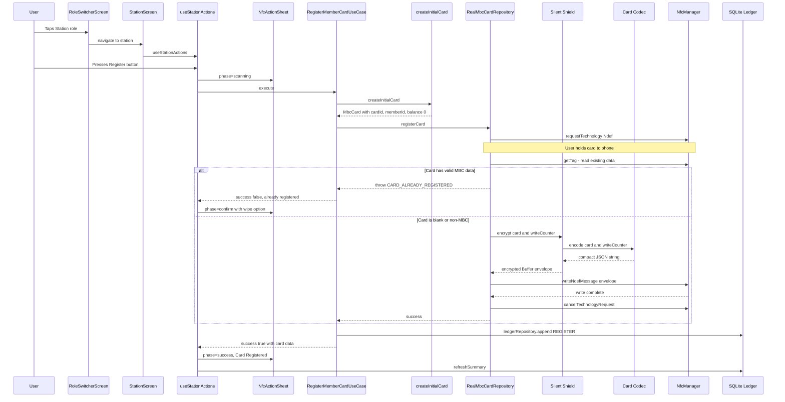
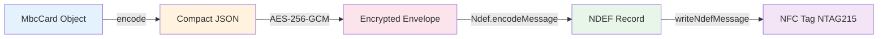
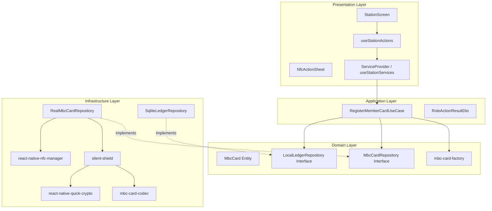

# Station Register Flow

This document explains the complete flow when a user selects the Station role and registers a new NFC membership card. It covers every layer from UI tap to physical NFC write.

## High-Level Summary

When the user presses "Tap NFC Card to Register":

1. A bottom sheet appears asking them to hold the card
2. The app creates a fresh member card in memory
3. It opens an NFC session and checks if the card is already registered
4. It encodes the card data into compact JSON, encrypts it with AES-256-GCM, and writes it to the physical tag
5. It logs the registration in the local SQLite ledger
6. The bottom sheet shows success or error

> **Analogy:** Think of it like issuing a new ID card at a government office. You fill in the form (create card data), laminate it (encrypt), stamp it onto the physical card (NFC write), and file a copy (ledger entry).

---

## Sequence Diagram



---

## Data Transformation Flowchart



### Each transformation step:

| Step                      | Input                    | Output                                                       | Size          |
| ------------------------- | ------------------------ | ------------------------------------------------------------ | ------------- |
| Domain Object             | —                        | `MbcCard` TypeScript object                                  | In memory     |
| Codec `encode()`          | `MbcCard` + writeCounter | Compact JSON string (`{v,c,m,b,i,x,n}`)                      | ≤337 bytes    |
| Silent Shield `encrypt()` | JSON string              | Binary envelope (magic + header + IV + authTag + ciphertext) | ≤372 bytes    |
| NDEF encoding             | Envelope buffer          | NDEF message with MIME type `application/vnd.mbc.v1`         | ≤504 bytes    |
| NFC write                 | NDEF message             | Physical bytes on NTAG215 tag                                | 504 bytes max |

---

## Clean Architecture Layer Diagram



**Dependency rule:** Arrows point inward. Infrastructure implements domain interfaces. The domain layer has zero dependencies on outer layers.

---

## Detailed Step-by-Step

### 1. RoleSwitcher → Station Navigation

When the user taps "Station" on the role switcher:

```tsx
// RoleSwitcherScreen
const handleSelectRole = roleKey => {
  setSelectedRole(roleKey); // Zustand store
  navigation?.navigate?.(roleKey); // Navigate to 'station'
};
```

### 2. StationScreen Loads

The Station screen grabs its services from the DI container and initializes the action hook:

```tsx
export function StationScreen() {
  const services = useStationServices(); // from React Context
  const actions = useStationActions(services);
  // ...renders RegisterActions, TopUpActions, NfcActionSheet
}
```

### 3. User Presses Register Button

The `RegisterActions` fragment renders the button:

```tsx
<SignalButton
  label={
    busyAction === 'register' ? 'Registering...' : 'Tap NFC Card to Register'
  }
  disabled={busyAction !== null}
  onPress={() => {
    handleRegister();
  }}
/>
```

### 4. NfcActionSheet Appears (Scanning Phase)

Inside `handleRegister()`:

```ts
setBusyAction('register');
setNfcSheet({ phase: 'scanning', message: 'Hold your NFC card to register' });
```

The `NfcActionSheet` component renders a bottom sheet with a spinner and the message. The user now holds their NFC card to the phone.

### 5. RegisterMemberCardUseCase.execute()

```ts
const result = await services.registerMemberCardUseCase.execute();
```

Inside the use case:

```ts
async execute(): Promise<RoleActionResultDto> {
  try {
    return await this.performRegistration();
  } catch (error) {
    if (error instanceof CardRepositoryError && error.code === 'CARD_ALREADY_REGISTERED') {
      return { success: false, role: 'STATION', message: error.message };
    }
    throw error;
  }
}
```

### 6. createInitialCard() — Domain Factory

```ts
export function createInitialCard(): MbcCard {
  const card: MbcCard = {
    version: 1,
    cardId: createRandomId('CARD'), // e.g. "CARD-a1b2c3d4"
    member: { memberId: createRandomId('MEM') }, // e.g. "MEM-e5f6g7h8"
    balance: 0,
    currency: 'IDR',
    visitStatus: 'NOT_CHECKED_IN',
    transactionLogs: [],
  };

  // Appends a REGISTER transaction log entry
  return appendTransactionLog(
    card,
    createTransactionLog({
      id: createRandomId('LOG'),
      activity: 'REGISTER',
      nominal: 0,
      occurredAt: new Date().toISOString(),
    }),
  );
}
```

This creates a fresh card with zero balance and one transaction log entry recording the registration.

### 7. cardRepository.registerCard() — NFC Session

```ts
async registerCard(card: MbcCard): Promise<void> {
  await this.ensureStarted();           // NfcManager.start() once
  await this.requestNdefTechnology();   // Opens NFC session, waits for card

  // Check if card already has valid MBC data
  const currentTag = await NfcManager.getTag();
  if (currentTag?.ndefMessage?.length) {
    const payloadBytes = Buffer.from(currentTag.ndefMessage[0].payload);
    if (isMbcEnvelope(payloadBytes)) {
      const decryptResult = decrypt(payloadBytes);
      if (decryptResult.ok) {
        throw new CardRepositoryError('CARD_ALREADY_REGISTERED', '...');
      }
    }
  }

  // Card is blank — proceed with write
  await this.writeToActiveSession(card);
  await this.cancel(); // Close NFC session
}
```

> **Key insight:** The entire read-check-write happens in a single NFC session. The user only needs to tap once.

### 8. Card Codec encode() — Compact JSON

The codec converts the full `MbcCard` object into a minimal JSON format to fit within NTAG215's 504-byte limit:

```ts
// Full card object → compact payload
const compact: CompactPayload = {
  v: 1, // version
  c: 'CARD-a1b2c3d4', // cardId
  m: 'MEM-e5f6g7h8', // memberId
  b: 0, // balance
  i: null, // activeSession (null = not checked in)
  x: [['R', 0, '2026-05-08T07:00:00.000Z']], // transaction logs (compact)
  n: 1, // write counter
};
// Output: '{"v":1,"c":"CARD-a1b2c3d4","m":"MEM-e5f6g7h8","b":0,"i":null,"x":[["R",0,"2026-05-08T07:00:00.000Z"]],"n":1}'
```

Field mapping:
| Compact | Full Name | Example |
|---------|-----------|---------|
| `v` | version | `1` |
| `c` | cardId | `"CARD-a1b2c3d4"` |
| `m` | memberId | `"MEM-e5f6g7h8"` |
| `b` | balance | `0` |
| `i` | activeSession | `null` or `{a:1, t:"..."}` |
| `x` | transactionLogs | `[["R", 0, "2026-..."]]` |
| `n` | writeCounter | `1` |

Budget: ≤337 bytes of plaintext JSON.

### 9. Silent Shield encrypt() — AES-256-GCM Envelope

```ts
export function encrypt(
  card: MbcCard,
  writeCounter: number,
): ShieldResult<Buffer> {
  const encodeResult = encode(card, writeCounter); // Step 8
  const plaintext = Buffer.from(encodeResult.value, 'utf8');
  const iv = Crypto.randomBytes(12); // Fresh IV every write

  const cipher = Crypto.createCipheriv('aes-256-gcm', DEMO_KEY, iv);
  const encrypted = Buffer.concat([cipher.update(plaintext), cipher.final()]);
  const authTag = cipher.getAuthTag(); // 16 bytes integrity proof

  // Assemble envelope
  const envelope = Buffer.concat([
    MAGIC, // "MBC1" (4 bytes) — identifies this as our format
    Buffer.from([ENVELOPE_VERSION, KEY_ID, ALG_A256GCM]), // header (3 bytes)
    iv, // 12 bytes — never reused
    authTag, // 16 bytes — tamper detection
    encrypted, // variable — the actual ciphertext
  ]);

  return { ok: true, value: envelope };
}
```

Envelope binary layout:

```
[MBC1][v01][kid01][alg01][IV 12B][AuthTag 16B][Ciphertext...]
 4B     1B    1B     1B    12B      16B          variable
```

Total overhead: 35 bytes. With ≤337 bytes plaintext → ≤372 bytes envelope.

> **Why AES-256-GCM?** It provides both confidentiality (nobody can read the card data) and integrity (nobody can modify it without detection). The `authTag` acts like a tamper-evident seal.

### 10. writeNdefMessage() — Physical Write

```ts
const mimeType = 'application/vnd.mbc.v1';
const encoded = Ndef.encodeMessage([
  Ndef.record(Ndef.TNF_MIME_MEDIA, mimeType, '', Array.from(envelope)),
]);
await NfcManager.ndefHandler.writeNdefMessage(encoded);
```

The encrypted envelope is wrapped in an NDEF record with a custom MIME type (`application/vnd.mbc.v1`). This is the standard way to store application-specific data on NFC tags.

### 11. SQLite Ledger Entry

Back in the use case, after the NFC write succeeds:

```ts
await this.localLedgerRepository.append({
  id: createRandomId('LEDGER'),
  role: 'STATION',
  action: 'REGISTER',
  maskedMemberReference: maskMemberReference(card.member.memberId), // e.g. "MEM-****c3d4"
  occurredAt: new Date().toISOString(),
});
```

This is a device-side audit trail. The NFC card remains the source of truth, but the ledger lets the Station operator review past actions.

### 12. Success/Error Handling Back to UI

The use case returns a `RoleActionResultDto`:

```ts
return {
  success: true,
  role: 'STATION',
  message: 'Member card registered successfully.',
  card: toCardSummaryDto(card), // { cardId, memberId, balance, visitStatus }
};
```

### 13. NfcActionSheet Success Phase

Back in `handleRegister()`:

```ts
if (result.success) {
  setNfcSheet({
    phase: 'success',
    title: 'Card Registered',
    message: result.message,
  });
} else if (result.message.includes('already registered')) {
  setNfcSheet({
    phase: 'confirm',
    title: 'Card Already Registered',
    message: 'This card has existing data. Wipe and register as a new member?',
    confirmLabel: 'Wipe & Re-register',
    onConfirm: () => {
      handleWipeAndRegister();
    },
  });
}
```

The bottom sheet transitions from the spinner to a green success card, or shows a confirmation dialog if the card was already registered.

---

## Error Scenarios

| Error Code                   | When                                       | User Sees                            |
| ---------------------------- | ------------------------------------------ | ------------------------------------ |
| `CARD_ALREADY_REGISTERED`    | Card has valid MBC data                    | Confirm dialog with wipe option      |
| `SCAN_CANCELLED`             | User pulled card away too early            | "Scan was cancelled" error sheet     |
| `NFC_UNAVAILABLE`            | NFC session failed                         | "Please retry with card held steady" |
| `CARD_CAPACITY_INSUFFICIENT` | Payload > 504 bytes                        | "Exceeds NTAG215 capacity"           |
| `CARD_TAMPERED`              | Encryption/encoding failed (payload error) | "Payload error"                      |

---

## Key Design Decisions

1. **Single-tap operation** — Read + check + write happens in one NFC session. No "tap to read, tap again to write."
2. **Card is source of truth** — The SQLite ledger is only for audit. If the ledger write fails, the registration still succeeds (with a warning message).
3. **Write counter** — Incremented on every write, stored on the card. Prevents replay attacks.
4. **Fresh IV per write** — Even if the same card data is written twice, the ciphertext is different. Prevents pattern analysis.
5. **MIME type identification** — Using `application/vnd.mbc.v1` means other NFC apps won't accidentally interpret our data.
