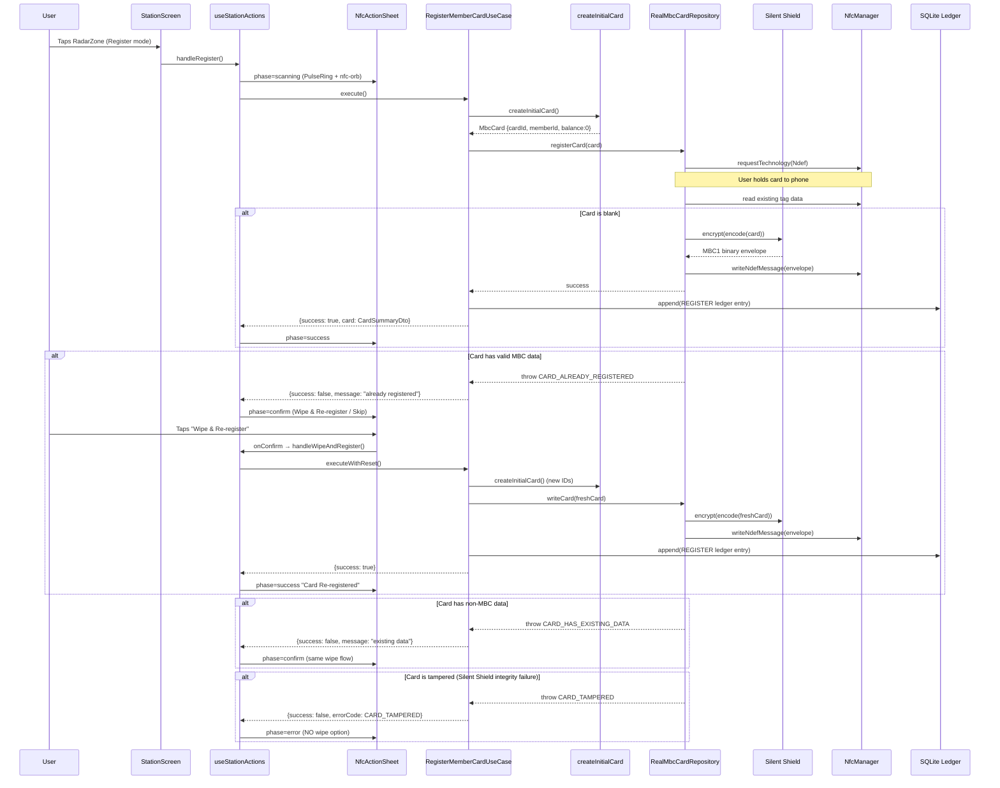

# Station Register Flow

This document explains the complete flow when a cooperative admin registers a new NFC membership card at the Station. It covers every layer from UI tap to physical NFC write, including the wipe & re-register safety flow.

> **Analogy:** Think of it like issuing a new ID card at a government office. You fill in the form (create card data), laminate it (encrypt with Silent Shield), stamp it onto the physical card (NFC write), and file a copy (ledger entry). If someone brings an old ID card, you ask "Want me to destroy the old one and issue a fresh one?"

## What Changed Since May 13

| Area                        | Before                             | After                                                 |
| --------------------------- | ---------------------------------- | ----------------------------------------------------- |
| Mode switching              | Boolean state + conditional button | `SegmentedControl` fragment (Register \| Top Up tabs) |
| NFC trigger                 | `SignalButton`                     | `RadarZone` (animated radar with gradient button)     |
| Header                      | `AppHeaderCard`                    | `ScreenHeader` with badge + back button               |
| Background                  | Plain color                        | `ImageBackground` with `blurRadius={15}`              |
| Result display              | Inline text                        | `LatestResultCard` fragment (success/error styling)   |
| Already-registered handling | Error message only                 | `NfcActionSheet` `confirm` phase → wipe & re-register |
| Use case API                | Single `execute()`                 | `execute()` + `executeWithReset()`                    |
| Ledger display              | Not shown                          | `LocalStationLedgerCard` (collapsible accordion)      |

---

## High-Level Summary

When the user taps the RadarZone button in Register mode:

1. `NfcActionSheet` appears in scanning phase (PulseRing animation + nfc-orb image)
2. The app creates a fresh member card in memory (`createInitialCard()`)
3. It opens an NFC session and checks if the card already has data
4. **If blank:** encodes → encrypts → writes → logs to ledger → shows success
5. **If already registered:** returns error → NfcActionSheet shows `confirm` phase → user decides wipe or skip
6. **If tampered:** returns `CARD_TAMPERED` error — no wipe option offered

---

## Sequence Diagram


```mermaid
sequenceDiagram
    participant User
    participant UI as StationScreen
    participant Hook as useStationActions
    participant Sheet as NfcActionSheet
    participant UC as RegisterMemberCardUseCase
    participant Factory as createInitialCard
    participant Repo as RealMbcCardRepository
    participant Shield as Silent Shield
    participant NFC as NfcManager
    participant DB as SQLite Ledger

    User->>UI: Taps RadarZone (Register mode)
    UI->>Hook: handleRegister()
    Hook->>Sheet: phase=scanning (PulseRing + nfc-orb)
    Hook->>UC: execute()
    UC->>Factory: createInitialCard()
    Factory-->>UC: MbcCard {cardId, memberId, balance:0}
    UC->>Repo: registerCard(card)
    Repo->>NFC: requestTechnology(Ndef)
    Note over Repo,NFC: User holds card to phone
    Repo->>NFC: read existing tag data

    alt Card is blank
        Repo->>Shield: encrypt(encode(card))
        Shield-->>Repo: MBC1 binary envelope
        Repo->>NFC: writeNdefMessage(envelope)
        Repo-->>UC: success
        UC->>DB: append(REGISTER ledger entry)
        UC-->>Hook: {success: true, card: CardSummaryDto}
        Hook->>Sheet: phase=success
    end

    alt Card has valid MBC data
        Repo-->>UC: throw CARD_ALREADY_REGISTERED
        UC-->>Hook: {success: false, message: "already registered"}
        Hook->>Sheet: phase=confirm (Wipe & Re-register / Skip)
        User->>Sheet: Taps "Wipe & Re-register"
        Sheet->>Hook: onConfirm → handleWipeAndRegister()
        Hook->>UC: executeWithReset()
        UC->>Factory: createInitialCard() (new IDs)
        UC->>Repo: writeCard(freshCard)
        Repo->>Shield: encrypt(encode(freshCard))
        Repo->>NFC: writeNdefMessage(envelope)
        UC->>DB: append(REGISTER ledger entry)
        UC-->>Hook: {success: true}
        Hook->>Sheet: phase=success "Card Re-registered"
    end

    alt Card has non-MBC data
        Repo-->>UC: throw CARD_HAS_EXISTING_DATA
        UC-->>Hook: {success: false, message: "existing data"}
        Hook->>Sheet: phase=confirm (same wipe flow)
    end

    alt Card is tampered (Silent Shield integrity failure)
        Repo-->>UC: throw CARD_TAMPERED
        UC-->>Hook: {success: false, errorCode: CARD_TAMPERED}
        Hook->>Sheet: phase=error (NO wipe option)
    end
```

---

## Step-by-Step Breakdown

### 1. Station Screen UI Layout

**File:** `src/presentation/screens/Station/index.tsx`

```tsx
<ImageBackground source={bgImage} style={{ flex: 1 }} resizeMode="cover" blurRadius={15}>
  <ScreenHeader title="The Station" subtitle="Register & Top Up Cards" badgeLabel="Station" ... />
  <SegmentedControl registerMode={...} setRegisterMode={...} />
  {!registerMode && <AmountInput ... />}
  <RadarZone label="Tap Card to Register" onPress={handlePress} />
  <LatestResultCard latestResult={...} />
  <LocalStationLedgerCard summary={...} refreshSummary={...} />
  <NfcLogPanel variant="light" />
  <NfcActionSheet state={...} onDismiss={...} />
</ImageBackground>
```

Visual stack (top to bottom):
| Element | Purpose |
|---------|---------|
| `ScreenHeader` | "The Station" title, "Register & Top Up Cards" subtitle, red badge |
| `SegmentedControl` | Register \| Top Up tab switcher |
| `RadarZone` | Animated NFC trigger button (center of screen) |
| `LatestResultCard` | Shows last operation result (success green border / error red border) |
| `LocalStationLedgerCard` | Collapsible accordion showing device-local audit summary |
| `NfcLogPanel` | Dev-only operational log (glassmorphic light variant) |
| `NfcActionSheet` | Bottom sheet overlay during NFC operations |

### 2. SegmentedControl — Mode Switching

**File:** `src/presentation/screens/Station/fragments/SegmentedControl.tsx`

```tsx
<View className="flex-row bg-white/50 rounded-full p-1 border border-white/60">
  <Pressable
    onPress={() => setRegisterMode(true)}
    className={registerMode ? 'bg-[#FFE4E8]' : ''}
  >
    <Text>Register</Text>
  </Pressable>
  <Pressable
    onPress={() => setRegisterMode(false)}
    className={!registerMode ? 'bg-[#FFE4E8]' : ''}
  >
    <Text>Top Up</Text>
  </Pressable>
</View>
```

Switching modes clears `latestResult` so stale results from the other mode don't confuse the operator.

### 3. Pressing the RadarZone Button (Register Mode)

When the user taps the RadarZone in Register mode, `handleRegister()` fires in `useStationActions`:

```ts
const handleRegister = useCallback(async () => {
  setBusyAction('register');
  setNfcSheet({ phase: 'scanning', message: 'Hold your NFC card to register', color: '#FF0025' });

  const result = await services.registerMemberCardUseCase.execute();

  if (result.success) {
    setNfcSheet({ phase: 'success', title: 'Card Registered', message: result.message });
  } else if (result.message.includes('already registered')) {
    // Trigger confirm phase for wipe decision
    setNfcSheet({
      phase: 'confirm',
      title: 'Card Already Registered',
      message: 'This card has existing data. Wipe and register as a new member?',
      confirmLabel: 'Wipe & Re-register',
      onConfirm: () => { handleWipeAndRegister(); },
    });
  }
}, [...]);
```

### 4. RegisterMemberCardUseCase — Two Methods

**File:** `src/application/use-cases/register-member-card.use-case.ts`

The use case exposes **two methods** following the **Command pattern**:

| Method               | When Used                | What It Does                                                |
| -------------------- | ------------------------ | ----------------------------------------------------------- |
| `execute()`          | First attempt            | Calls `registerCard()` which checks for existing data first |
| `executeWithReset()` | After user confirms wipe | Calls `writeCard()` which overwrites unconditionally        |

```ts
// execute() — safe registration (checks first)
async execute(): Promise<RoleActionResultDto> {
  const card = createInitialCard();
  await cardRepository.registerCard(card); // throws if card has data
  return buildSuccessResult(card);
}

// executeWithReset() — forced overwrite (user confirmed)
async executeWithReset(): Promise<RoleActionResultDto> {
  const card = createInitialCard(); // NEW cardId + memberId
  await cardRepository.writeCard(card); // overwrites without checking
  return buildSuccessResult(card);
}
```

**Why two methods?** This follows the **Single Responsibility Principle** — the use case doesn't make UI decisions about whether to wipe. It provides both capabilities; the presentation layer decides which to call based on user input.

### 5. createInitialCard() — Fresh Card Factory

Every registration (including re-registration) generates completely new IDs:

```ts
function createInitialCard(): MbcCard {
  return {
    version: 1,
    cardId: createRandomId('CARD'),
    member: { memberId: createRandomId('MBR') },
    balance: 0,
    currency: 'IDR',
    visitStatus: 'NOT_CHECKED_IN',
    transactionLogs: [
      /* initial REGISTER log */
    ],
  };
}
```

No initial balance field is presented. New cards always start at zero.

### 6. NFC Write: Encode → Encrypt → Write

The repository performs these steps in a single NFC session:

1. **Encode** — `MbcCard` → compact comma-separated format: `v,c,m,b,i,x,n`
2. **Encrypt** — AES-256-GCM via `react-native-quick-crypto` → `MBC1` binary envelope
3. **Write** — `writeNdefMessage()` to NTAG215 tag

The envelope structure: `MBC1` magic (4B) + version (1B) + kid (1B) + alg (1B) + IV (12B) + authTag (16B) + ciphertext.

### 7. SQLite Ledger Entry

After successful card write, the use case appends a ledger entry:

```ts
await localLedgerRepository.append({
  id: createRandomId('LEDGER'),
  role: 'STATION',
  action: 'REGISTER',
  maskedMemberReference: maskMemberReference(card.member.memberId),
  occurredAt: new Date().toISOString(),
});
```

If ledger write fails, the card registration is still considered successful (ledger is audit-only, not source of truth).

### 8. NfcActionSheet — The Confirm Phase

**File:** `src/presentation/components/NfcActionSheet/index.tsx`

The `confirm` phase is unique to registration safety:

```tsx
{
  state.phase === 'confirm' && (
    <View>
      <View className="w-32 h-32 rounded-full bg-[#FEF3C7] border-[#D97706]">
        <Text>⚠</Text>
      </View>
      <Text>{state.title}</Text>
      <Text>{state.message}</Text>
      <SignalButton label={state.confirmLabel} onPress={state.onConfirm} />
      <SignalButton label="Skip" variant="secondary" onPress={onDismiss} />
    </View>
  );
}
```

Two buttons:

- **"Wipe & Re-register"** → calls `handleWipeAndRegister()` → `executeWithReset()`
- **"Skip"** → dismisses sheet, no card modification

### 9. LatestResultCard — Visual Feedback

**File:** `src/presentation/screens/Station/fragments/LatestResultCard.tsx`

Shows the result of the last operation with color-coded borders:

- **Success** (green left border): Shows masked member reference + balance
- **Error** (red left border): Shows error message

---

## Error Scenarios

| Error                     | Source                          | UI Behavior                                  |
| ------------------------- | ------------------------------- | -------------------------------------------- |
| `CARD_ALREADY_REGISTERED` | Card has valid MBC payload      | Confirm phase: Wipe & Re-register / Skip     |
| `CARD_HAS_EXISTING_DATA`  | Card has non-MBC data           | Confirm phase: Wipe & Re-register / Skip     |
| `CARD_TAMPERED`           | Silent Shield integrity failure | Error phase only — NO wipe option            |
| NFC write failure         | Hardware/tag issue              | Error phase with message                     |
| Ledger write failure      | SQLite issue                    | Success (card was written) + warning message |

---

## SOLID Principles in This Flow

| Principle                 | Application                                                               |
| ------------------------- | ------------------------------------------------------------------------- |
| **Single Responsibility** | Use case handles business logic only; UI handles wipe decision            |
| **Open/Closed**           | New error types can be added without changing the confirm flow            |
| **Liskov Substitution**   | Mock repository works identically to real one in tests                    |
| **Interface Segregation** | `StationServices` only exposes register + top-up + ledger                 |
| **Dependency Inversion**  | Use case depends on `MbcCardRepository` interface, not NFC implementation |
