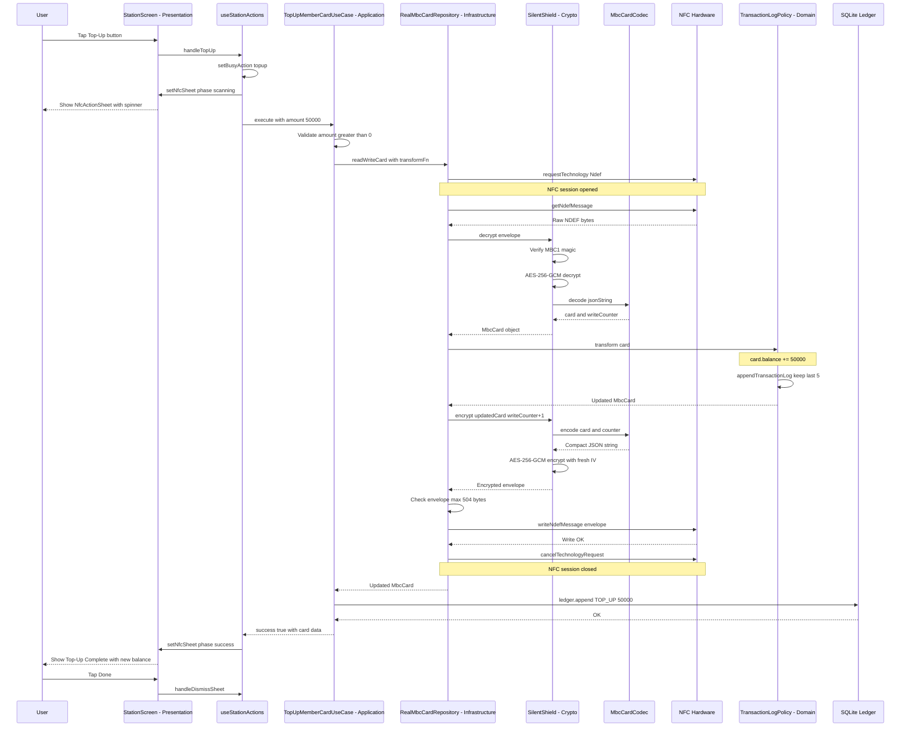
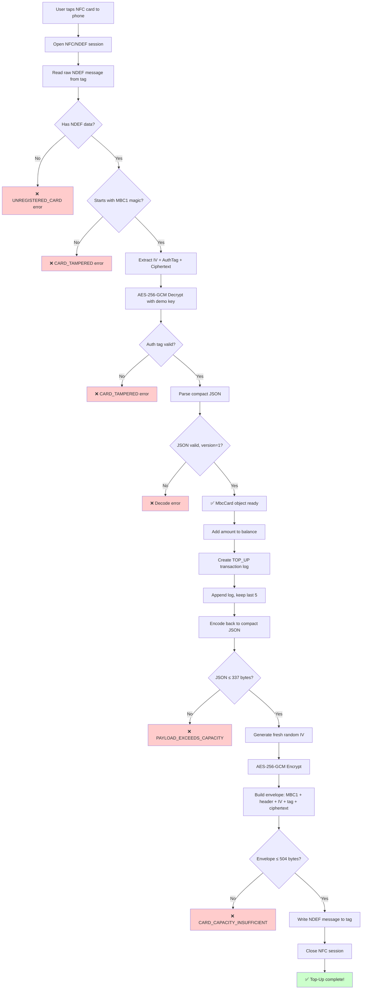

# Station Top-Up Flow — A Junior Developer's Guide

> **Analogy:** Think of the NFC card as a physical wallet. The Top-Up flow is like going to an ATM, inserting your debit card (NFC tap), the machine reading your current balance, adding money, and writing the new balance back onto the card — all in one tap.

---

## Table of Contents

1. [Overview](#overview)
2. [Navigation: Getting to the Station Screen](#navigation-getting-to-the-station-screen)
3. [Station Screen: Switching to Top-Up Mode](#station-screen-switching-to-top-up-mode)
4. [Selecting a Top-Up Amount](#selecting-a-top-up-amount)
5. [Pressing the Top-Up Button](#pressing-the-top-up-button)
6. [NfcActionSheet: The Scanning Phase](#nfcactionsheet-the-scanning-phase)
7. [Use Case Execution: TopUpMemberCardUseCase](#use-case-execution-topupmembercardusecase)
8. [NFC Read: Decrypt & Decode](#nfc-read-decrypt--decode)
9. [Domain Logic: Validate, Add Balance, Append Log](#domain-logic-validate-add-balance-append-log)
10. [NFC Write: Re-encode & Re-encrypt](#nfc-write-re-encode--re-encrypt)
11. [SQLite Ledger Entry](#sqlite-ledger-entry)
12. [Success/Error Back to UI](#successerror-back-to-ui)
13. [Edge Cases](#edge-cases)
14. [Mermaid Diagrams](#mermaid-diagrams)

---

## Overview

The Top-Up flow allows a **Station operator** to add balance (Rp 10,000 / 20,000 / 50,000 / 100,000) to a member's NFC card. The entire operation — read existing data, modify it, write it back — happens in a **single NFC tap** (one session, no re-tap needed).

**Layers involved:**

| Layer          | Folder                | Responsibility                       |
| -------------- | --------------------- | ------------------------------------ |
| Presentation   | `src/presentation/`   | UI, user interaction, NFC sheet      |
| Application    | `src/application/`    | Use case orchestration               |
| Domain         | `src/domain/`         | Business rules, entities, validation |
| Infrastructure | `src/infrastructure/` | NFC hardware, encryption, SQLite     |

---

## Navigation: Getting to the Station Screen

The app starts at the **RoleSwitcher** screen (`src/presentation/screens/RoleSwitcher/index.tsx`). It shows four role cards: Station, Gate, Terminal, Scout.

When the user taps **"Station"**, this happens:

```typescript
// RoleSwitcherScreen
const handleSelectRole = roleKey => {
  setSelectedRole(roleKey); // Updates global store
  navigation?.navigate?.(roleKey); // Navigates to 'station' route
};
```

The navigation stack is defined in `src/app/navigation.tsx`:

```typescript
export type RootStackParamList = {
  roleSwitcher: undefined;
  station: undefined;
  // ... other roles
};
```

React Navigation pushes the `StationScreen` component onto the stack.

---

## Station Screen: Switching to Top-Up Mode

The Station screen (`src/presentation/screens/Station/index.tsx`) has **two modes**:

1. **Register mode** (default) — for registering blank cards
2. **Top-Up mode** — for adding balance to existing cards

The mode is controlled by a boolean state:

```typescript
const [registerMode, setRegisterMode] = useState(true); // starts in Register mode
```

The screen conditionally renders:

```tsx
{actions.registerMode && <RegisterActions ... />}
{!actions.registerMode && <TopUpActions ... />}
```

To switch to Top-Up mode, the user taps **"Switch to Top Up"** button inside `RegisterActions`, which calls `setRegisterMode(false)`.

---

## Selecting a Top-Up Amount

Once in Top-Up mode, the `TopUpCard` component (`src/presentation/screens/Station/fragments/TopUpCard.tsx`) renders:

1. A **text input** showing the current amount (formatted with Indonesian locale)
2. **Four preset buttons**: 10,000 / 20,000 / 50,000 / 100,000

```tsx
{
  [10000, 20000, 50000, 100000].map(amount => (
    <Pressable
      key={amount}
      onPress={() => setTopUpAmount(String(amount))}
      className={`rounded-full border px-4 py-2 ${
        topUpAmount === String(amount)
          ? 'border-[#0050AE] bg-[#0050AE]' // selected = blue
          : 'border-slate-200 bg-white' // unselected = white
      }`}
    >
      <Text>{amount.toLocaleString(LOCALE_ID)}</Text>
    </Pressable>
  ));
}
```

The default amount is `'50000'`. The user can also type a custom amount in the text input.

---

## Pressing the Top-Up Button

Below the amount selector, there's a `SignalButton`:

```tsx
<SignalButton
  label={busyAction === 'topup' ? 'Processing...' : 'Tap NFC Card to Top Up'}
  disabled={busyAction !== null}
  onPress={() => {
    void handleTopUp();
  }}
/>
```

When pressed, it calls `handleTopUp()` from `useStationActions.ts`.

---

## NfcActionSheet: The Scanning Phase

The first thing `handleTopUp` does is show the NFC scanning bottom sheet:

```typescript
const handleTopUp = useCallback(async () => {
  dismissedRef.current = false;
  setBusyAction('topup');
  setNfcSheet({ phase: 'scanning', message: 'Hold your NFC card to top up' });
  // ...
```

This triggers the `NfcActionSheet` component to appear — a bottom sheet with:

- A spinning `ActivityIndicator`
- The message "Hold your NFC card to top up"
- A hint: "Keep the card steady until the operation completes"

The user now holds their NFC card to the back of the phone.

---

## Use Case Execution: TopUpMemberCardUseCase

Inside `handleTopUp`, the use case is called:

```typescript
const result = await services.topUpMemberCardUseCase.execute({
  amount: Number(topUpAmount),
});
```

The use case (`src/application/use-cases/top-up-member-card.use-case.ts`) does:

1. **Validates the amount** — must be a positive finite number
2. **Calls `cardRepository.readWriteCard(transform)`** — this is the single-tap NFC operation
3. **Writes to the local SQLite ledger** (if available)
4. **Returns a result DTO** with success/failure + card summary

```typescript
async execute({ amount }: TopUpMemberCardRequest): Promise<RoleActionResultDto> {
  if (!Number.isFinite(amount) || amount <= 0) {
    return { success: false, role: 'STATION', message: 'Top-up amount must be a positive number.' };
  }

  const nextCard = await this.cardRepository.readWriteCard(card =>
    appendTransactionLog(
      { ...card, balance: card.balance + amount },
      createTransactionLog({
        id: createRandomId('LOG'),
        activity: 'TOP_UP',
        nominal: amount,
        occurredAt: new Date().toISOString(),
      }),
    ),
  );
  // ... ledger + return
}
```

---

## NFC Read: Decrypt & Decode

The `readWriteCard` method in `RealMbcCardRepository` (`src/infrastructure/nfc/real-mbc-card.repository.ts`) opens a **single NFC session** and does both read and write:

```typescript
async readWriteCard(transform: (card: MbcCard) => MbcCard): Promise<MbcCard> {
  await this.ensureStarted();
  try {
    await this.requestNdefTechnology();       // Opens NFC session
    const card = await this.readCardFromActiveSession();  // READ
    const updated = transform(card);          // TRANSFORM (domain logic)
    await this.writeToActiveSession(updated); // WRITE
    return updated;
  } finally {
    await this.cancel();                      // Close NFC session
  }
}
```

### Reading the card (`readCardFromActiveSession`):

1. **Read raw NDEF message** from the physical NFC tag
2. **Check for MBC envelope** — looks for the `"MBC1"` magic bytes
3. **Decrypt** using Silent Shield (`silent-shield.ts`)
4. **Decode** the compact JSON into an `MbcCard` object

```
NFC Tag → Raw bytes → isMbcEnvelope? → decrypt(envelope) → MbcCard object
```

### Silent Shield Decrypt (`src/infrastructure/nfc/silent-shield.ts`):

The envelope format on the card is:

```
[MBC1 magic 4B] [version 1B] [keyId 1B] [alg 1B] [IV 12B] [authTag 16B] [ciphertext...]
```

Decryption steps:

1. Verify magic bytes = `"MBC1"`
2. Verify version, key ID, algorithm
3. Extract IV (12 bytes) and auth tag (16 bytes)
4. Use AES-256-GCM with the demo key to decrypt the ciphertext
5. Verify the auth tag (tamper detection!)
6. Parse the decrypted UTF-8 string as compact JSON

### Codec Decode (`src/infrastructure/nfc/mbc-card-codec.ts`):

The compact JSON on the card looks like:

```json
{
  "v": 1,
  "c": "CARD-abc123",
  "m": "MBR-xyz789",
  "b": 50000,
  "i": null,
  "x": [
    ["R", 0, "2026-05-01T10:00:00Z"],
    ["U", 50000, "2026-05-01T10:05:00Z"]
  ],
  "n": 3
}
```

| Field | Meaning                                          |
| ----- | ------------------------------------------------ |
| `v`   | Version (always 1)                               |
| `c`   | Card ID                                          |
| `m`   | Member ID                                        |
| `b`   | Balance in IDR                                   |
| `i`   | Active check-in session (null if not checked in) |
| `x`   | Transaction logs (max 5, compact tuples)         |
| `n`   | Write counter (increments each write)            |

Activity codes: `R` = Register, `U` = Top-Up, `I` = Check-In, `O` = Check-Out.

---

## Domain Logic: Validate, Add Balance, Append Log

The `transform` function passed to `readWriteCard` does two things:

### 1. Add balance

```typescript
{ ...card, balance: card.balance + amount }
```

### 2. Append a transaction log

```typescript
// From src/domain/services/transaction-log-policy.ts
export function appendTransactionLog(
  card: MbcCard,
  log: TransactionLog,
): MbcCard {
  const nextLogs = [...card.transactionLogs, log].slice(-5); // Keep only last 5
  return {
    ...card,
    member: { ...card.member },
    activeSession: card.activeSession ? { ...card.activeSession } : undefined,
    transactionLogs: nextLogs,
  };
}
```

The log entry created:

```typescript
createTransactionLog({
  id: createRandomId('LOG'), // e.g. "LOG-a1b2c3d4"
  activity: 'TOP_UP',
  nominal: amount, // e.g. 50000
  occurredAt: new Date().toISOString(),
});
```

> **Why only 5 logs?** The NTAG215 card has limited memory (504 bytes usable). Keeping only the last 5 transaction logs ensures the compact JSON stays within the 337-byte plaintext budget.

---

## NFC Write: Re-encode & Re-encrypt

After the domain transform, the updated `MbcCard` is written back in `writeToActiveSession`:

### 1. Encode (codec)

The `encode()` function converts the `MbcCard` back to compact JSON:

```typescript
const compact = {
  v: 1,
  c: card.cardId,
  m: card.member.memberId,
  b: card.balance, // NEW balance (old + amount)
  i: card.activeSession ? { a: 1, t: card.activeSession.checkedInAt } : null,
  x: card.transactionLogs.map(log => [
    ACTIVITY_TO_COMPACT[log.activity],
    log.nominal,
    log.occurredAt,
  ]),
  n: writeCounter, // Incremented
};
```

It also checks the JSON doesn't exceed 337 bytes.

### 2. Encrypt (Silent Shield)

```typescript
export function encrypt(
  card: MbcCard,
  writeCounter: number,
): ShieldResult<Buffer> {
  const encodeResult = encode(card, writeCounter);
  const plaintext = Buffer.from(encodeResult.value, 'utf8');
  const iv = Crypto.randomBytes(IV_LENGTH); // Fresh random IV every write!

  const cipher = Crypto.createCipheriv('aes-256-gcm', DEMO_KEY, iv);
  const encrypted = Buffer.concat([cipher.update(plaintext), cipher.final()]);
  const authTag = cipher.getAuthTag();

  const envelope = Buffer.concat([
    MAGIC,
    [VERSION, KEY_ID, ALG],
    iv,
    authTag,
    encrypted,
  ]);
  return { ok: true, value: envelope };
}
```

> **Key insight:** A fresh random IV is generated on every write. This means even if you top up the same amount twice, the encrypted bytes on the card will be completely different — preventing replay attacks.

### 3. Write to NFC

```typescript
const mimeType = 'application/vnd.mbc.v1';
const encoded = Ndef.encodeMessage([
  Ndef.record(Ndef.TNF_MIME_MEDIA, mimeType, '', Array.from(envelope)),
]);
await NfcManager.ndefHandler.writeNdefMessage(encoded);
```

The envelope is wrapped in an NDEF record with a custom MIME type.

### 4. Capacity check

Before writing, the code checks:

```typescript
if (envelope.length > NTAG215_USER_MEMORY) {
  // 504 bytes
  throw new CardRepositoryError('CARD_CAPACITY_INSUFFICIENT', '...');
}
```

---

## SQLite Ledger Entry

After the NFC write succeeds, the use case writes to the **local SQLite ledger** for audit purposes:

```typescript
await this.localLedgerRepository.append({
  id: createRandomId('LEDGER'),
  role: 'STATION',
  action: 'TOP_UP',
  maskedMemberReference: maskMemberReference(nextCard.member.memberId),
  amount,
  occurredAt: new Date().toISOString(),
});
```

> **Important:** The ledger is for device-side audit only. The NFC card remains the source of truth. If the ledger write fails, the top-up still succeeds (the user gets a slightly different success message).

---

## Success/Error Back to UI

Back in `handleTopUp` (presentation layer), the result is handled:

```typescript
if (result.success) {
  setNfcSheet({
    phase: 'success',
    title: 'Top-Up Complete',
    message: `${result.message}\nBalance: Rp ${result.card?.balance?.toLocaleString('id-ID') ?? '0'}`,
  });
} else {
  setNfcSheet({
    phase: 'error',
    title: 'Top-Up Failed',
    message: result.message,
  });
}
await refreshSummary(); // Refresh the ledger summary card on screen
```

The `NfcActionSheet` transitions from "scanning" → "success" (green card) or "error" (red card). The user taps "Done" or "Dismiss" to close the sheet.

---

## Edge Cases

| Scenario                         | Error Code                   | What Happens                                                  |
| -------------------------------- | ---------------------------- | ------------------------------------------------------------- |
| Card is blank / never registered | `UNREGISTERED_CARD`          | "Card is blank or not registered yet."                        |
| Card data tampered / corrupted   | `CARD_TAMPERED`              | Auth tag verification fails during decrypt                    |
| Payload too large after top-up   | `CARD_CAPACITY_INSUFFICIENT` | Encoded + encrypted data > 504 bytes                          |
| User pulls card away mid-scan    | `SCAN_CANCELLED`             | "Scan was cancelled before card processing finished."         |
| NFC not available on device      | `NFC_UNAVAILABLE`            | "NFC session failed. Please retry with the card held steady." |
| Amount is 0 or negative          | (validation)                 | "Top-up amount must be a positive number."                    |
| User dismisses the sheet         | `dismissedRef`               | Operation result is silently discarded                        |
| SQLite ledger write fails        | (caught)                     | Top-up still succeeds, message notes ledger issue             |

---

## Mermaid Diagrams

### 1. Sequence Diagram: Full Top-Up Flow Across Layers



### 2. Flowchart: Read-Modify-Write Cycle on the NFC Card



### 3. Before/After Comparison of Card Data

```mermaid
flowchart LR
    subgraph BEFORE["Card BEFORE Top-Up"]
        direction TB
        B1["v: 1"]
        B2["c: CARD-abc123"]
        B3["m: MBR-xyz789"]
        B4["b: 20000"]
        B5["i: null"]
        B6["x: 2 logs - Register and Top-Up"]
        B7["n: 2"]
    end

    subgraph TOPUP["Top-Up Rp 50000"]
        direction TB
        T1["balance += 50000"]
        T2["append TOP_UP log"]
        T3["writeCounter++"]
    end

    subgraph AFTER["Card AFTER Top-Up"]
        direction TB
        A1["v: 1"]
        A2["c: CARD-abc123"]
        A3["m: MBR-xyz789"]
        A4["b: 70000 - changed"]
        A5["i: null"]
        A6["x: 3 logs - Register, Top-Up, Top-Up - changed"]
        A7["n: 3 - changed"]
    end

    BEFORE --> TOPUP --> AFTER
```



**Detailed field comparison (Rp 50,000 top-up on a card with Rp 20,000 balance):**

| Field                  | Before          | After              | Changed? |
| ---------------------- | --------------- | ------------------ | -------- |
| `v` (version)          | 1               | 1                  | No       |
| `c` (card ID)          | CARD-abc123     | CARD-abc123        | No       |
| `m` (member ID)        | MBR-xyz789      | MBR-xyz789         | No       |
| `b` (balance)          | 20000           | 70000              | Yes      |
| `i` (active session)   | null            | null               | No       |
| `x` (transaction logs) | 2 entries: R, U | 3 entries: R, U, U | Yes      |
| `n` (write counter)    | 2               | 3                  | Yes      |

---

## Summary: The Complete Journey

Here's the entire top-up flow in plain English:

1. **User opens app** → sees RoleSwitcher → taps **Station**
2. **Station screen loads** in Register mode → user taps **"Switch to Top Up"**
3. **User picks an amount** (e.g., Rp 50,000) from preset buttons
4. **User taps "Tap NFC Card to Top Up"** → bottom sheet appears with spinner
5. **User holds NFC card** to phone back
6. **Phone reads card** → decrypts (AES-256-GCM) → decodes (compact JSON → MbcCard)
7. **Domain logic runs** → adds 50,000 to balance → appends a TOP_UP log entry
8. **Phone writes card** → encodes (MbcCard → compact JSON) → encrypts (fresh IV) → writes NDEF
9. **All in one tap** — the NFC session stays open for both read and write
10. **SQLite ledger** gets an audit entry (masked member ID, amount, timestamp)
11. **Bottom sheet shows success** with new balance → user taps "Done"

The card is now updated. The member has Rp 50,000 more. No server needed. No internet needed. Pure offline-first magic. ✨
