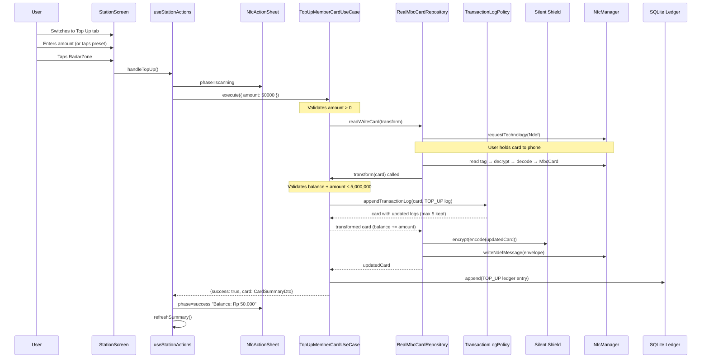
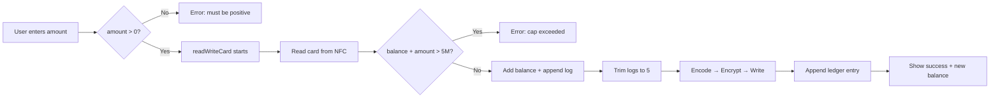

# Station Top-Up Flow

This document explains the complete flow when a cooperative admin tops up balance on a member's NFC card at the Station. The entire operation — read, validate, modify, write — happens in a **single NFC tap**.

> **Analogy:** Think of the NFC card as a physical wallet. The Top-Up flow is like going to an ATM: insert your card (NFC tap), the machine reads your current balance, adds money, writes the new balance back — all in one session. But this ATM also has a maximum wallet capacity (Rp 5.000.000) and won't let you overfill it.

## What Changed Since May 13

| Area           | Before                             | After                                                                               |
| -------------- | ---------------------------------- | ----------------------------------------------------------------------------------- |
| Mode switching | Boolean state + conditional button | `SegmentedControl` fragment (Register \| Top Up tabs)                               |
| Amount input   | Preset buttons only                | `AmountInput` fragment: free-text numeric input + preset buttons (10k/20k/50k/100k) |
| NFC trigger    | `SignalButton`                     | `RadarZone` (animated radar with gradient button)                                   |
| Balance cap    | None                               | `MAX_CARD_BALANCE = 5,000,000` — rejects top-up if result would exceed              |
| Header         | `AppHeaderCard`                    | `ScreenHeader` with badge                                                           |
| Background     | Plain color                        | `ImageBackground` with `blurRadius={15}`                                            |
| Result display | Inline text                        | `LatestResultCard` fragment                                                         |
| Ledger display | Not shown                          | `LocalStationLedgerCard` (collapsible accordion)                                    |

---

## High-Level Summary

When the user switches to Top Up mode and taps the RadarZone:

1. `NfcActionSheet` appears in scanning phase
2. The app reads the card in a single NFC session (`readWriteCard`)
3. Validates: amount > 0, resulting balance ≤ 5,000,000
4. Adds the amount to balance, appends a transaction log
5. Encrypts and writes the updated card back (same NFC session)
6. Logs to SQLite ledger
7. Shows success with new balance

---

## Sequence Diagram


```mermaid
sequenceDiagram
    participant User
    participant UI as StationScreen
    participant Hook as useStationActions
    participant Sheet as NfcActionSheet
    participant UC as TopUpMemberCardUseCase
    participant Repo as RealMbcCardRepository
    participant Policy as TransactionLogPolicy
    participant Shield as Silent Shield
    participant NFC as NfcManager
    participant DB as SQLite Ledger

    User->>UI: Switches to Top Up tab
    User->>UI: Enters amount (or taps preset)
    User->>UI: Taps RadarZone
    UI->>Hook: handleTopUp()
    Hook->>Sheet: phase=scanning
    Hook->>UC: execute({ amount: 50000 })

    Note over UC: Validates amount > 0

    UC->>Repo: readWriteCard(transform)
    Repo->>NFC: requestTechnology(Ndef)
    Note over Repo,NFC: User holds card to phone
    Repo->>NFC: read tag → decrypt → decode → MbcCard
    Repo->>UC: transform(card) called

    Note over UC: Validates balance + amount ≤ 5,000,000

    UC->>Policy: appendTransactionLog(card, TOP_UP log)
    Policy-->>UC: card with updated logs (max 5 kept)
    UC-->>Repo: transformed card (balance += amount)
    Repo->>Shield: encrypt(encode(updatedCard))
    Repo->>NFC: writeNdefMessage(envelope)
    Repo-->>UC: updatedCard

    UC->>DB: append(TOP_UP ledger entry)
    UC-->>Hook: {success: true, card: CardSummaryDto}
    Hook->>Sheet: phase=success "Balance: Rp 50.000"
    Hook->>Hook: refreshSummary()
```

---

## Step-by-Step Breakdown

### 1. Switching to Top Up Mode

The `SegmentedControl` toggles between Register and Top Up:

```tsx
<SegmentedControl
  registerMode={actions.registerMode}
  setRegisterMode={actions.setRegisterMode}
/>
```

When switching modes, `latestResult` is cleared so stale results don't confuse the operator.

### 2. AmountInput — Entering the Amount

**File:** `src/presentation/screens/Station/fragments/AmountInput.tsx`

```tsx
<View>
  <Text>Top Up Amount</Text>
  <View className="flex-row items-center">
    <Text className="text-2xl font-bold">Rp </Text>
    <TextInput
      keyboardType="numeric"
      value={Number(topUpAmount).toLocaleString(LOCALE_ID)}
      onChangeText={text => {
        const numeric = text.replaceAll(/\D/g, '');
        setTopUpAmount(numeric || '0');
      }}
    />
  </View>
  <View className="flex-row gap-2">
    {[10000, 20000, 50000, 100000].map(amount => (
      <Pressable key={amount} onPress={() => setTopUpAmount(String(amount))}>
        <Text>{amount / 1000}k</Text>
      </Pressable>
    ))}
  </View>
</View>
```

Key behaviors:

- **Free-text input** with numeric keyboard — strips non-digit characters
- **Preset buttons** (10k, 20k, 50k, 100k) — one-tap shortcuts
- **Formatted display** — shows locale-formatted number (e.g., "50.000")
- Default amount: `'50000'`

### 3. Pressing the RadarZone (Top Up Mode)

```ts
const handleTopUp = useCallback(async () => {
  setBusyAction('topup');
  setNfcSheet({ phase: 'scanning', message: 'Hold your NFC card to top up', color: '#FF0025' });

  const result = await services.topUpMemberCardUseCase.execute({
    amount: Number(topUpAmount),
  });

  if (result.success) {
    setNfcSheet({
      phase: 'success',
      title: 'Top-Up Complete',
      message: `${result.message}\nBalance: Rp ${result.card?.balance?.toLocaleString('id-ID')}`,
    });
  }
  await refreshSummary(); // update ledger card
}, [topUpAmount, ...]);
```

### 4. TopUpMemberCardUseCase — Business Logic

**File:** `src/application/use-cases/top-up-member-card.use-case.ts`

```ts
async execute({ amount }: TopUpMemberCardRequest): Promise<RoleActionResultDto> {
  // Guard 1: Amount must be positive
  if (!Number.isFinite(amount) || amount <= 0) {
    return { success: false, role: 'STATION', message: 'Top-up amount must be a positive number.' };
  }

  const nextCard = await cardRepository.readWriteCard(card => {
    // Guard 2: Balance cap
    if (card.balance + amount > MAX_CARD_BALANCE) {
      throw createDomainError('BALANCE_CAP_EXCEEDED',
        'Top-up rejected. Resulting balance would exceed the maximum allowed balance of Rp 5.000.000.');
    }

    // Transform: add balance + append log
    return appendTransactionLog(
      { ...card, balance: card.balance + amount },
      createTransactionLog({ id: createRandomId('LOG'), activity: 'TOP_UP', nominal: amount, occurredAt: ... }),
    );
  });
}
```

**Two validation layers:**

1. **Pre-NFC** — amount > 0 check (no NFC session needed)
2. **During NFC session** — balance cap check (needs current card balance)

### 5. Balance Cap: MAX_CARD_BALANCE

**File:** `src/domain/membership/config/balance-limits.ts`

```ts
export const MAX_CARD_BALANCE = 5_000_000; // Rp 5.000.000
```

This prevents overfilling a card. If current balance is Rp 4.900.000 and operator tries to add Rp 200.000, the use case throws `BALANCE_CAP_EXCEEDED` and the NFC write is aborted (the `readWriteCard` transform throws before the write step).

### 6. readWriteCard — Single-Tap Atomic Operation

The repository's `readWriteCard(transform)` performs read + transform + write in one NFC session:

1. Open NFC session (`requestTechnology`)
2. Read tag → decrypt (Silent Shield) → decode (compact codec) → `MbcCard`
3. Call `transform(card)` — the use case's business logic runs here
4. Encode → encrypt → write back to same tag
5. Close NFC session

If the transform throws (e.g., balance cap exceeded), the write never happens. The card is unchanged.

### 7. Transaction Log Policy

```ts
appendTransactionLog(card, newLog);
```

- Appends the new log to `card.transactionLogs`
- Trims to keep only the **latest 5** entries
- Each log: `{ id, activity: 'TOP_UP', nominal: amount, occurredAt }`

### 8. SQLite Ledger Entry

After successful card write:

```ts
await localLedgerRepository.append({
  id: createRandomId('LEDGER'),
  role: 'STATION',
  action: 'TOP_UP',
  maskedMemberReference: maskMemberReference(nextCard.member.memberId),
  amount,
  occurredAt: new Date().toISOString(),
});
```

The ledger is device-local audit only. If it fails, the top-up is still successful (card was already written).

### 9. LocalStationLedgerCard — Audit Summary

**File:** `src/presentation/screens/Station/fragments/LocalStationLedgerCard.tsx`

A collapsible accordion (collapsed by default) showing:

- Total top-up amount (Rp)
- Total checkout amount (Rp)
- Count of registers, top-ups, checkouts
- "Refresh" button to reload from SQLite

The summary auto-refreshes after each successful operation via `refreshSummary()`.

---

## Error Scenarios

| Error                  | Source                          | UI Behavior                                 |
| ---------------------- | ------------------------------- | ------------------------------------------- |
| Amount ≤ 0             | Pre-validation                  | Error sheet: "must be a positive number"    |
| `BALANCE_CAP_EXCEEDED` | Domain error during transform   | Error sheet: "would exceed Rp 5.000.000"    |
| `CARD_TAMPERED`        | Silent Shield integrity failure | Error sheet with message                    |
| `UNREGISTERED_CARD`    | Card has no MBC data            | Error sheet with message                    |
| NFC write failure      | Hardware/tag issue              | Error sheet with message                    |
| Ledger write failure   | SQLite issue                    | Success (card written) + warning in message |

---

## Data Flow Diagram


```mermaid
graph LR
    A[User enters amount] --> B{amount > 0?}
    B -->|No| C[Error: must be positive]
    B -->|Yes| D[readWriteCard starts]
    D --> E[Read card from NFC]
    E --> F{balance + amount > 5M?}
    F -->|Yes| G[Error: cap exceeded]
    F -->|No| H[Add balance + append log]
    H --> I[Trim logs to 5]
    I --> J[Encode → Encrypt → Write]
    J --> K[Append ledger entry]
    K --> L[Show success + new balance]
```

---

## SOLID Principles in This Flow

| Principle                 | Application                                                                                                    |
| ------------------------- | -------------------------------------------------------------------------------------------------------------- |
| **Single Responsibility** | Balance cap is a domain concern (not UI); amount validation is separate from NFC                               |
| **Open/Closed**           | New validation rules (e.g., daily limit) can be added in the transform without changing the use case structure |
| **Liskov Substitution**   | Mock repository in tests behaves identically to real NFC repository                                            |
| **Interface Segregation** | `StationServices` only exposes what Station needs                                                              |
| **Dependency Inversion**  | Use case imports `MAX_CARD_BALANCE` from domain config, not a magic number                                     |
