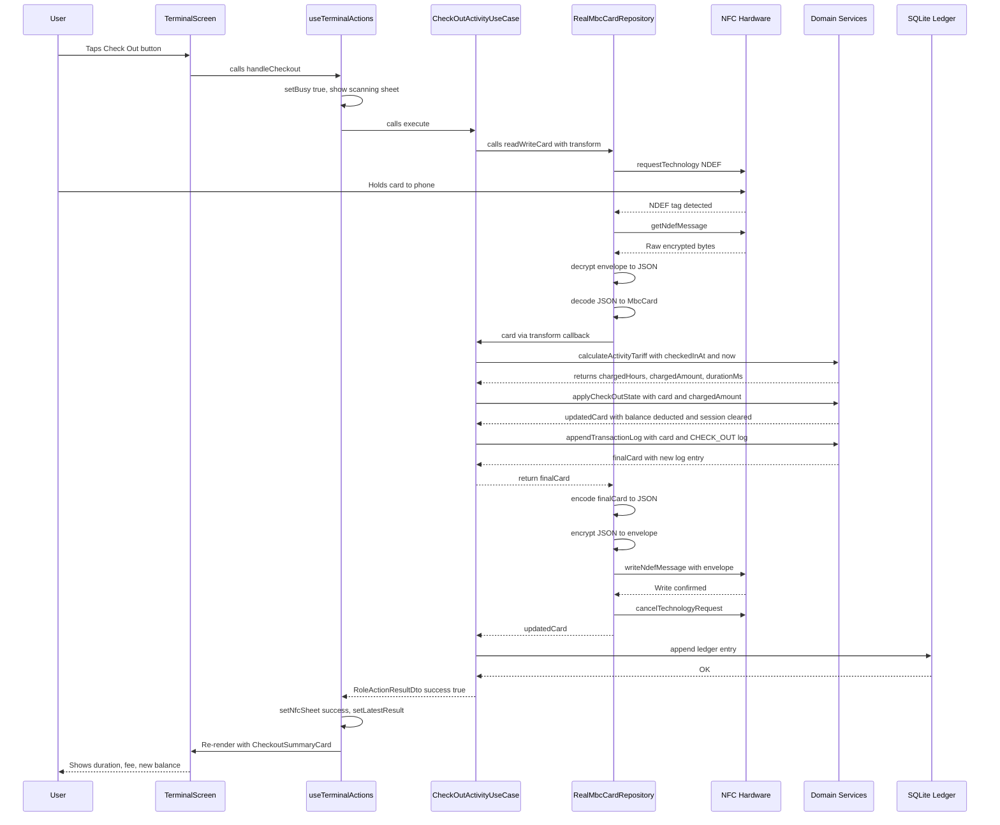
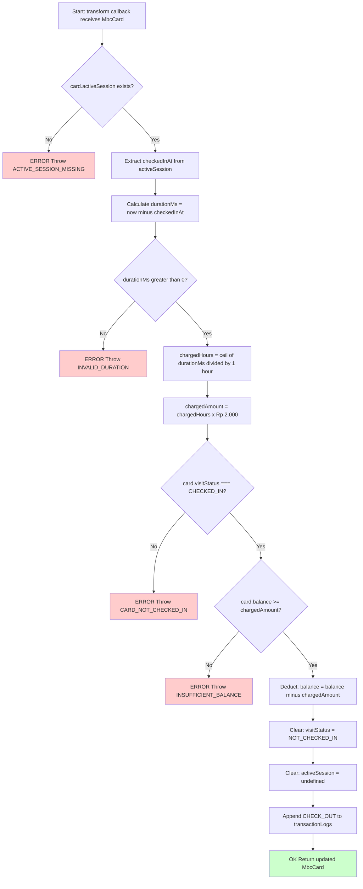

# Terminal Check-Out Flow — A Junior Developer's Guide

> **Analogy:** Think of the Terminal like a parking garage exit gate. When you drive out, the machine reads your ticket (NFC card), calculates how long you stayed, charges you, and lifts the barrier. That's exactly what this flow does — digitally.

---

## Table of Contents

1. [Navigation: Getting to the Terminal Screen](#1-navigation-getting-to-the-terminal-screen)
2. [Terminal Screen UI](#2-terminal-screen-ui)
3. [Pressing the Check-Out Button](#3-pressing-the-check-out-button)
4. [NfcActionSheet: The Scanning Phase](#4-nfcactionsheet-the-scanning-phase)
5. [CheckOutActivityUseCase.execute()](#5-checkoutactivityusecaseexecute)
6. [NFC Read: Decrypt → Decode → Get MbcCard](#6-nfc-read-decrypt--decode--get-mbccard)
7. [Domain Logic: The Brain of Check-Out](#7-domain-logic-the-brain-of-check-out)
8. [NFC Write: Re-encode → Re-encrypt → Write Back](#8-nfc-write-re-encode--re-encrypt--write-back)
9. [SQLite Ledger Entry](#9-sqlite-ledger-entry)
10. [Success Result Display](#10-success-result-display)
11. [Edge Cases & Error Handling](#11-edge-cases--error-handling)
12. [Mermaid Diagrams](#12-mermaid-diagrams)

---

## 1. Navigation: Getting to the Terminal Screen

The app starts at the **RoleSwitcher** screen (`src/presentation/screens/RoleSwitcher/index.tsx`). It shows four role cards:

| Role         | Purpose                              |
| ------------ | ------------------------------------ |
| Station      | Register & top up cards              |
| Gate         | Check-in (tap in)                    |
| **Terminal** | **Check-out (tap out & charge fee)** |
| Scout        | Read-only inspection                 |

When the user taps the "Terminal" card, this happens:

```typescript
// RoleSwitcher/index.tsx
const handleSelectRole = roleKey => {
  setSelectedRole(roleKey); // Updates global state
  navigation?.navigate?.(roleKey); // Navigates to 'terminal' route
};
```

The navigation stack is defined in `src/app/navigation.tsx`:

```typescript
export type RootStackParamList = {
  roleSwitcher: undefined;
  gate: undefined;
  scout: undefined;
  station: undefined;
  terminal: undefined; // ← This is our destination
};
```

React Navigation pushes the `TerminalScreen` component onto the stack.

---

## 2. Terminal Screen UI

The Terminal screen (`src/presentation/screens/Terminal/index.tsx`) renders:

1. **AppHeaderCard** — Title "The Terminal", subtitle "Checking out for Parking", a yellow "Terminal" badge
2. **TariffPreviewCard** — Shows the fixed rate: `Rp 2.000 / started hour`
3. **SignalButton** — The main action button labeled "Tap Card to Check Out"
4. **CheckoutSummaryCard** — Appears after a successful checkout (shows duration, fee, new balance)
5. **InsufficientBalanceCard** — Appears if the card doesn't have enough money
6. **NfcLogPanel** — Debug log showing NFC events
7. **NfcActionSheet** — Bottom sheet overlay for scan/success/error feedback

The screen uses a custom hook `useTerminalActions` that manages all the state and logic.

---

## 3. Pressing the Check-Out Button

When the user presses "Tap Card to Check Out", the `handleCheckout` function fires:

```typescript
// useTerminalActions.ts
const handleCheckout = useCallback(async () => {
  dismissedRef.current = false;
  setBusy(true); // Disables the button, shows "Processing..."
  setNfcSheet({
    phase: 'scanning',
    message: 'Hold your NFC card to check out',
  });

  try {
    appendNfcLog('[NFC] Checkout flow started');
    const result = await services.checkOutActivityUseCase.execute({});
    // ... handle result
  } catch (error) {
    // ... handle unexpected errors
  } finally {
    setBusy(false);
  }
}, [appendNfcLog, services]);
```

**What happens step by step:**

1. Button becomes disabled (prevents double-tap)
2. NfcActionSheet slides up showing "scanning" phase
3. The use case is called — this is where the NFC tap actually happens
4. The phone waits for the user to hold their card

---

## 4. NfcActionSheet: The Scanning Phase

The `NfcActionSheet` is a bottom sheet (50% screen height, dark overlay) that shows three possible phases:

| Phase      | What the user sees                                         |
| ---------- | ---------------------------------------------------------- |
| `scanning` | "Hold your NFC card to check out" with a pulsing animation |
| `success`  | "Checkout Complete" with the result message                |
| `error`    | "Checkout Failed" with the error message                   |

The user can dismiss the sheet at any time. If they do, `handleDismissSheet` cancels the NFC session:

```typescript
const handleDismissSheet = useCallback(() => {
  dismissedRef.current = true;
  setNfcSheet({ phase: 'idle' });
  setBusy(false);
  services.cancelNfc().catch(noop); // Cancels the NFC hardware session
}, [services]);
```

---

## 5. CheckOutActivityUseCase.execute()

This is the **application layer** orchestrator (`src/application/use-cases/check-out-activity.use-case.ts`). Think of it as the "manager" that coordinates between the NFC hardware and the business rules.

```typescript
export class CheckOutActivityUseCase {
  constructor(
    private readonly cardRepository: MbcCardRepository,
    private readonly localLedgerRepository?: LocalLedgerRepository,
  ) {}

  async execute({
    checkedOutAt,
  }: CheckOutActivityRequest = {}): Promise<RoleActionResultDto> {
    const occurredAt = checkedOutAt ?? new Date().toISOString();

    const updatedCard = await this.cardRepository.readWriteCard(card => {
      // 1. Validate card has active session
      // 2. Calculate tariff (duration × rate)
      // 3. Apply check-out state (deduct balance, clear session)
      // 4. Append transaction log
      return transformedCard;
    });

    // 5. Write to local SQLite ledger
    // 6. Return success result
  }
}
```

The key insight: **`readWriteCard` does the NFC read AND write in a single tap**. The `transform` function receives the decoded card, applies business logic, and returns the updated card — which is then written back to the physical tag.

---

## 6. NFC Read: Decrypt → Decode → Get MbcCard

When `readWriteCard` is called on `RealMbcCardRepository` (`src/infrastructure/nfc/real-mbc-card.repository.ts`):

```typescript
async readWriteCard(transform: (card: MbcCard) => MbcCard): Promise<MbcCard> {
  await this.ensureStarted();          // Initialize NFC hardware
  try {
    await this.requestNdefTechnology(); // Wait for card tap (NDEF tech)
    const card = await this.readCardFromActiveSession();  // READ
    const updated = transform(card);    // TRANSFORM (domain logic)
    await this.writeToActiveSession(updated);             // WRITE
    return updated;
  } catch (error) {
    throw toReadableError(error);
  } finally {
    await this.cancel();                // Release NFC hardware
  }
}
```

### The Read Process (`readCardFromActiveSession`):

1. **Read raw NDEF message** from the physical NFC tag
2. **Check if card is registered** — if no NDEF message, throw `UNREGISTERED_CARD`
3. **Validate envelope** — check for `MBC1` magic bytes (Silent Shield format)
4. **Decrypt** using AES-256-GCM:
   - Extract IV (12 bytes) and auth tag (16 bytes) from envelope
   - Decrypt ciphertext with the demo key
   - If auth tag doesn't match → `CARD_TAMPERED`
5. **Decode** the compact JSON format back into an `MbcCard` object

The compact format on the card looks like this:

```json
{
  "v": 1,
  "c": "CARD-001",
  "m": "MBR-001",
  "b": 10000,
  "i": { "a": 1, "t": "2026-05-08T10:00:00.000Z" },
  "x": [["I", 0, "2026-05-08T10:00:00.000Z"]],
  "n": 3
}
```

Where:

- `v` = version
- `c` = cardId
- `m` = memberId
- `b` = balance (in IDR)
- `i` = active session (`null` if not checked in, `{a: 1, t: checkedInAt}` if checked in)
- `x` = transaction logs (last 5, as `[activityCode, nominal, timestamp]` tuples)
- `n` = write counter (anti-replay)

---

## 7. Domain Logic: The Brain of Check-Out

Once we have the `MbcCard` object, the transform function inside the use case runs three domain services in sequence:

### Step 1: Validate Active Session

```typescript
if (!card.activeSession) {
  throw new DomainError(
    'ACTIVE_SESSION_MISSING',
    'Card does not have an active activity session to check out.',
  );
}
```

If the card isn't checked in, we can't check it out. Simple.

### Step 2: Calculate Tariff (`activity-tariff-calculator.ts`)

```typescript
tariffResult = calculateActivityTariff({
  checkedInAt: card.activeSession.checkedInAt, // e.g., "2026-05-08T10:00:00Z"
  checkedOutAt: occurredAt, // e.g., "2026-05-08T12:30:00Z"
});
```

**How the tariff works:**

```typescript
const DEFAULT_STRATEGY: TariffStrategy = {
  ratePerUnit: 2000, // Rp 2.000 per unit
  unitMs: 60 * 60 * 1000, // 1 unit = 1 hour (in milliseconds)
  roundUp: true, // Ceiling rounding (any partial hour = full hour)
};
```

**Calculation:**

1. `durationMs = exitTime - entryTime` (in milliseconds)
2. `durationUnits = durationMs / unitMs` (e.g., 2.5 hours)
3. `chargedHours = Math.ceil(durationUnits)` (e.g., 3 hours — rounds UP)
4. `chargedAmount = chargedHours × ratePerUnit` (e.g., 3 × 2000 = Rp 6.000)

> **Analogy:** If you park for 2 hours and 1 minute, you pay for 3 full hours. Like a taxi meter that clicks to the next hour the moment you go past.

**Validation:** If `durationMs <= 0` (exit before entry), it throws `INVALID_DURATION`.

### Step 3: Apply Check-Out State (`activity-state-policy.ts`)

```typescript
const checkedOutCard = applyCheckOutState(card, {
  chargedAmount: tariffResult.chargedAmount,
});
```

This function does three critical things:

1. **Validates** the card is `CHECKED_IN` — if not, throws `CARD_NOT_CHECKED_IN`
2. **Checks balance** — if `card.balance < chargedAmount`, throws `INSUFFICIENT_BALANCE`
3. **Mutates state** (on a clone):
   - `balance = balance - chargedAmount` (deducts the fee)
   - `visitStatus = 'NOT_CHECKED_IN'` (resets status)
   - `activeSession = undefined` (clears the parking session)

### Step 4: Append Transaction Log (`transaction-log-policy.ts`)

```typescript
return appendTransactionLog(
  checkedOutCard,
  createTransactionLog({
    id: createRandomId('LOG'),
    activity: 'CHECK_OUT',
    nominal: tariffResult.chargedAmount,
    occurredAt,
  }),
);
```

This adds a `CHECK_OUT` entry to the card's transaction log array. The log is capped at **5 entries** (oldest are dropped via `.slice(-5)`).

---

## 8. NFC Write: Re-encode → Re-encrypt → Write Back

After the transform function returns the updated `MbcCard`, the repository writes it back:

```typescript
// writeToActiveSession in real-mbc-card.repository.ts
private async writeToActiveSession(card: MbcCard): Promise<void> {
  this.writeCounter++;
  const shieldResult = encrypt(card, this.writeCounter);
  // ... validate size fits NTAG215 (504 bytes)
  // ... encode as NDEF MIME record
  await NfcManager.ndefHandler.writeNdefMessage(encoded);
}
```

**The write pipeline:**

1. Increment write counter (anti-replay protection)
2. **Encode** the `MbcCard` → compact JSON string
3. **Encrypt** with AES-256-GCM → binary envelope with `MBC1` magic header
4. Validate the envelope fits within NTAG215's 504-byte user memory
5. Wrap in an NDEF record with MIME type `application/vnd.mbc.v1`
6. Write to the physical NFC tag

All of this happens while the card is still on the phone — that's why it's a **single-tap operation**.

---

## 9. SQLite Ledger Entry

After the NFC write succeeds, the use case writes an audit record to the local SQLite database:

```typescript
await this.localLedgerRepository.append({
  id: createRandomId('LEDGER'),
  role: 'TERMINAL',
  action: 'CHECK_OUT',
  maskedMemberReference: maskMemberReference(updatedCard.member.memberId),
  activityType: 'PARKING',
  amount: tariffResult.chargedAmount,
  occurredAt,
});
```

**Important:** The ledger is for **device-side audit only**. The NFC card remains the source of truth. If the ledger write fails, the checkout still succeeds — the user just gets a slightly different success message:

```
"Card checked out successfully, but the local audit ledger could not be updated."
```

The member ID is masked (e.g., `MBR-***01`) for privacy in the local database.

---

## 10. Success Result Display

When everything succeeds, the use case returns a `RoleActionResultDto`:

```typescript
{
  success: true,
  role: 'TERMINAL',
  message: 'Card checked out successfully.',
  chargedHours: 3,
  chargedAmount: 6000,
  durationMs: 9000000,  // 2.5 hours in ms
  card: { balance: 4000, visitStatus: 'NOT_CHECKED_IN', ... }
}
```

Back in `useTerminalActions`, this triggers:

1. **NfcActionSheet** transitions to `success` phase: "Checkout Complete"
2. **CheckoutSummaryCard** renders showing:
   - **Tap out at:** formatted timestamp (e.g., "08-May-2026 12:30")
   - **Duration:** calculated from `durationMs` (e.g., "2h 30m 0s")
   - **Charged Hours:** ceiling-rounded hours (e.g., "3h")
   - **Fee:** formatted amount (e.g., "Rp 6.000")
   - **New Balance:** remaining balance (e.g., "Rp 4.000")

---

## 11. Edge Cases & Error Handling

### Card Not Checked In (Double Check-Out)

If someone tries to check out a card that's already checked out:

- `applyCheckOutState` throws `DomainError('CARD_NOT_CHECKED_IN', ...)`
- OR the use case catches missing `activeSession` first
- Result: `{ success: false, errorCode: 'GENERIC_FAILURE', message: '...' }`
- UI shows the red "Card cannot be processed" banner

### Insufficient Balance

If the parking fee exceeds the card balance:

- `applyCheckOutState` throws `DomainError('INSUFFICIENT_BALANCE', ...)`
- Result: `{ success: false, errorCode: 'INSUFFICIENT_BALANCE', message: '...' }`
- UI shows `InsufficientBalanceCard` with:
  - Required fee vs. available balance
  - "Go to Station Top Up" button (navigates to Station)
  - "Retry Checkout" button

### Tampered Card

If the AES-256-GCM authentication tag doesn't match (someone modified the card data):

- `decrypt()` returns `{ ok: false }` → `readCardFromActiveSession` throws `CardRepositoryError('CARD_TAMPERED', ...)`
- Result: `{ success: false, errorCode: 'CARD_TAMPERED' }`
- UI shows generic failure banner

### Unregistered Card (Blank Tag)

If the NFC tag has no NDEF message:

- `readCardFromActiveSession` throws `CardRepositoryError('UNREGISTERED_CARD', ...)`
- Result: `{ success: false, errorCode: 'UNREGISTERED_CARD' }`
- UI shows generic failure banner

### Scan Cancelled

If the user dismisses the NfcActionSheet before tapping:

- `dismissedRef.current = true` prevents state updates
- `services.cancelNfc()` releases the NFC hardware
- No error shown — sheet just closes

---

## 12. Mermaid Diagrams

### Diagram 1: Full Check-Out Sequence (Across Layers)



### Diagram 2: Validation, Tariff Calculation & Balance Deduction Flowchart



### Diagram 3: Before/After Card State Comparison

```mermaid
flowchart LR
    subgraph BEFORE["BEFORE Check-Out"]
        direction TB
        B1["version: 1"]
        B2["cardId: CARD-001"]
        B3["memberId: MBR-001"]
        B4["balance: 10000"]
        B5["visitStatus: CHECKED_IN"]
        B6["activeSession: PARKING at 2026-05-08T10:00:00Z"]
        B7["transactionLogs: I, 0, 2026-05-08T10:00:00Z"]
        B8["writeCounter: 3"]
    end

    subgraph AFTER["AFTER Check-Out"]
        direction TB
        A1["version: 1"]
        A2["cardId: CARD-001"]
        A3["memberId: MBR-001"]
        A4["balance: 4000 reduced by 6000"]
        A5["visitStatus: NOT_CHECKED_IN changed"]
        A6["activeSession: undefined cleared"]
        A7["transactionLogs: I + O 6000 at 12:30 added"]
        A8["writeCounter: 4 incremented"]
    end

    BEFORE --> |"3h charged x Rp 2.000 = Rp 6.000"| AFTER
```



---

## Quick Reference: File Map

| Layer          | File                                       | Responsibility                           |
| -------------- | ------------------------------------------ | ---------------------------------------- |
| Presentation   | `screens/Terminal/index.tsx`               | Screen layout, button, conditional cards |
| Presentation   | `screens/Terminal/useTerminalActions.ts`   | State management, NFC sheet control      |
| Presentation   | `fragments/CheckoutSummaryCard.tsx`        | Success result display                   |
| Presentation   | `fragments/TariffPreviewCard.tsx`          | Static tariff info                       |
| Presentation   | `fragments/InsufficientBalanceCard.tsx`    | Insufficient balance UI + navigation     |
| Application    | `use-cases/check-out-activity.use-case.ts` | Orchestrates read→transform→write→ledger |
| Domain         | `services/activity-tariff-calculator.ts`   | Duration & fee calculation               |
| Domain         | `services/activity-state-policy.ts`        | State transitions & balance validation   |
| Domain         | `services/transaction-log-policy.ts`       | Log creation & append (max 5)            |
| Domain         | `config/parking-tariff.ts`                 | Tariff constants (Rp 2.000/hour)         |
| Domain         | `entities/mbc-card.ts`                     | MbcCard type definition                  |
| Infrastructure | `nfc/real-mbc-card.repository.ts`          | NFC hardware read/write, single-tap      |
| Infrastructure | `nfc/silent-shield.ts`                     | AES-256-GCM encrypt/decrypt              |
| Infrastructure | `nfc/mbc-card-codec.ts`                    | Compact JSON encode/decode               |

---

## Summary for Junior Devs

1. **User taps button** → hook shows scanning sheet and calls use case
2. **Use case calls `readWriteCard`** → single NFC session that reads, transforms, and writes
3. **Read** = raw bytes → decrypt (AES-256-GCM) → decode (compact JSON) → `MbcCard` object
4. **Transform** = validate → calculate tariff → deduct balance → clear session → add log
5. **Write** = encode → encrypt → write bytes back to same tag
6. **After NFC** = save audit to SQLite, return result to UI
7. **UI updates** = show summary card with duration, fee, and new balance

The entire operation happens in **one card tap** — the user holds their card, and by the time they lift it, the checkout is complete. ✨
