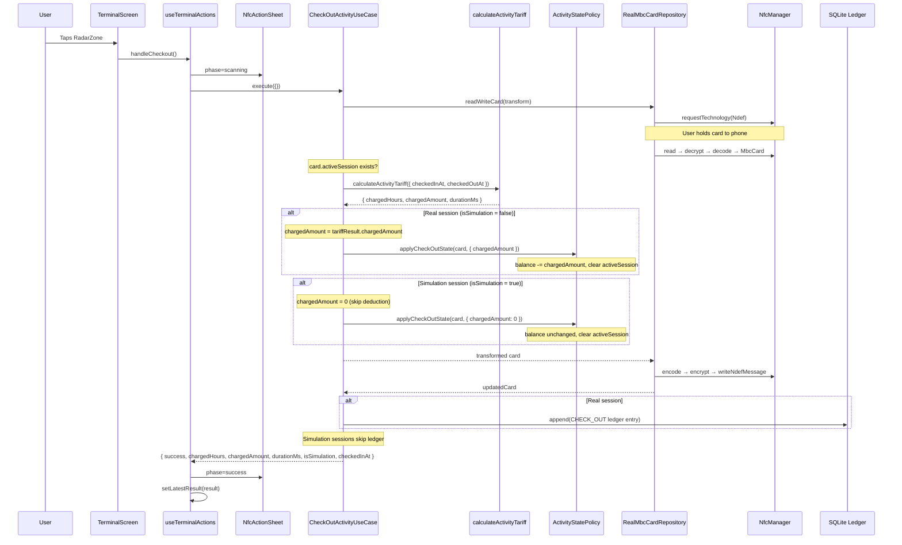

# Terminal Check-Out Flow

This document explains the complete flow when a terminal operator checks out a member from parking at the Terminal. It covers tariff calculation, balance deduction, and the **simulation-aware checkout** that skips deduction for simulated sessions.

> **Analogy:** Think of the Terminal like a parking garage exit gate. When you drive out, the machine reads your ticket (NFC card), calculates how long you stayed, charges you the fee, and lifts the barrier. But if your ticket was stamped with a "SIMULATION" watermark (from the Gate's time machine), the exit gate shows you what the fee _would_ be but doesn't actually charge you.

## What Changed Since May 13

| Area                    | Before                       | After                                                                                                    |
| ----------------------- | ---------------------------- | -------------------------------------------------------------------------------------------------------- |
| NFC trigger             | `SignalButton`               | `RadarZone` (animated radar with gradient button)                                                        |
| Header                  | `AppHeaderCard`              | `ScreenHeader` with amber badge                                                                          |
| Background              | Plain color                  | `ImageBackground` with `blurRadius={15}`                                                                 |
| Result display          | Single `CheckoutSummaryCard` | 4 fragments: `CheckoutSummaryCard`, `TariffPreviewCard`, `InsufficientBalanceCard`, `GenericFailureCard` |
| **Simulation handling** | Not implemented              | Detects `isSimulation` on card → skips deduction → shows simulation banner                               |
| Simulation banner       | N/A                          | Animated pulsing amber badge "⚠️ SIMULATION"                                                             |
| Result DTO              | Basic fields                 | New: `isSimulation`, `checkedInAt`, `durationMs`                                                         |
| Ledger                  | Always writes                | Skips ledger for simulation checkouts                                                                    |
| Fee display             | Plain text                   | "(not deducted)" suffix for simulation                                                                   |
| Balance display         | Plain text                   | "(unchanged)" suffix for simulation                                                                      |

---

## High-Level Summary

When the terminal operator taps the RadarZone:

1. `NfcActionSheet` appears in scanning phase
2. Reads the card via `readWriteCard` (single NFC session)
3. Validates: card has active session, exit time > entry time
4. Calculates tariff: Rp 2.000 × started hours
5. **If real session:** deducts fee from balance, clears session, writes card
6. **If simulation session:** calculates fee but sets `chargedAmount = 0`, clears session, writes card
7. Appends ledger entry (real sessions only)
8. Shows checkout summary with duration, fee, and new balance

---

## Sequence Diagram


```mermaid
sequenceDiagram
    participant User
    participant UI as TerminalScreen
    participant Hook as useTerminalActions
    participant Sheet as NfcActionSheet
    participant UC as CheckOutActivityUseCase
    participant Tariff as calculateActivityTariff
    participant Policy as ActivityStatePolicy
    participant Repo as RealMbcCardRepository
    participant NFC as NfcManager
    participant DB as SQLite Ledger

    User->>UI: Taps RadarZone
    UI->>Hook: handleCheckout()
    Hook->>Sheet: phase=scanning

    Hook->>UC: execute({})
    UC->>Repo: readWriteCard(transform)
    Repo->>NFC: requestTechnology(Ndef)
    Note over Repo,NFC: User holds card to phone
    Repo->>NFC: read → decrypt → decode → MbcCard

    Note over UC: card.activeSession exists?

    UC->>Tariff: calculateActivityTariff({ checkedInAt, checkedOutAt })
    Tariff-->>UC: { chargedHours, chargedAmount, durationMs }

    alt Real session (isSimulation = false)
        Note over UC: chargedAmount = tariffResult.chargedAmount
        UC->>Policy: applyCheckOutState(card, { chargedAmount })
        Note over Policy: balance -= chargedAmount, clear activeSession
    end

    alt Simulation session (isSimulation = true)
        Note over UC: chargedAmount = 0 (skip deduction)
        UC->>Policy: applyCheckOutState(card, { chargedAmount: 0 })
        Note over Policy: balance unchanged, clear activeSession
    end

    UC-->>Repo: transformed card
    Repo->>NFC: encode → encrypt → writeNdefMessage
    Repo-->>UC: updatedCard

    alt Real session
        UC->>DB: append(CHECK_OUT ledger entry)
    end
    Note over UC: Simulation sessions skip ledger

    UC-->>Hook: { success, chargedHours, chargedAmount, durationMs, isSimulation, checkedInAt }
    Hook->>Sheet: phase=success
    Hook->>Hook: setLatestResult(result)
```

---

## Step-by-Step Breakdown

### 1. Terminal Screen UI Layout

**File:** `src/presentation/screens/Terminal/index.tsx`

```tsx
<ImageBackground source={bgImage} style={{ flex: 1 }} resizeMode="cover" blurRadius={15}>
  <ScreenHeader title="The Terminal" subtitle="Checking out for Parking" badgeLabel="Terminal" badgeColor="#F59E0B" />

  {/* Simulation banner — only shows after successful simulation checkout */}
  {actions.latestResult?.isSimulation && actions.success && (
    <Animated.View style={[{ backgroundColor: '#F59E0B' }, badgeStyle]}>
      <Text>⚠️ SIMULATION</Text>
    </Animated.View>
  )}

  {!actions.latestResult ? (
    <>
      <TariffPreviewCard />
      <RadarZone label="Tap Card to Check Out" onPress={handleCheckout} />
    </>
  ) : actions.success ? (
    <CheckoutSummaryCard ... />
  ) : actions.insufficient ? (
    <InsufficientBalanceCard ... />
  ) : (
    <GenericFailureCard ... />
  )}

  <NfcLogPanel variant="light" />
  <NfcActionSheet ... />
</ImageBackground>
```

**State machine** — the screen shows one of four views:

| State                | Condition                              | Component                         |
| -------------------- | -------------------------------------- | --------------------------------- |
| Idle                 | `!latestResult`                        | `TariffPreviewCard` + `RadarZone` |
| Success              | `latestResult.success`                 | `CheckoutSummaryCard`             |
| Insufficient balance | `errorCode === 'INSUFFICIENT_BALANCE'` | `InsufficientBalanceCard`         |
| Generic failure      | Other errors                           | `GenericFailureCard`              |

### 2. TariffPreviewCard — Before Scan

**File:** `src/presentation/screens/Terminal/fragments/TariffPreviewCard.tsx`

Shows the fixed rate before any scan: **Rp 2.000 / started hour**

### 3. CheckOutActivityUseCase — The Brain

**File:** `src/application/use-cases/check-out-activity.use-case.ts`

```ts
const updatedCard = await cardRepository.readWriteCard(card => {
  if (!card.activeSession) {
    throw createDomainError(
      'ACTIVE_SESSION_MISSING',
      'Card does not have an active activity session.',
    );
  }

  wasSimulation = card.activeSession.isSimulation === true;
  sessionCheckedInAt = card.activeSession.checkedInAt;

  // Calculate tariff regardless of simulation
  tariffResult = calculateActivityTariff({
    checkedInAt: card.activeSession.checkedInAt,
    checkedOutAt: occurredAt,
  });

  // KEY DIFFERENCE: simulation sessions don't deduct
  const chargedAmount = card.activeSession.isSimulation
    ? 0
    : tariffResult.chargedAmount;

  const checkedOutCard = applyCheckOutState(card, { chargedAmount });

  return appendTransactionLog(
    checkedOutCard,
    createTransactionLog({
      activity: 'CHECK_OUT',
      nominal: tariffResult.chargedAmount, // log shows REAL fee even for simulation
      isSimulation: wasSimulation || undefined,
    }),
  );
});
```

**Critical design decision:** The tariff is always calculated (so the UI can show what the fee _would_ be), but `chargedAmount` passed to `applyCheckOutState` is 0 for simulations. This means:

- Balance is unchanged for simulation checkouts
- The transaction log still records the real fee amount (for audit visibility)
- The `isSimulation` flag on the log marks it as non-deducted

### 4. Tariff Calculation

```ts
function calculateActivityTariff({
  checkedInAt,
  checkedOutAt,
}): ActivityTariffCalculation {
  const durationMs = exitTime - entryTime;
  const chargedHours = Math.ceil(durationMs / (60 * 60 * 1000)); // round UP
  const chargedAmount = chargedHours * PARKING_TARIFF_PER_STARTED_HOUR; // × 2000
  return { chargedHours, chargedAmount, durationMs };
}
```

- **Rp 2.000 per started hour** — 1 minute = 1 hour charged
- Throws `INVALID_TIMESTAMP` if dates are unparseable
- Throws `INVALID_DURATION` if exit ≤ entry

### 5. Ledger — Simulation Sessions Skipped

```ts
if (localLedgerRepository && !wasSimulation) {
  await localLedgerRepository.append({
    role: 'TERMINAL',
    action: 'CHECK_OUT',
    amount: tariffResult.chargedAmount,
    ...
  });
}
```

Simulation checkouts don't pollute the device-local audit ledger. The ledger only tracks real money movement.

### 6. CheckoutSummaryCard — Success Display

**File:** `src/presentation/screens/Terminal/fragments/CheckoutSummaryCard.tsx`

```
┌─────────────────────────────────┐
│           ✓ (green)             │
│      Checkout Summary           │
│                                 │
│   Rp 50.000 (unchanged)  ← simulation suffix
│                                 │
│  Tap in at:   21-May-2026 14:30 │
│  Tap out at:  21-May-2026 16:45 │
│  Duration:    2h 15m 0s         │
│  Charged Hours: 3h              │
│  Fee: Rp 6.000 (not deducted)  ← simulation suffix
│                                 │
│  [Scan Another Card]            │
└─────────────────────────────────┘
```

Key simulation indicators:

- Balance shows `"(unchanged)"` when `isSimulation`
- Fee shows `"(not deducted)"` when `isSimulation`
- Animated amber "⚠️ SIMULATION" banner pulses above the card

### 7. Animated Simulation Banner

```tsx
useEffect(() => {
  if (actions.latestResult?.isSimulation && actions.success) {
    badgeOpacity.value = withRepeat(
      withTiming(0.5, { duration: 1000 }),
      -1,
      true,
    );
  }
}, [actions.latestResult?.isSimulation, actions.success]);
```

The banner pulses between full opacity and 50% opacity to draw attention to the simulation state.

### 8. InsufficientBalanceCard — When Balance Is Too Low

**File:** `src/presentation/screens/Terminal/fragments/InsufficientBalanceCard.tsx`

Shows when `errorCode === 'INSUFFICIENT_BALANCE'`:

- Displays the required fee
- Guidance: "Direct the member to top up at Station before checkout"
- "Retry" button to attempt checkout again (after top-up)

### 9. GenericFailureCard — Other Errors

**File:** `src/presentation/screens/Terminal/fragments/GenericFailureCard.tsx`

Catches all other errors (tampered card, no active session, etc.) with a "Scan Another Card" reset button.

---

## RoleActionResultDto — Extended Fields

The checkout result includes simulation-specific fields:

```ts
{
  success: true,
  role: 'TERMINAL',
  message: 'Card checked out successfully.',
  chargedHours: 3,
  chargedAmount: 6000,        // always the REAL calculated fee
  durationMs: 8100000,
  card: CardSummaryDto,
  isSimulation: true,          // NEW: propagated from card
  checkedInAt: '2026-05-21T14:30:00.000Z',  // NEW: for display
}
```

---

## Error Scenarios

| Error                    | Source                             | UI Behavior                           |
| ------------------------ | ---------------------------------- | ------------------------------------- |
| `ACTIVE_SESSION_MISSING` | Card not checked in                | GenericFailureCard                    |
| `INSUFFICIENT_BALANCE`   | Balance < fee (real sessions only) | InsufficientBalanceCard with guidance |
| `INVALID_DURATION`       | Exit time ≤ entry time             | GenericFailureCard                    |
| `CARD_TAMPERED`          | Silent Shield integrity failure    | GenericFailureCard                    |
| `UNREGISTERED_CARD`      | Card has no MBC data               | GenericFailureCard                    |
| NFC write failure        | Hardware/tag issue                 | Error sheet                           |

Note: `INSUFFICIENT_BALANCE` can never occur for simulation sessions because `chargedAmount = 0`.

---

## SOLID Principles in This Flow

| Principle                 | Application                                                                                |
| ------------------------- | ------------------------------------------------------------------------------------------ |
| **Single Responsibility** | Tariff calculation is isolated in `tariff-policy.ts`; simulation logic is in use case only |
| **Open/Closed**           | New tariff rules can be added without changing the checkout flow structure                 |
| **Liskov Substitution**   | Simulation and real sessions use the same `applyCheckOutState` — only the amount differs   |
| **Interface Segregation** | `TerminalServices` only exposes `checkOutActivityUseCase` + `cancelNfc`                    |
| **Dependency Inversion**  | Use case doesn't know about UI banners or animations                                       |
